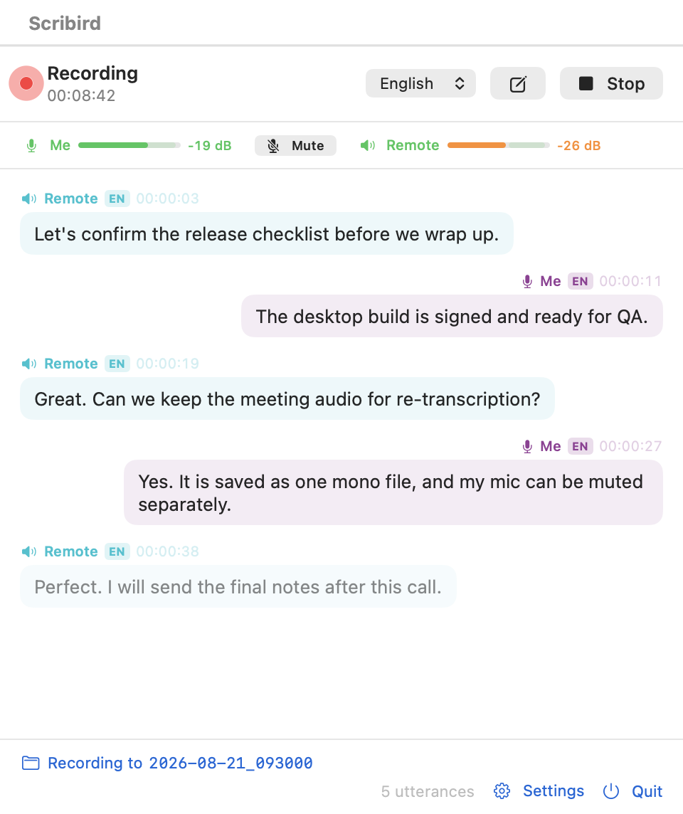
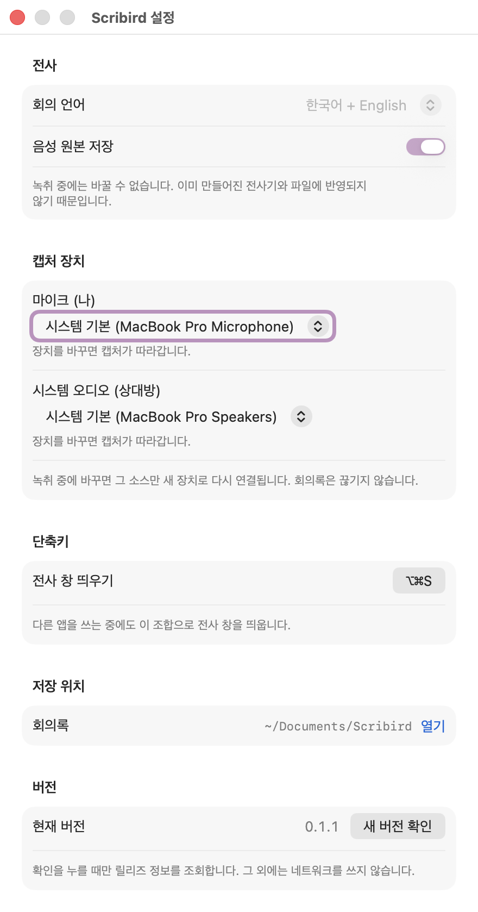

<div align="center">
  

  <h1>Scribird</h1>

  <p><strong>A macOS menu-bar app that transcribes your meetings in real time — entirely on-device.</strong></p>

  <p>
    <a href="./LICENSE"></a>
    
    
    <a href="https://github.com/haandol/scribird/releases/latest"></a>
  </p>
</div>

Scribird writes down your Zoom or Teams meeting while it happens. Your microphone is
labeled **me**, whatever comes out of your speakers is labeled **remote**, and when the
meeting ends you are left with a transcript and the original audio in a single folder.

Transcription and storage both happen on your machine. **Neither the meeting audio nor the
transcript ever leaves the device.** The app makes exactly one network request, and only
when you press *Check for updates* in settings — see [Network use](#network-use).

The interface is available in **Korean and English**, following your system language by default
and switchable in settings. Screenshots in this document were taken with the Korean interface, so
where it names a button it quotes that Korean and puts the English alongside — what you see on
screen depends on your language setting.

> [!NOTE]
> A separate, opt-in [plugin](#optional-splitting-remote-into-individual-speakers) for Claude
> Code and Codex can split *remote* into individual participants afterwards. It sends the saved
> audio to **your own** AWS account, so it is deliberately outside the app — the app itself
> still makes no network request beyond the update check.

<div align="center">
  
</div>

*me* (「나」) is aligned right, *remote* (「상대방」) is aligned left, and the two use different
colors. The `KO`/`EN` badge shows which language each utterance was recognized in. The last
line is dimmed because it is still volatile — the moment it is finalized it sharpens and is
written to disk.

## Features

|  | |
|---|---|
| **Automatic speaker attribution** | Microphone is *me*, system output is *remote*. The audio path decides the speaker, so there is nothing to infer and nothing to get wrong |
| **Live transcription** | Volatile text appears dimmed while you speak and sharpens once finalized. Finalized text is written to disk immediately |
| **Korean + English** | Both languages are recognized at once. Code-switching meetings keep both sides thanks to token-level arbitration |
| **Original audio kept** | One `.m4a` per source, captured before resampling — you can re-transcribe later |
| **Silent failures surfaced** | A denied permission raises no error; it just delivers silence. Scribird judges by amplitude and warns you mid-recording |
| **Input level meters** | Per-source dBFS in real time with the recommended range marked, so you don't find out after the meeting |
| **Per-meeting session boundaries** | Starting a new meeting swaps the output files without interrupting capture — you don't lose the opening of the next meeting |
| **Follows device changes** | Plug in a headset mid-meeting and capture moves with it, without splitting the transcript or the audio files |
| **Or pin a device** | Choose a specific microphone or output device per source and capture stays there, even when the system default moves |
| **Korean or English interface** | The screen follows your system language and can be switched in settings. Transcript files keep English speaker labels either way, so tools reading them see one vocabulary |
| **Global hotkey** | `⌥⌘S` brings up the transcript window from anywhere, and it stays open when it loses focus. `⌘W` puts it away; closing it doesn't stop a recording. Both shortcuts are re-bindable |

## System Requirements

macOS 26 or later, on Apple silicon or Intel. The on-device `SpeechAnalyzer` API that
Scribird is built on does not exist on earlier releases, so there is no back-deployed
build.

The language model is downloaded by macOS on first use, not by Scribird. Expect a progress
bar the first time you press Start for a given language.

## Installation

### From a release

Download `Scribird-<version>.zip` from the
[latest release](https://github.com/haandol/scribird/releases/latest), unzip it, and move
`Scribird.app` into `/Applications`.

> [!IMPORTANT]
> **These builds are not notarized.** Gatekeeper blocks the first launch. Either
> **right-click the app → Open**, or press *Open Anyway* in System Settings › Privacy &
> Security. If you would rather not do that dance, build from source below.

### From source

You need a Swift 6.2+ toolchain and macOS 26 (verified on Swift 6.3.3 / macOS 26.5.2).

```bash
git clone https://github.com/haandol/scribird.git
cd scribird
./install.sh          # release-build, then replace /Applications/Scribird.app
```

To build and run it in place instead:

```bash
./build.sh release
open build/Scribird.app
```

It has to be wrapped in an `.app` bundle and code-signed. A bare executable cannot obtain
microphone or audio-capture permission, because macOS ties permissions (TCC) to the bundle
identifier.

> [!WARNING]
> **Signing is a functional requirement here, not a distribution one.** `build.sh` looks for
> a `Developer ID Application` or `Apple Development` certificate in your keychain (override
> with `SIGN_IDENTITY`). Without one it falls back to ad-hoc signing, which leaves
> `TeamIdentifier` empty — and in that state system-audio capture never prompts and silently
> delivers nothing but silence. If the remote voice isn't picked up, check the signing
> identity before you debug anything else.

## How to use it

1. Click the waveform icon in the menu bar, or press `⌥⌘S`, to bring up the transcript window.
2. Press **시작** / **Start**. On first run the language model is downloaded and progress is shown.
3. Check that both level meters move — a meter that doesn't move means that source isn't arriving.
4. When the meeting changes, press **✎** to cut the transcript. Capture is not interrupted.
5. Press **중지** / **Stop**. It wraps up within 6 seconds and shows a link to the output folder.

### Reading the level meters

The shaded band is the recommended range, **-24 to -3 dBFS**. Below -24 the source is too
quiet to be worth re-listening to later; above -3 it is clipping. If a source stays silent
past its grace period — 4 seconds for the microphone, 8 for system output, because a
meeting may genuinely have nothing playing yet — the meter is replaced by the likely cause
and a link to the relevant System Settings pane.

### Settings

Everything you set once and forget lives in the settings window (`⌘,`), split across three
tabs — **Recording** (meeting language, original-audio saving, capture devices), **Output** (the
save location and whether to open the session folder when a recording ends), and **General**
(interface language, both hotkeys, and the update check). The transcript window keeps only what
you look at during a meeting.

**The interface is available in Korean and English.** It follows your system language unless
you pick one, and picking one keeps it even if the system language later changes. Note that this
is separate from the *meeting* language — you can read an English interface while recording a
Korean meeting, or the reverse. Speaker labels inside `transcript.md` are always English
regardless of this setting, because that file is read later by other tools and its vocabulary
should not depend on a preference.

<div align="center">
  
</div>

> [!NOTE]
> The screenshot predates the tabbed layout — the sections it shows are now spread across the
> three tabs described above. The behavior it illustrates is unchanged.

The transcription rows are greyed out there because a recording is in progress — changing the
language or audio-saving mid-session would contradict the transcribers and file handles that
already exist, and the window says so rather than failing silently. **Capture devices stay
editable while recording**, because that's exactly when you notice you picked the wrong one.
So does the folder-opening toggle, which is only read when a recording stops, and so does the
interface language, which only affects what's drawn.

## Where your data goes

Each session gets its own directory, named for the moment it started:

```
~/Documents/Scribird/2026-07-31_142530/
```

**You can put that folder somewhere else.** Settings → Save location lets you pick any folder —
a synced folder so meetings reach your other machines, an external volume, or an encrypted disk.
Pick nothing and it stays where it is above. Two things to know: existing transcripts are **not**
moved when you change it (the app never relocates your files — a half-finished move of a meeting
you can't re-record is worse than two folders), and if the folder you picked is gone at the
moment you start recording — an unplugged drive — Scribird records into the default location
instead and tells you so. It does not refuse to record, because a meeting happens once.

**The transcript window always shows where recordings are stored**, so you can confirm one is
actually being saved without waiting for it to end. Click it to open that folder. What it
points at follows the app's state — the session being written to while recording, the last one
after stopping, and the root above them before you've recorded anything — and the label says
which of the three you're looking at.

When a recording stops, that session's folder opens on its own, and the transcript window steps
behind it — it floats above other apps so a meeting can't hide it, but not above something you
just asked for. Click the transcript window to bring it back above everything. Turn the
auto-opening off in settings if you record back-to-back meetings and don't want the window.
Starting a *new session* mid-meeting does not open anything, since you're still in the meeting.

| File | Contents |
|---|---|
| `transcript.jsonl` | One finalized utterance per line (speaker, timestamp, confidence, language), flushed as soon as it is finalized |
| `transcript.md` | Readable transcript, grouped by speaker |
| `me.m4a` | Microphone original (AAC, 128 kbps per channel) |
| `remote.m4a` | System-output original (AAC, 128 kbps per channel) |

The `.m4a` files are only written when *음성 원본 저장* (save original audio) is on, which
is the default. Nothing here is ever pruned or rotated — the folder grows until you delete
from it.

### Network use

The only network request in the app is the release lookup behind *새 버전 확인* (check for
updates), and it fires only from that button press. There is no launch check, no periodic
check, and no preference that enables one. The request carries nothing the app produced:
no transcript, no usage counts, no device identifier. Scribird never downloads an update
either — it points you at the release page and leaves signature verification to Gatekeeper.

## Optional: splitting *remote* into individual speakers

Because a meeting app mixes participants down before Scribird ever sees them, *remote* is one
label for everyone on the far side. The per-source `.m4a` files exist so that limit can be
lifted afterwards, by a tool that isn't the app.

[`plugin/scribird-diarize`](./plugin/README.md) is a Claude Code plugin that does exactly that.
It sends `remote.m4a` to Amazon Transcribe for speaker partitioning, overlays only the speaker
boundaries onto the transcript you already have, splitting the single `상대방` label
(*remote*, as the app writes it) into `상대방 A` / `상대방 B`:

```
Before   [상대방]   00:12  Let's ship on Tuesday next week, then.
         [상대방]   00:18  I'd prefer the week after. QA needs the time.

After    [상대방 A] 00:12  Let's ship on Tuesday next week, then.
         [상대방 B] 00:18  I'd prefer the week after. QA needs the time.
```

> [!WARNING]
> **This sends meeting audio to Amazon Transcribe under your own AWS account.** That is the
> opposite of how the app works, which is why it lives outside the app and never runs on its
> own. It uses your local `aws` credentials, prints exactly what it is about to send, and
> refuses to proceed until you confirm.
>
> By default it **streams** the audio over a WebSocket, so nothing is stored in S3 — no bucket
> to create, no object left behind to forget about.

### Prerequisites

| | Check |
|---|---|
| [Claude Code](https://claude.com/claude-code) or [Codex](https://developers.openai.com/codex/cli) | `claude --version` / `codex --version` |
| AWS CLI with working credentials | `aws sts get-caller-identity` |
| A region set | `aws configure get region` |
| Python 3 | already there — macOS ships `/usr/bin/python3`, and nothing needs `pip install` |

IAM permission needed for the default streaming path is just
`transcribe:StartStreamTranscription`. The batch path additionally needs `s3:CreateBucket`,
`s3:PutObject`, `s3:GetObject`, `s3:DeleteObject`, `s3:ListBucket`,
`transcribe:StartTranscriptionJob`, and `transcribe:GetTranscriptionJob`.

### Install

The repository doubles as a plugin marketplace for both agents. Register it, then install the
plugin from it — substitute the path where you cloned this repository.

**Claude Code**

```bash
claude plugin marketplace add ~/git/scribird
claude plugin install scribird-diarize@scribird
```

Inside a session, `/plugin marketplace add ~/git/scribird` then picking it from `/plugin` does
the same thing. Invoke it with `/multi-speaker-diarize` or just describe the task.

**Codex**

```bash
codex plugin marketplace add ~/git/scribird
codex plugin add scribird-diarize@scribird
```

Invoke it with `$multi-speaker-diarize` or describe the task. Verify with
`codex plugin list`, which should show `scribird-diarize@scribird` as *installed, enabled*.

Both read the same skill; the two `plugin.json` files differ only in the metadata each agent
expects. Once this repository is on GitHub you can also register it remotely — with
`claude plugin marketplace add haandol/scribird` or `codex plugin marketplace add
haandol/scribird` — which is the same marketplace fetched over Git instead of read from disk.

### Use it

Just ask, in either agent:

```
split the remote speaker in ~/Documents/Scribird/2026-07-31_142530 by participant
```

The agent picks the session, reads the language out of your existing transcript, shows you what
is about to be sent, and waits. Nothing leaves the machine until you say yes. It then reports
how many speakers were found and which words the two engines heard differently.

You can also run the scripts directly, which is useful when you want to see the exact steps:

```bash
cd plugin/scribird-diarize/skills/multi-speaker-diarize
SESSION=~/Documents/Scribird/2026-07-31_142530

# 1. Print the plan and stop (exit 3). Nothing has been sent yet.
/usr/bin/python3 scripts/stream_transcribe.py --session "$SESSION" --language-code ko-KR

# 2. Approve and run it.
/usr/bin/python3 scripts/stream_transcribe.py --session "$SESSION" --language-code ko-KR --yes

# 3. Overlay the speaker boundaries onto your transcript.
/usr/bin/python3 scripts/merge_speakers.py --session "$SESSION" --aws-remote "$SESSION/aws-remote.json"
```

### What you get

Three new files land next to the originals, which are never modified:

| File | Contents |
|---|---|
| `transcript.speakers.md` | The readable transcript, now split by speaker. Body text is still your on-device transcript |
| `transcript.speakers.jsonl` | Machine-readable. Keeps the original `me`/`remote` in a `source` field, so the certain two-way split is always recoverable |
| `diarization-report.md` | How many speakers, how much each one talked, and every word the two engines wrote differently |

### Two properties worth knowing

These are what make the result trustworthy:

- **The `me` / `remote` split is never re-derived.** That one came from the audio path and
  cannot be wrong; only the *inside* of `remote` is estimated. `me.m4a` is not sent at all
  unless you ask for it, since a microphone's speaker is already settled. (Pass
  `--sources remote,me` when the meeting was in-person and other voices reached your mic.)
- **Your on-device transcript stays the transcript.** Amazon Transcribe is called for speaker
  boundaries, not for text. Where the two engines disagree on a word, the difference is
  reported rather than silently applied — deciding which one is right needs meaning, and the
  script doesn't claim to have it.

### When you need the batch path instead

Streaming can't do two things, and `scripts/run_transcribe.py` exists for exactly those:

| | Streaming (default) | Batch |
|---|---|---|
| S3 | **not used** | creates a bucket, uploads, deletes after |
| Speaker count | up to 10, not adjustable | `--max-speakers` 2–30 |
| Multiple languages | one language only | multi-language identification |

So reach for batch when more than 10 people attended, or when the meeting genuinely switches
between two languages in comparable amounts. Otherwise streaming is the better trade.

See [`plugin/README.md`](./plugin/README.md) for the full option list and the reasoning behind
each default.

## Permissions

Two things have to be allowed on first launch. **Screen-recording permission is never
requested**, and neither is accessibility.

| Permission | System Settings pane | Used for |
|---|---|---|
| Microphone | Privacy & Security › Microphone | Transcribing what you say |
| Audio Recording | Privacy & Security › Audio Recording | Transcribing the remote voices |

If one of the two is missing, the other keeps working. Microphone transcription still runs
without a meeting app open, and your own speech is still recorded without audio-capture
permission. The session is only abandoned when both sources fail.

## Preferences Storage

Everything in the settings window persists across launches. Preferences live in
`~/Library/Preferences/com.scribird.app.plist` under the `com.scribird.app` domain:

```bash
defaults read com.scribird.app
```

| Key | Setting | Default |
|---|---|---|
| `interfaceLanguage` | Interface language | unset (follow system language) |
| `transcriptionLanguage` | Meeting language | `auto` (한국어 + English) |
| `savesOriginalAudio` | Save original audio | `true` |
| `pinnedInputDeviceUID` | Pinned microphone | unset (follow system default) |
| `pinnedOutputDeviceUID` | Pinned output device | unset (follow system default) |
| `transcriptRootPath` | Save location | unset (use the default folder) |
| `hotKeyCode`, `hotKeyModifiers` | Global hotkey (show transcript) | `⌥⌘S` |
| `settingsHotKeyCode`, `settingsHotKeyModifiers` | Open settings | `⌘,` |

Window positions and the menu-bar item position are stored in the same domain by AppKit.
A value that can't be interpreted falls back to its default rather than failing to start a
recording — deleting the whole domain resets every setting:

```bash
defaults delete com.scribird.app
```

> [!NOTE]
> Because these persist, a setting you changed once stays changed. If original-audio saving
> was turned off in an earlier session, no `.m4a` files appear in later ones. The current
> language is always readable in the transcript window's header for that reason.

## Troubleshooting

Start with the cheap checks; each one rules out a whole class of cause.

1. **Are both level meters moving?** A meter that never moves means that source is not
   arriving at all — that is a permission or device problem, not a transcription problem.
2. **Is anything actually playing?** System-audio capture taps the output device. If the
   meeting app is routing to a headset that isn't the system default output, Scribird
   won't see it.
3. **Check the signing identity.** An ad-hoc-signed build silently yields silence on the
   system-audio path:
   ```bash
   codesign -dv /Applications/Scribird.app 2>&1 | grep TeamIdentifier
   ```
   An empty or missing `TeamIdentifier` is the problem. Rebuild with a real certificate.
4. **Confirm the permission is actually granted**, in System Settings › Privacy & Security
   under both *Microphone* and *Audio Recording*.

For permission resets, device-switching problems, model download failures, and the rest,
see **[docs/Troubleshooting.md](./docs/Troubleshooting.md)**.

## Known limitations

All of these came out of measurement or are direct consequences of a design decision.
Knowing them up front saves some surprise.

- **Speaker separation tops out at *me* vs. *everyone remote*.** Individual participants are
  not distinguished. Apple Speech has no diarization API, and meeting apps mix participants
  down to a single stream before handing it to Core Audio. That is exactly why the original
  audio is kept per source — see
  [splitting *remote* afterwards](#optional-splitting-remote-into-individual-speakers) for an
  opt-in tool that does it, at the cost of leaving the device.
- **Remote audio recognizes less accurately.** The remote voice has already been through a
  codec and been played back. It is especially noticeable in Korean.
- **Switching devices costs a moment of audio.** Scribird follows the default input and
  output device while recording, so plugging in a headset right before or during a meeting
  keeps transcription going — but the audio during the reconnect itself is not captured, and
  cannot be recovered. A notice names the device it moved to so the gap isn't mistaken for
  silence in the meeting.
- **A pinned device stops following the system.** That's the point of pinning, but it means
  plugging in a headset won't move a pinned source. Settings states which device each source
  is on, and if a pinned device is absent Scribird falls back to the system default and says
  so — the pin itself is kept, so reconnecting the device restores it.
- **If the meeting is monolingual, picking that one language is more accurate.** In a
  multilingual configuration, utterances at a code-switching boundary can be clipped short.
  Choosing a single language skips the arbiter entirely, so that loss doesn't occur.
- **Language and original-audio saving are locked while recording.** Changing them would
  contradict the transcribers and file handles that already exist.
- **Stop completes within 6 seconds.** The transcript and audio files must be saved even if
  one transcriber stops responding, so past that deadline the remaining tasks are cancelled
  and whatever was secured is written out.
- **App Sandbox is off.** That is convenient for working with Core Audio taps and for keeping
  transcripts in Documents. Targeting the App Store would mean turning it on and adjusting
  the file-access scope.

Zoom and Scribird *can* share the microphone — macOS input devices are multi-client, so the
mic opens even while a meeting app is using it. Note that the meeting app's echo
cancellation can change the characteristics of the microphone signal.

## Uninstallation

```bash
rm -rf /Applications/Scribird.app
defaults delete com.scribird.app
tccutil reset Microphone com.scribird.app
tccutil reset AudioCapture com.scribird.app
```

> [!TIP]
> Your meetings are **not** removed by any of the above. Transcripts and audio stay in
> `~/Documents/Scribird/` — or wherever you pointed the save location — until you delete them
> yourself, which is deliberate — an uninstall should not throw away a meeting record.

---

## How it works

The key to speaker separation is splitting the audio **before** anything is mixed.

```
Microphone in  ──→ AVAudioEngine tap       ──→ SpeechAnalyzer #1 ──→ [me]     ─┐
                                                                               ├─→ TranscriptTimeline ─→ JSONL + Markdown
System output  ──→ Core Audio Process Tap  ──→ SpeechAnalyzer #2 ──→ [remote] ─┘
   (whatever Zoom/Teams plays back)
```

Sound arriving through the microphone is necessarily me, and sound the system plays back is
necessarily someone else. Giving each source its own `SpeechAnalyzer` makes the speaker
label a fact rather than an inference.

System audio comes from a **Core Audio process tap** rather than ScreenCaptureKit because
of permissions. ScreenCaptureKit checks screen-recording permission
(`kTCCServiceScreenCapture`) even when all you want is audio — its entry point
`SCShareableContent` is an API that returns a list of windows and displays, and that is also
the only TCC service its backing daemon `/usr/libexec/replayd` references. Calling it from a
bundle that declares only `NSAudioCaptureUsageDescription` fails with `-3801
(userDeclined)`. A process tap uses `kTCCServiceAudioCapture` and nothing else.

The reasoning behind each decision, and the alternatives that were rejected, are recorded as
ADRs under [`docs/adr/`](./docs/adr/). If you want to know *why* something is the way it is,
that's the primary source. The ADRs are written in Korean.

- [System-audio capture path](./docs/adr/capture/0001-system-audio-process-tap.md) — why ScreenCaptureKit is not used
- [Silent capture-failure detection](./docs/adr/capture/0002-silent-capture-detection.md) — judging by amplitude instead of return values
- [Per-source failure isolation](./docs/adr/capture/0003-per-source-failure-isolation.md) — why one dead source doesn't end the session
- [Source-based speaker attribution](./docs/adr/transcription/0001-source-based-speaker-attribution.md) — why the two-speaker ceiling is accepted
- [Token-level language arbitration](./docs/adr/transcription/0002-token-level-language-arbitration.md) — code-switching measurements and the three rules
- [Session boundary control](./docs/adr/session/0001-session-boundary-control.md) — cutting the transcript without cutting capture
- [User-initiated update check](./docs/adr/session/0004-user-initiated-update-check.md) — why there is no automatic check
- [Transcript durability](./docs/adr/archive/0001-transcript-durability.md) — appending the moment a segment is final
- [Original audio format](./docs/adr/archive/0002-original-audio-format.md) — AAC 128k, and why 64k was dropped

## Contributing

Issues and pull requests are both welcome. See **[CONTRIBUTING.md](./CONTRIBUTING.md)** for
the build commands, the manual smoke test that hardware changes require, the ADR-first
workflow, and the commit conventions.

Two things are worth knowing before you start:

- The **[architecture invariants](./AGENTS.md#architecture-invariants)** in `AGENTS.md` were
  each established by measurement. Read them before touching the capture or transcription
  path — undoing one reintroduces a bug that is hard to notice.
- **Never commit recorded meeting audio or generated transcripts.**

To report a security issue, see [SECURITY.md](./SECURITY.md).

## Credits

Built on Apple's on-device `SpeechAnalyzer` and Core Audio process taps. The app icon is in
[`Resources/AppIcon.png`](./Resources/AppIcon.png) and is regenerated into `.icns` at build
time by `build.sh`.

## License

[MIT](./LICENSE)
