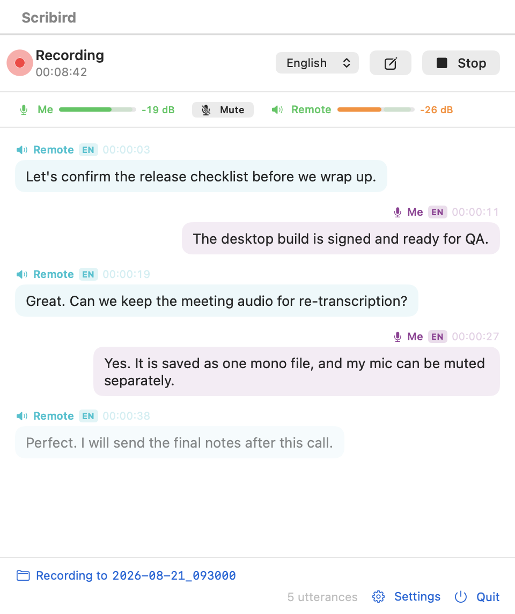
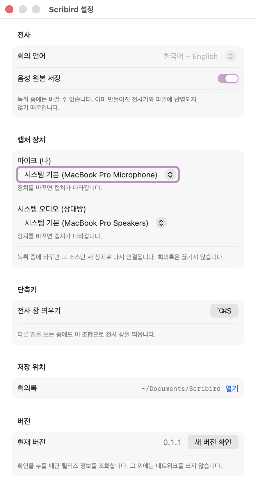
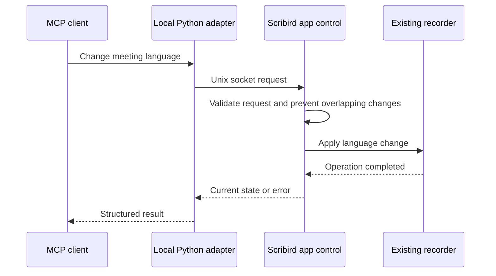

<div align="center">
  

  <h1>Scribird</h1>

  <p><strong>A macOS menu-bar app that transcribes your meetings in real time — entirely on-device.</strong></p>

  <p>
    <a href="./LICENSE"></a>
    
    
    <a href="https://github.com/haandol/scribird/releases/latest"></a>
  </p>
</div>

Scribird writes down your Zoom or Teams meeting while it happens. Your microphone is
labeled **me**, whatever comes out of your speakers is labeled **remote**, and when the
meeting ends you are left with a transcript and the meeting audio in a single folder.

You can also [transcribe an audio file or the audio from an MP4/MOV video](mcp/file-transcription.md)
from **Transcribe File** in the app, the command line, or the local
`transcribe_audio` MCP tool. File imports support English or Korean and save timed
JSONL and Markdown transcripts; imported speakers are marked `unknown`. Choose
**SpeechAnalyzer** or **Qwen3 ASR** for live recording and file imports. Qwen3 uses
[Alkd/Qwen3-ASR-1.7B-MLX-8bit](https://huggingface.co/Alkd/Qwen3-ASR-1.7B-MLX-8bit)
on Apple Silicon and downloads its runtime and model on first use.

The [local MCP server](mcp/README.md) also controls live recording, meeting language
(English, Korean, or both), microphone mute, devices and settings, and reads current
or saved transcripts. It connects to the running app without keyboard/mouse control.

Transcription and storage both happen on your machine. **Scribird does not upload
meeting audio or transcripts.** Transcript tools return text to the configured MCP
client, whose own handling of that text is outside Scribird. macOS may download the
mandatory English Speech asset at launch. Release checks run only when you press
*Check for updates* or call `check_for_updates`; see [Network use](#network-use).

The interface is available in **Korean and English**, following your system language by default
and switchable in settings. The screenshots below use the English interface and fixed,
non-identifying mock meeting data rendered by the real SwiftUI components.

> [!NOTE]
> A separate, opt-in [plugin](#optional-splitting-remote-into-individual-speakers) for Claude
> Code and Codex can split *remote* in legacy source-separated sessions into individual
> participants afterwards. It sends the saved audio to **your own** AWS account, so it is
> deliberately outside the app. For the app's model setup and release checks, see
> [Network use](#network-use).

<div align="center">
  
</div>

*Me* is aligned right, *Remote* is aligned left, and the two use different colors. The `EN`
badge shows which language each utterance was recognized in. The last line is dimmed because
it is still volatile — the moment it is finalized it sharpens and is written to disk.

## Features

|  | |
|---|---|
| **Automatic speaker attribution** | Microphone is *me*, system output is *remote*. The audio path decides the speaker, so there is nothing to infer and nothing to get wrong |
| **Live transcription** | Volatile text appears dimmed while you speak and sharpens once finalized. Finalized text is written to disk immediately |
| **Local file ASR** | Transcribe audio files and MP4/MOV video audio with SpeechAnalyzer or Qwen3 ASR. Use the app, CLI or MCP |
| **Korean + English** | Both languages are recognized at once. Code-switching meetings keep both sides thanks to token-level arbitration |
| **Switch language mid-meeting** | Pick any installed meeting language from the transcript window while recording. The audio and transcript continue — only the transcribers change |
| **Meeting audio kept** | Microphone and system output are mixed live into one mono `meeting.m4a` for natural playback and later re-transcription |
| **Silent failures surfaced** | A denied permission raises no error; it just delivers silence. Scribird judges by amplitude and warns you mid-recording |
| **Input level meters** | Per-source dBFS in real time with the recommended range marked, so you don't find out after the meeting |
| **Per-meeting session boundaries** | Starting a new meeting swaps the output files without interrupting capture — you don't lose the opening of the next meeting |
| **Follows device changes** | Plug in a headset mid-meeting and capture moves with it, without splitting the transcript or the audio files |
| **Or pin a device** | Choose a specific microphone or output device per source and capture stays there, even when the system default moves |
| **Korean or English interface** | The screen follows your system language and can be switched in settings. Transcript files keep English speaker labels either way, so tools reading them see one vocabulary |
| **Shortcuts** | `⌥⌘S` brings up the transcript window globally. While Scribird has focus, the configurable microphone-mute shortcut (default `⌘Y`) toggles only your microphone |

## System Requirements

macOS 26 or later, on Apple silicon or Intel. The on-device `SpeechAnalyzer` API that
Scribird is built on does not exist on earlier releases, so there is no back-deployed
build.

Live recording requires the English Speech model. If it is missing, macOS downloads it
when Scribird starts. Korean is optional and can be installed from settings or through the MCP tool
`install_speech_model`. Qwen3 file
transcription uses its own model and additionally requires Apple Silicon and `uv`;
see [Local Qwen3 ASR](#local-qwen3-asr).

## Installation

### From a release

Download `Scribird-<version>.zip` from the
[latest release](https://github.com/haandol/scribird/releases/latest), unzip it, and move
`Scribird.app` into `/Applications`.

> [!IMPORTANT]
> **These builds are not notarized.** On macOS 26, Gatekeeper can show an alert with only
> *Move to Trash* and *Done*; right-clicking the app and choosing *Open* may still be blocked.
> After confirming that the ZIP came from this repository's release page and that its
> SHA-256 matches the release notes:
>
> 1. Move `Scribird.app` to `/Applications` and try to open it once.
> 2. In the warning, click **Done** — not *Move to Trash*.
> 3. Open System Settings › Privacy & Security, scroll down to **Security**, and click
>    **Open Anyway** next to Scribird.
> 4. Authenticate, then confirm **Open** when macOS asks again.
>
> This creates an exception for this copy of Scribird. Do not disable Gatekeeper globally or
> remove quarantine metadata from an app whose source and checksum you have not verified.
> See Apple's [guidance for opening an unnotarized app](https://support.apple.com/102445).
> A build made locally from source does not normally need this override.

### From source

You need a Swift 6.2+ toolchain and macOS 26 (verified on Swift 6.3.3 / macOS 26.5.2).

```bash
git clone https://github.com/haandol/scribird.git
cd scribird
./install.sh          # release-build, then replace /Applications/Scribird.app
```

To build and run it in place instead:

```bash
./build.sh release
open build/Scribird.app
```

It has to be wrapped in an `.app` bundle and code-signed. A bare executable cannot obtain
microphone or audio-capture permission, because macOS ties permissions (TCC) to the bundle
identifier.

> [!WARNING]
> **Signing is a functional requirement here, not a distribution one.** `build.sh` looks for
> a `Developer ID Application` or `Apple Development` certificate in your keychain (override
> with `SIGN_IDENTITY`). Without one it falls back to ad-hoc signing, which leaves
> `TeamIdentifier` empty — and in that state system-audio capture never prompts and silently
> delivers nothing but silence. If the remote voice isn't picked up, check the signing
> identity before you debug anything else.

## How to use it

1. Click the waveform icon in the menu bar, or press `⌥⌘S`, to bring up the transcript window.
2. Wait for the English model to show as installed, then press **Start**.
3. Check that both level meters move — a meter that doesn't move means that source isn't arriving.
4. When the meeting changes, press **✎** to cut the transcript. Capture is not interrupted.
5. Press **Stop**. It wraps up within 6 seconds and shows a link to the output folder.

### Control Scribird through MCP

MCP (Model Context Protocol) lets an agent call Scribird's recording, settings and
transcript functions. The local server exposes **23 tools**. Live controls use the
running app's recorder and settings, so changes also appear in its interface.

Build and launch the current app as described in [From source](#from-source), then
install the adapter dependencies from the repository root:

```bash
uv sync --project mcp --frozen
```

Configure your MCP client to start this standard input/output (stdio) command,
replacing the directory with your checkout's absolute path:

```bash
uv run --directory /absolute/path/to/scribird/mcp --frozen python server.py
```

Use the absolute path to `uv` if it is missing from the client's PATH. Reconnect the
MCP server after adding it. See the [connection guide](mcp/README.md#connection-and-app-lifecycle)
for client configuration, executable selection, multiple app instances and timeouts.

| Responsibility | Available controls |
|---|---|
| **Live recording** | Start/stop, split sessions, change meeting language, and mute/unmute the microphone |
| **Settings and devices** | Read/change recording preferences, output folder, interface language, shortcuts and capture devices; inspect/install speech models |
| **Transcripts** | Read current or saved transcripts, list sessions, and transcribe local audio files |
| **App access** | Launch the app, read status and warnings, show windows, dismiss errors, and request a release check |

For a meeting using both Korean and English:

1. Call `launch_app` if needed, then `get_speech_models`. If a required model is
   missing, call `install_speech_model` and poll until installation finishes.
2. Call `start_recording` with `{"language":"auto"}`. Here **`auto` means Korean +
   English together** and requires both models. The other choices are `korean` and
   `english`.
3. To change recognition during recording, call `set_recording_language`, for
   example with `{"language":"korean"}`. Capture and the current session continue.
4. Call `stop_recording` to finalize the files. Its response identifies the saved
   session, which you can inspect with `read_session`.

`set_interface_language` changes screen text only. Audio-retention and output-folder
settings are locked during startup, recording and finalization; the meeting language
can change during recording.
File transcription accepts one language per file, `english` or `korean`, and does not
use live `auto` mode.

Control requests use a Unix socket accessible only to the current user. They do not
need browser, keyboard or mouse automation. After a timeout, read `get_app_status`
before repeating a change: the app may still finish the original operation. The
[tool guide](mcp/README.md) documents each input, result and restriction.

<a id="local-qwen3-asr-for-audio-files"></a>

### Local Qwen3 ASR

For live meetings, open **Settings → Recording → Transcription engine** and choose
**Qwen3 ASR (MLX 8-bit)**. The selection is saved and applies to the next recording;
finish the current recording before switching engines. English, Korean and Korean + English
are available independently of Apple Speech model installation. Initial setup finishes before
capture begins. Results arrive in chunks, with additional inference delay, and retain the
microphone/remote speaker labels. Each source has an independent local worker.

Live sessions save the engine, model and timestamp precision in `transcription.json`.
Qwen3 transcript records also identify chunk timing; those boundaries are not exact utterance
or word times. Language changes and new-session actions keep capture running. Unfinished
processing or input overflow is reported, and already saved results and audio are retained.

ASR means automatic speech recognition: converting speech into text. Click
**Transcribe File** in the transcript window, select an MP3, M4A, WAV, AIFF, CAF,
MP4 or MOV file, and choose **Qwen3 ASR (MLX 8-bit)** or **SpeechAnalyzer** under **ASR engine**.
Choose **English** or **Korean**, then click **Transcribe**.

For video, Scribird extracts the **first audio track** without playing or decoding
the video frames. It preserves the original video timeline, including delayed audio
and gaps. Temporary audio uses WAV, so this step does not add MP3 compression loss.
The temporary file is removed after ordinary completion or cancellation; there is
no separate MP3 export. A video with no audio track returns an error. Other video
formats depend on macOS media support.

| Engine | Required setup | Time information |
|---|---|---|
| **SpeechAnalyzer** — default | macOS 26+ and the selected Speech model installed through Scribird settings | Utterance time ranges |
| **Qwen3 ASR** — local MLX | Apple Silicon, macOS 26+, and `uv`; Scribird prepares Python/MLX and the model on first use | Input chunks of up to 20 seconds, not exact utterance or word boundaries |

**Scribird installation alone does not complete Qwen3 setup.** Install
[`uv`](https://docs.astral.sh/uv/getting-started/installation/) first. If you use
Homebrew:

```bash
brew install uv
```

On the first Qwen3 transcription, Scribird uses `uv` to create a private **Python
3.12** environment with the locked MLX dependencies and download
**[Alkd/Qwen3-ASR-1.7B-MLX-8bit](https://huggingface.co/Alkd/Qwen3-ASR-1.7B-MLX-8bit)**
(approximately 2.3 GB). You do not need to install Python or MLX system-wide. The
runtime lives under `~/Library/Application Support/Scribird/QwenRuntime/`; model
weights use the local Hugging Face cache. This first setup needs internet access.
After it completes, transcription works offline without uploading audio or text.

For CLI use, point at the installed app's executable:

```bash
/Applications/Scribird.app/Contents/MacOS/Scribird \
  --transcribe "/absolute/path/meeting.mp3" \
  --engine qwen3 \
  --language korean
```

The same engine is available through the **`transcribe_audio` MCP tool**. After
[connecting the MCP server](mcp/README.md#connection-and-app-lifecycle), pass:

```json
{
  "file_path": "/absolute/path/meeting.mp3",
  "engine": "qwen3",
  "language": "korean"
}
```

Each file import saves `transcript.jsonl`, `transcript.md` and `result.json` in a new
`import-<UUID>` folder. Imported speakers are `unknown`; file transcription does
not identify individual speakers. The original audio is unchanged. Engine selection
here applies to file imports and does not change the live engine selected in settings.
See the [full file transcription guide](mcp/file-transcription.md) for output locations, cancellation,
timeouts and runtime overrides.

### Reading the level meters

The shaded band is the recommended range, **-24 to -3 dBFS**. Below -24 the source is too
quiet to be worth re-listening to later; above -3 it is clipping. If a source stays silent
past its grace period — 4 seconds for the microphone, 8 for system output, because a
meeting may genuinely have nothing playing yet — the meter is replaced by the likely cause
and a link to the relevant System Settings pane.

### Settings

Everything you set once and forget lives in the settings window (`⌘,`), split across three tabs
by what the setting is *about* — **General** (interface language, both hotkeys, the update check),
**Recording** (language models, meeting language, plus what the output contains and where it goes), and **Device**
(which microphone and which output device to capture). The transcript window keeps only what you
look at during a meeting.

**The meeting language is in both places on purpose.** You set it before a meeting in settings,
but you find out it was wrong *during* one — a missing utterance is the signal — so the transcript
window carries the same picker. Changing it there does not interrupt anything: capture keeps
running, `meeting.m4a` keeps growing, and the transcript continues in the same file. Only
installed language combinations appear. Install Korean from settings before selecting Korean
or Korean + English.

**The interface is available in Korean and English.** It follows your system language unless
you pick one, and picking one keeps it even if the system language later changes. Note that this
is separate from the *meeting* language — you can read an English interface while recording a
Korean meeting, or the reverse. Speaker labels inside `transcript.md` are always English
regardless of this setting, because that file is read later by other tools and its vocabulary
should not depend on a preference.

<div align="center">
  
</div>

The Recording tab shows model status per language. English is mandatory and installed
automatically when absent; Korean remains optional and is installed from this screen. During
recording, settings that would contradict live transcribers or open file handles are disabled
with an explanation. **Capture devices stay editable while recording**, because that's exactly
when you notice you picked the wrong one. The folder-opening toggle and interface language also
stay editable because they do not alter the live capture or archive.

## Where your data goes

Each session gets its own directory, named for the moment it started. If two
sessions start within the same second, the later one gets a unique suffix so it
cannot overwrite the first:

```
~/Documents/Scribird/2026-07-31_142530/
```

**You can put that folder somewhere else.** Settings → Save location lets you pick any folder —
a synced folder so meetings reach your other machines, an external volume, or an encrypted disk.
Pick nothing and it stays where it is above. Two things to know: existing transcripts are **not**
moved when you change it (the app never relocates your files — a half-finished move of a meeting
you can't re-record is worse than two folders), and if the folder you picked is gone at the
moment you start recording — an unplugged drive — Scribird records into the default location
instead and tells you so. It does not refuse to record, because a meeting happens once.

**The transcript window always shows where recordings are stored**, so you can confirm one is
actually being saved without waiting for it to end. Click it to open that folder. What it
points at follows the app's state — the session being written to while recording, the last one
after stopping, and the root above them before you've recorded anything — and the label says
which of the three you're looking at.

When a recording stops, that session's folder opens on its own, and the transcript window steps
behind it — it floats above other apps so a meeting can't hide it, but not above something you
just asked for. Click the transcript window to bring it back above everything. Turn the
auto-opening off in settings if you record back-to-back meetings and don't want the window.
Starting a *new session* mid-meeting does not open anything, since you're still in the meeting.

| File | Contents |
|---|---|
| `transcript.jsonl` | One finalized utterance per line (speaker, timestamp, confidence, language), flushed as soon as it is finalized |
| `transcript.md` | Readable transcript, grouped by speaker |
| `meeting.m4a` | Microphone and system output mixed live into one 48 kHz mono AAC file |

`meeting.m4a` is only written when *Save meeting audio* is on, which
is the default. Nothing here is ever pruned or rotated — the folder grows until you delete
from it.

### Network use

When the mandatory English Speech asset is absent, Scribird asks macOS to install it at
launch. Korean is downloaded only after an install action in settings or an explicit
`install_speech_model` MCP call. These system asset requests never include meeting
audio, transcripts, usage counts, or a device identifier.

Starting a file import with Qwen3 may download its Python/MLX runtime and model from
package registries and Hugging Face. [First-use setup](#local-qwen3-asr)
is initiated by the user; subsequent runs reuse local files. The worker disables
Hugging Face telemetry and never uploads the input audio or transcript.

The release lookup runs only when you press *Check for updates* or call the
`check_for_updates` MCP tool. There is no launch or periodic release check. Scribird never downloads an update
either — it points you at the release page. Release downloads are not notarized, so follow
the first-launch steps in [Installation](#from-a-release).

## Optional: splitting *remote* into individual speakers

Because a meeting app mixes participants down before Scribird ever sees them, *remote* is one
label for everyone on the far side.

[`plugin/scribird-diarize`](./plugin/README.md) is a Claude Code plugin that does exactly that.
It currently supports legacy sessions that contain `remote.m4a` and `me.m4a`; current
`meeting.m4a` sessions are not source-separated and are not accepted by this workflow. For
legacy sessions it sends `remote.m4a` to Amazon Transcribe for speaker partitioning and overlays only the speaker
boundaries onto the transcript you already have, splitting the single `상대방` label
(*remote*, as the app writes it) into actual participant names when evidence supports them,
or `Unknown 1` / `Unknown 2` otherwise:

```
Before   [상대방]   00:12  Let's ship on Tuesday next week, then.
         [상대방]   00:18  I'd prefer the week after. QA needs the time.

After    [Alice]     00:12  Let's ship on Tuesday next week, then.
         [Unknown 2] 00:18  I'd prefer the week after. QA needs the time.
```

> [!WARNING]
> **This sends meeting audio to Amazon Transcribe under your own AWS account.** That is the
> opposite of how the app works, which is why it lives outside the app and never runs on its
> own. It uses your local `aws` credentials, prints exactly what it is about to send, and
> refuses to proceed until you confirm.
>
> The plugin uploads the saved M4A to a private S3 location and runs an Amazon Transcribe batch
> job. It states the required AWS permissions and temporary storage location before asking for
> approval, and deletes the job objects after a successful run unless you explicitly keep them.

### Prerequisites

| | Check |
|---|---|
| [Claude Code](https://claude.com/claude-code) or [Codex](https://developers.openai.com/codex/cli) | `claude --version` / `codex --version` |
| AWS CLI with working credentials | `aws sts get-caller-identity` |
| A region set | `aws configure get region` |
| Python 3 | already there — macOS ships `/usr/bin/python3`, and nothing needs `pip install` |

The batch path needs `s3:CreateBucket`, `s3:PutBucketPublicAccessBlock`, `s3:PutObject`,
`s3:GetObject`, `s3:DeleteObject`, `s3:ListBucket`,
`transcribe:StartTranscriptionJob`, and `transcribe:GetTranscriptionJob`.

### Install

The repository doubles as a plugin marketplace for both agents. Register it, then install the
plugin from it — substitute the path where you cloned this repository.

**Claude Code**

```bash
claude plugin marketplace add ~/git/scribird
claude plugin install scribird-diarize@scribird
```

Inside a session, `/plugin marketplace add ~/git/scribird` then picking it from `/plugin` does
the same thing. Invoke it with `/multi-speaker-diarize` or just describe the task.

**Codex**

```bash
codex plugin marketplace add ~/git/scribird
codex plugin add scribird-diarize@scribird
```

Invoke it with `$multi-speaker-diarize` or describe the task. Verify with
`codex plugin list`, which should show `scribird-diarize@scribird` as *installed, enabled*.

Both read the same skill; the two `plugin.json` files differ only in the metadata each agent
expects. Once this repository is on GitHub you can also register it remotely — with
`claude plugin marketplace add haandol/scribird` or `codex plugin marketplace add
haandol/scribird` — which is the same marketplace fetched over Git instead of read from disk.

### Use it

Just ask, in either agent:

```
split the remote speaker in ~/Documents/Scribird/2026-07-31_142530 by participant
```

The agent picks the session, reads the language out of your existing transcript, shows you what
is about to be sent, and waits. Nothing leaves the machine until you say yes. It then reports
how many speakers were found and which words the two engines heard differently. Before analysis,
it asks for the participant count and names you know. Names and optional role hints stay local;
verified matches are applied, and every unresolved speaker receives a stable `Unknown N` name
instead of failing the merge.

You can also run the scripts directly, which is useful when you want to see the exact steps:

```bash
cd plugin/scribird-diarize/skills/multi-speaker-diarize
SESSION=~/Documents/Scribird/2026-07-31_142530

# 1. Print the plan and stop (exit 3). Nothing has been sent yet.
/usr/bin/python3 scripts/run_transcribe.py \
  --session "$SESSION" --language-code ko-KR --max-speakers 5

# 2. Approve and run it.
/usr/bin/python3 scripts/run_transcribe.py \
  --session "$SESSION" --language-code ko-KR --max-speakers 5 --yes

# 3. Overlay the speaker boundaries onto your transcript.
/usr/bin/python3 scripts/merge_speakers.py --session "$SESSION" --aws-remote "$SESSION/aws-remote.json"

# 4. Optionally apply locally verified participant names.
/usr/bin/python3 scripts/merge_speakers.py \
  --session "$SESSION" \
  --aws-remote "$SESSION/aws-remote.json" \
  --speaker-names "$SESSION/speaker-names.json"
```

### What you get

Three new files land next to the originals, which are never modified:

| File | Contents |
|---|---|
| `transcript.speakers.md` | The readable transcript, now split by speaker. Body text is still your on-device transcript |
| `transcript.speakers.jsonl` | Machine-readable. Keeps the original `me`/`remote` in a `source` field, so the certain two-way split is always recoverable |
| `diarization-report.md` | How many speakers, how much each one talked, and every word the two engines wrote differently |

When participant names are provided, `speaker-names.json` remains local and records the evidence
used for verified names and candidates. Invalid or conflicting entries are reported as warnings;
they do not prevent the three result files from being generated.

### Two properties worth knowing

These are what make the result trustworthy:

- **The `me` / `remote` split is never re-derived.** That one came from the audio path and
  cannot be wrong; only the *inside* of `remote` is estimated. `me.m4a` is not sent at all
  unless you ask for it, since a microphone's speaker is already settled. (Pass
  `--sources remote,me` when the meeting was in-person and other voices reached your mic.)
- **Your on-device transcript stays the transcript.** Amazon Transcribe is called for speaker
  boundaries, not for text. Where the two engines disagree on a word, the difference is
  reported rather than silently applied — deciding which one is right needs meaning, and the
  script doesn't claim to have it.

### Batch behavior

The plugin has one cloud-analysis path: upload to S3 and run an Amazon Transcribe batch job.
It can set `--max-speakers` from 2–30 and use multi-language identification. A missing bucket
is created with public access blocked; successful runs delete their per-run objects by default.
There is no streaming fallback.

See [`plugin/README.md`](./plugin/README.md) for the full option list and the reasoning behind
each default.

## Permissions

Two things have to be allowed on first launch. **Screen-recording permission is never
requested**, and neither is accessibility.

| Permission | System Settings pane | Used for |
|---|---|---|
| Microphone | Privacy & Security › Microphone | Transcribing what you say |
| Audio Recording | Privacy & Security › Audio Recording | Transcribing the remote voices |

If one of the two is missing, the other keeps working. Microphone transcription still runs
without a meeting app open, and your own speech is still recorded without audio-capture
permission. The session is only abandoned when both sources fail.

## Preferences Storage

Everything in the settings window persists across launches. Preferences live in
`~/Library/Preferences/com.scribird.app.plist` under the `com.scribird.app` domain:

```bash
defaults read com.scribird.app
```

| Key | Setting | Default |
|---|---|---|
| `interfaceLanguage` | Interface language | unset (follow system language) |
| `transcriptionLanguage` | Meeting language | `english` |
| `savesOriginalAudio` | Save original audio | `true` |
| `pinnedInputDeviceUID` | Pinned microphone | unset (follow system default) |
| `pinnedOutputDeviceUID` | Pinned output device | unset (follow system default) |
| `transcriptRootPath` | Save location | unset (use the default folder) |
| `hotKeyCode`, `hotKeyModifiers` | Global hotkey (show transcript) | `⌥⌘S` |
| `settingsHotKeyCode`, `settingsHotKeyModifiers` | Open settings | `⌘,` |

Window positions and the menu-bar item position are stored in the same domain by AppKit.
A value that can't be interpreted falls back to its default rather than failing to start a
recording — deleting the whole domain resets every setting:

```bash
defaults delete com.scribird.app
```

> [!NOTE]
> Because these persist, a setting you changed once stays changed. If original-audio saving
> was turned off in an earlier session, no `.m4a` files appear in later ones. The current
> language is always readable in the transcript window's header for that reason.

## Troubleshooting

Start with the cheap checks; each one rules out a whole class of cause.

1. **Are both level meters moving?** A meter that never moves means that source is not
   arriving at all — that is a permission or device problem, not a transcription problem.
2. **Is anything actually playing?** System-audio capture taps the output device. If the
   meeting app is routing to a headset that isn't the system default output, Scribird
   won't see it.
3. **Check the signing identity.** An ad-hoc-signed build silently yields silence on the
   system-audio path:
   ```bash
   codesign -dv /Applications/Scribird.app 2>&1 | grep TeamIdentifier
   ```
   An empty or missing `TeamIdentifier` is the problem. Rebuild with a real certificate.
4. **Confirm the permission is actually granted**, in System Settings › Privacy & Security
   under both *Microphone* and *Audio Recording*.

For permission resets, device-switching problems, model download failures, and the rest,
see **[docs/Troubleshooting.md](./docs/Troubleshooting.md)**.

## Known limitations

All of these came out of measurement or are direct consequences of a design decision.
Knowing them up front saves some surprise.

- **Speaker separation tops out at *me* vs. *everyone remote*.** Individual participants are
  not distinguished. Apple Speech has no diarization API, and meeting apps mix participants
  down to a single stream before handing it to Core Audio. That is exactly why the original
  audio is kept per source — see
  [splitting *remote* afterwards](#optional-splitting-remote-into-individual-speakers) for an
  opt-in tool that does it, at the cost of leaving the device.
- **Remote audio recognizes less accurately.** The remote voice has already been through a
  codec and been played back. It is especially noticeable in Korean.
- **Switching devices costs a moment of audio.** Scribird follows the default input and
  output device while recording, so plugging in a headset right before or during a meeting
  keeps transcription going — but the audio during the reconnect itself is not captured, and
  cannot be recovered. A notice names the device it moved to so the gap isn't mistaken for
  silence in the meeting.
- **A pinned device stops following the system.** That's the point of pinning, but it means
  plugging in a headset won't move a pinned source. Settings states which device each source
  is on, and if a pinned device is absent Scribird falls back to the system default and says
  so — the pin itself is kept, so reconnecting the device restores it.
- **If the meeting is monolingual, picking that one language is more accurate.** In a
  multilingual configuration, utterances at a code-switching boundary can be clipped short.
  Choosing a single language skips the arbiter entirely, so that loss doesn't occur.
- **Original-audio saving and the output folder are locked while recording.** They
  determine the files already open for the session. Meeting language remains changeable
  through the interface or `set_recording_language`, provided the required models are installed.
- **Stop completes within 6 seconds.** The transcript and audio files must be saved even if
  one transcriber stops responding, so past that deadline the remaining tasks are cancelled
  and whatever was secured is written out.
- **App Sandbox is off.** That is convenient for working with Core Audio taps and for keeping
  transcripts in Documents. Targeting the App Store would mean turning it on and adjusting
  the file-access scope.

Zoom and Scribird *can* share the microphone — macOS input devices are multi-client, so the
mic opens even while a meeting app is using it. Note that the meeting app's echo
cancellation can change the characteristics of the microphone signal.

## Uninstallation

```bash
rm -rf /Applications/Scribird.app
defaults delete com.scribird.app
tccutil reset Microphone com.scribird.app
tccutil reset AudioCapture com.scribird.app
```

> [!TIP]
> Your meetings are **not** removed by any of the above. Transcripts and audio stay in
> `~/Documents/Scribird/` — or wherever you pointed the save location — until you delete them
> yourself, which is deliberate — an uninstall should not throw away a meeting record.

---

## How it works

The key to speaker separation is splitting the audio **before** anything is mixed.

```
Microphone in  ──→ AVAudioEngine tap       ──→ SpeechAnalyzer #1 ──→ [me]     ─┐
                                                                               ├─→ TranscriptTimeline ─→ JSONL + Markdown
System output  ──→ Core Audio Process Tap  ──→ SpeechAnalyzer #2 ──→ [remote] ─┘
   (whatever Zoom/Teams plays back)
```

Sound arriving through the microphone is necessarily me, and sound the system plays back is
necessarily someone else. Giving each source its own `SpeechAnalyzer` makes the speaker
label a fact rather than an inference.

System audio comes from a **Core Audio process tap** rather than ScreenCaptureKit because
of permissions. ScreenCaptureKit checks screen-recording permission
(`kTCCServiceScreenCapture`) even when all you want is audio — its entry point
`SCShareableContent` is an API that returns a list of windows and displays, and that is also
the only TCC service its backing daemon `/usr/libexec/replayd` references. Calling it from a
bundle that declares only `NSAudioCaptureUsageDescription` fails with `-3801
(userDeclined)`. A process tap uses `kTCCServiceAudioCapture` and nothing else.

The reasoning behind each decision and the alternatives that were rejected are recorded in
the repository's ADR index. If you want to know *why* something is the way it is, that is the
primary source. The ADRs are written in Korean.

### MCP control flow

The adapter in `mcp/live_tools.py` declares the public tools; `mcp/app_client.py`
handles their local socket connection. In the app, `ControlCommand` defines supported
commands, accepted input keys and which requests change state. `AppControl` validates
and dispatches them to recording, settings or status handlers. These handlers share
the app's existing recorder; they do not create a second live capture pipeline.


```mermaid
sequenceDiagram
    participant Client as MCP client
    participant Adapter as Local Python adapter
    participant App as Scribird app control
    participant Recorder as Existing recorder
    Client->>Adapter: Change meeting language
    Adapter->>App: Unix socket request
    App->>App: Validate request and prevent overlapping changes
    App->>Recorder: Apply language change
    Recorder-->>App: Operation completed
    App-->>Adapter: Current state or error
    Adapter-->>Client: Structured result
```

Only one MCP change runs at a time; status and transcript reads remain available.
The app clears the pending-operation marker before returning a completed state.
File imports use a separate local worker and retain their own cancellation and output
contracts. See [CONTRIBUTING.md](CONTRIBUTING.md) for regression and MCP integration tests.

## Contributing

Issues and pull requests are both welcome. See **[CONTRIBUTING.md](./CONTRIBUTING.md)** for
the build commands, the manual smoke test that hardware changes require, the ADR-first
workflow, and the commit conventions.

Two things are worth knowing before you start:

- The **[architecture invariants](./AGENTS.md#architecture-invariants)** in `AGENTS.md` were
  each established by measurement. Read them before touching the capture or transcription
  path — undoing one reintroduces a bug that is hard to notice.
- **Never commit recorded meeting audio or generated transcripts.**

To report a security issue, see [SECURITY.md](./SECURITY.md).

## Credits

Built on Apple's on-device `SpeechAnalyzer` and Core Audio process taps. The app icon is in
[`Resources/AppIcon.png`](./Resources/AppIcon.png) and is regenerated into `.icns` at build
time by `build.sh`.

## License

[MIT](./LICENSE)
