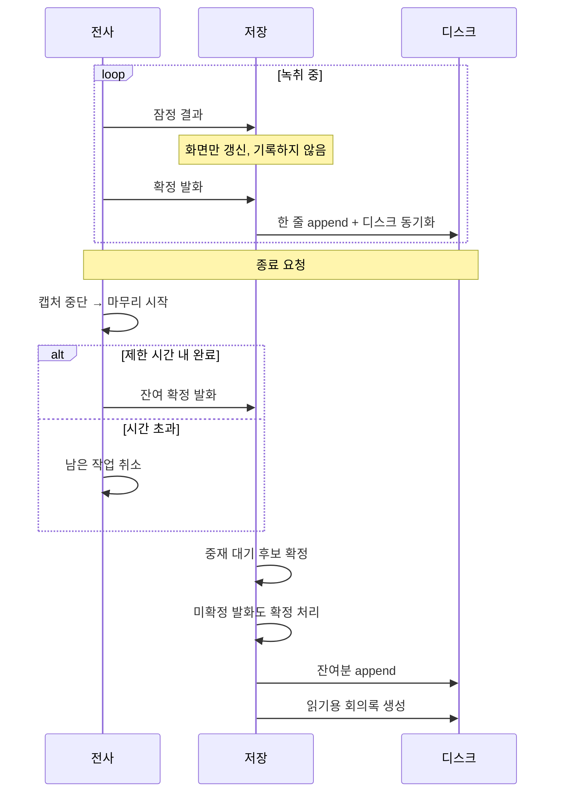

# ADR 0001: 회의록을 발화 확정 즉시 append 하고 종료를 시간 제한한다

Date: 2026-07-30

## Status

Proposed

## Context

회의는 길다. 한 시간짜리 회의를 전사하는 동안 앱이 죽을 수 있고, 기기가 잠들거나
강제 종료될 수도 있다. 그리고 회의록은 **다시 만들 수 없는 산출물**이다 — 회의는 한 번
일어나고 끝난다.

동시에 회의록은 두 가지 소비 방식을 가진다. 하나는 기계 처리(나중에 검색·분석·재처리),
하나는 사람의 읽기. 두 요구가 같은 형식으로 잘 충족되지 않는다. 사람이 읽으려면 화자별로
묶고 시각을 정리한 문서가 좋은데, 그런 형식은 발화가 하나 추가될 때마다 문서 구조가
바뀌므로 증분 기록에 적합하지 않다.

종료 경로에도 문제가 있다. 전사 분석기는 남은 오디오를 확정 결과로 비우는 마무리
단계를 거치는데, 이 단계가 응답하지 않을 수 있다. 마무리를 무한정 기다리면 이미
확보한 회의록과 오디오 파일까지 저장되지 못한 채 사용자가 앱을 강제 종료하게 된다.

## Decision Drivers

- 회의록은 재생성이 불가능하고 앱은 회의 중간에 죽을 수 있다 — 종료 시 일괄 기록은 그
  시점까지의 전부를 영구히 잃는다.
- 기계 처리용 형식과 사람이 읽는 형식의 요구가 다르다 — 후자는 증분 기록에 부적합하다.
- 전사기의 마무리 단계가 응답하지 않을 수 있다.
- 잠정 결과는 계속 바뀌므로 그대로 기록하면 같은 발화가 중복으로 남는다.

## Decision

기록을 **두 형식으로 분리**하고 각각 다른 시점에 쓴다.

**기계 처리용 기록은 발화가 확정될 때마다 즉시 append 한다.** 한 발화가 한 줄인
줄 단위 형식을 쓰고, 확정 즉시 디스크에 흘려보낸 뒤 동기화까지 요청한다.

내구성의 층이 두 개다. **앱 크래시**는 발화마다 쓰기를 내보내는 것만으로 막힌다 —
쓰기가 커널로 넘어가면 프로세스가 죽어도 내용은 남는다. **OS 패닉·전원 손실**은
그것으로 부족해 디스크 동기화가 필요하다. 회의록은 다시 만들 수 없으므로 후자까지
대비하고, 발화당 한 번의 동기화 비용을 받아들인다.

**잠정 결과는 기록하지 않는다** — 계속 바뀌는 값이므로 확정된 것만 남긴다.

**사람이 읽는 회의록은 세션 종료 시 한 번 생성한다.** 같은 화자의 연속 발화를 한
단락으로 묶는 구조는 전체 발화 목록이 확정된 뒤에야 정할 수 있다 — 이것이 종료 시
생성하는 근거다.

즉 **즉시 기록이 내구성을 담당하고, 종료 시 생성이 가독성을 담당한다.** 크래시로
후자를 잃어도 전자에서 복원할 수 있다.

**종료 시 전사기 마무리를 시간 제한한다.** 제한 시간 안에 마무리가 끝나지 않으면 남은
작업을 취소하고 다음 단계로 넘어간다. 확정되지 못한 마지막 발화도 버리지 않고 저장한다 —
불완전한 발화가 누락된 발화보다 낫다. 다국어 중재로 대기 중인 후보도 먼저 확정해
시간축을 완전하게 만든 뒤 저장한다.

### 대안 검토

#### 메모리에 모아 종료 시 두 형식을 함께 쓴다

쓰기가 세션당 한 번뿐이라 디스크 I/O가 최소이고, 회의 중 동기화 비용이 없다. 두 형식을
같은 시점에 같은 데이터로부터 생성하므로 둘 사이의 불일치가 원리적으로 발생하지 않고,
정렬이나 중복 제거도 전체를 손에 쥔 상태에서 한 번에 처리할 수 있어 코드가 단순하다.

채택하지 않은 이유는 실패 모드가 치명적이라는 것이다. 앱이 죽는 순간 **그 회의의 회의록
전체가 사라진다** — 재생성 불가능한 산출물에 대해 받아들일 수 없는 위험이다. 한 시간
회의의 59분째에 죽으면 59분이 없어진다. 절약되는 것은 회의당 수백 번의 짧은 쓰기인데,
이는 최신 저장 장치에서 무시할 수 있는 비용이다. 위험과 이득의 비율이 성립하지 않는다.

#### 단일 형식만 쓰고 읽기용 문서는 필요할 때 변환한다

저장 경로가 하나로 줄어 두 형식 간 불일치 가능성이 사라지고, 즉시 append의 내구성을
그대로 유지한다. 읽기용 문서는 별도 도구나 나중의 변환 단계로 만들 수 있다.

채택하지 않은 이유는 제품의 산출물 성격이다. 이 앱의 결과물은 사용자가 회의 직후 열어
읽는 회의록이고, 줄 단위 기계 형식은 그 목적에 적합하지 않다. 변환을 사용자에게 맡기면
앱이 회의록 도구가 아니라 데이터 수집기가 된다. 두 형식을 유지하는 비용은 종료 시 한
번의 생성이므로 낮고, 불일치 위험도 한쪽이 다른 쪽에서 파생되는 관계이므로 관리
가능하다.

## Consequences

### Positive

- 크래시가 나도 그 시점까지 확정된 발화가 모두 디스크에 남는다.
- 사람이 읽는 회의록을 잃어도 즉시 기록에서 복원할 수 있다 — 형식 분리가 이중화 역할을
  한다.
- 종료가 시간 제한되므로 전사기가 응답하지 않아도 회의록과 오디오 파일이 저장된다.
- 미확정 발화와 중재 대기 후보까지 저장하므로 종료 시점의 손실이 최소화된다.

### Negative

- 발화마다 디스크 동기화를 요청하므로 세션당 쓰기 횟수와 I/O 비용이 증가한다.
- 같은 내용이 두 형식으로 존재하므로 저장 공간이 중복되고, 한쪽 생성이 실패하면 두
  형식이 불일치한다.
- 종료 시간 제한이 만료되면 전사기가 만들던 마지막 확정 결과를 잃을 수 있다 — 완전성을
  가용성과 교환한 것이다.

### Risks

- 시간 제한을 넘긴 세션에서는 마지막 몇 초의 발화가 미확정 상태로 저장되어 정확도가
  낮을 수 있다.
- 읽기용 회의록 생성이 실패해도 세션은 성공으로 보고된다 — 즉시 기록이 남아 있으므로
  의도된 처리이지만, 사용자는 파일 하나가 없는 것을 스스로 발견해야 한다.
- 디스크가 가득 차면 append가 조용히 실패할 수 있다.

## Related

- [원본 오디오를 리샘플링 전 AAC로 보관한다](./0002-original-audio-format.md)
- [화자를 오디오 소스로 확정하고 2화자 상한을 수용한다](../transcription/0001-source-based-speaker-attribution.md)
