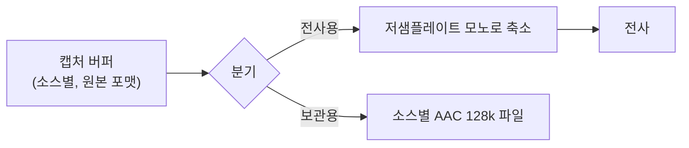

# ADR 0002: 원본 오디오를 소스별로, 리샘플링 전 AAC 128k로 보관한다

Date: 2026-07-30

## Status

Proposed

## Context

전사 결과만 남기면 되돌릴 수 없는 것이 생긴다. 전사 품질은 모델과 후처리에 의존하는데
둘 다 시간이 지나면 나아진다. 화자분리도 지금은 2화자가 상한이지만 나중에 모델을 붙여
개선할 여지를 남겨 두기로 했다. 그 재처리의 전제가 **원본 오디오의 보관**이다.

보관하기로 하면 세 가지를 정해야 한다. 소스를 섞을지, 파이프라인의 어느 지점에서
저장할지, 어떤 포맷으로 쓸지.

파이프라인 지점이 중요한 이유는 전사용 버퍼가 이미 변형된 신호라는 것이다. 전사
모델은 저샘플레이트 모노를 요구하므로 캡처 원본(보통 고샘플레이트 스테레오)을 줄여
넘긴다. 줄인 뒤 저장하면 재처리에 쓸 정보가 이미 사라진 상태다.

포맷 선택에는 실측이 필요했다. 널리 쓰이는 mp3를 먼저 시험했는데 **쓸 수 없었다.**
이 플랫폼은 mp3 디코딩만 지원하고 인코딩은 지원하지 않아, mp3로 파일을 만들면
포맷 미지원 오류로 실패한다.

| 포맷 | 쓰기 | 크기 (모노 1시간) |
|---|---|---|
| AAC 128k | O | 54 MB |
| AAC 64k | O | 29 MB |
| ALAC 무손실 | O | 139 MB |
| WAV PCM16 | O | 331 MB |
| mp3 | **X** | — |
| FLAC | X (변환 도구로는 되지만 파일 쓰기 API로는 실패) | — |

비트레이트는 크기가 아니라 **재전사 정확도**를 기준으로 정했다. 이 파일의 용도가
재처리이므로 압축이 인식률을 떨어뜨리면 저장 자체가 무의미하다. 같은 음성을 포맷별로
저장한 뒤 다시 전사한 결과:

| 포맷 | 재전사 결과 |
|---|---|
| 원본 WAV | 원문 일치 |
| ALAC 무손실 | 원문 일치 |
| AAC 128k | 원문 일치 |
| AAC 64k | `배포 일정` → **`대포 일정`** (오인식) |

## Decision Drivers

- 이 파일의 유일한 용도는 재처리(재전사, 화자분리 모델 적용)다 — 감상용이 아니다.
- 64k에서 재전사 오인식이 실측으로 확인됐다 — 압축률이 용도를 훼손하는 지점이 있다.
- 소스를 섞으면 100% 정확한 화자 정보가 영구히 사라진다 — 되돌릴 수 없다.
- 회의는 한 시간 이상 이어지므로 무손실 저장은 세션당 수백 MB에 달하고, 디스크 I/O가
  캡처 콜백을 막으면 오디오가 드롭된다.
- mp3 인코딩은 플랫폼이 지원하지 않고, 외부 인코더 번들링은 의존성 없는 앱이라는 성격에
  어긋난다.

## Decision

원본 오디오를 **소스별로 분리해, 리샘플링 이전 버퍼로, AAC 128kbps(채널당)** 로
저장한다. 세 선택이 각각 다른 driver에 대응한다.

**소스별 분리** — 마이크와 시스템 출력을 별도 파일로 쓴다. 섞으면 지금 공짜로 얻고 있는
화자 정보가 사라지고, 재처리 시 화자분리를 처음부터 추정해야 한다. 분리해 두면 나중에
화자분리 모델을 붙일 때 `상대방` 파일만 처리하면 되고 `나`는 이미 확정이다.

**리샘플링 이전 저장** — 전사용으로 줄이기 전의 캡처 버퍼를 쓴다. 줄인 신호를 저장하면
나중에 더 좋은 모델이 나와도 그 모델에 저품질 입력을 주게 된다.

**AAC 128k** — 무손실은 재전사 정확도가 같은데 크기가 2.6배다. 64k는 크기를 절반으로
줄이지만 재전사에서 오인식이 발생했다. 즉 **128k가 이 용도에서 정확도를 잃지 않는 가장
작은 선택**이다. mp3는 애초에 쓸 수 없고, 외부 인코더를 번들에 넣는 것은 의존성 없는
온디바이스 앱이라는 성격에 맞지 않는다. AAC는 같은 비트레이트에서 mp3보다 음질이 좋고
플랫폼이 직접 지원한다.

쓰기는 **캡처 콜백과 분리된 경로**에서 수행한다. 디스크 I/O가 콜백을 막으면 오디오가
드롭되기 때문이다.

저장 실패는 **세 가지 정책**으로 다룬다. 세 가지 모두 "정직한 보고"라는 같은 목적을
향한다.

- **저장 성공을 파일이 실제로 열리는지로 검증한다.** 컨테이너 형식은 마지막 참조가
  사라질 때 메타데이터를 기록하는데, 이를 놓치면 데이터는 있어도 열 수 없는 파일이
  남는다. 검증을 통과한 파일만 결과로 보고한다.
- **한 소스의 저장이 실패하면 그 소스만 포기하고 다른 소스는 계속 쓴다.** 매 버퍼마다
  같은 실패가 반복될 상황에서 재시도는 의미가 없다.
- **원본 저장 실패를 세션 실패로 뭉개지 않는다.** 회의록이 이미 남았다면 그것은
  성공이므로 저장 실패만 별도로 알린다. 손실의 크기가 다른 두 실패를 같은 오류로
  보고하면 사용자가 회의록도 잃었다고 오해한다.

**저장 자체를 끌 수 있게 한다.** 디스크 여유가 없거나 원본이 필요 없는 사용자를 위한
선택지이며, 세션 시작 시점에 고정된다.

### 대안 검토

#### 무손실(ALAC)로 저장한다

재처리 정확도가 원본과 완전히 동일하고, 어떤 미래 모델을 붙여도 압축 손실이 결과에
영향을 주지 않는다. 저장 형식을 한 번 정하면 다시 고민할 필요가 없다는 점도 이득이다.
실측에서 재전사 결과가 원문과 일치했다.

채택하지 않은 이유는 정확도 이득이 **측정되지 않았다**는 것이다. 128k와 무손실이 재전사
결과에서 동일했으므로, 2.6배 크기(모노 1시간 139MB vs 54MB, 소스 두 개면 두 배)를 지불해
얻는 것이 현재 측정으로는 없다. 회의를 상시 녹취하는 사용 패턴에서 이 차이는 빠르게
누적된다. 다만 이 판단은 현재 전사 모델 기준이므로, 무손실이 필요한 사용자를 위해 저장
형식을 바꾸는 경로는 열어 둔다.

#### 전사용 버퍼를 그대로 저장한다

파이프라인이 단순해진다. 이미 변환된 버퍼를 쓰므로 별도 변환 경로가 필요 없고,
저샘플레이트 모노라서 파일 크기가 크게 줄어든다. 전사에 쓰인 것과 정확히 같은 신호가
남으므로 "전사 결과가 왜 이렇게 나왔는지" 재현하기에는 오히려 더 정확하다.

채택하지 않은 이유는 보관의 목적과 어긋난다는 것이다. 이 파일은 전사 결과를 재현하기
위한 것이 아니라 **더 나은 처리를 다시 시도하기 위한** 것이다. 전사 모델이 요구하는
저샘플레이트 모노로 줄인 신호에는 나중에 쓸 정보가 이미 없고, 특히 화자분리는 원본의
주파수 대역과 채널 정보에 의존하므로 줄인 신호로는 품질이 떨어진다. 크기 이득을 위해
보관 자체의 가치를 포기하는 교환이 된다.

## Consequences

### Positive

- 화자 정보가 파일 분리로 보존되어 재처리 시 `나`/`상대방` 구분이 확정된 상태로 유지된다.
- 재전사 정확도를 잃지 않는 가장 작은 크기를 쓴다 — 정확도와 크기의 교환점이 실측으로
  뒷받침된다.
- 외부 인코더 의존이 없어 앱이 단일 번들로 유지된다.
- 저장 경로가 캡처 콜백과 분리되어 디스크 지연이 오디오 드롭을 유발하지 않는다.
- 열리지 않는 파일을 걸러내므로 "저장 완료" 보고가 실제 사용 가능한 파일만 가리킨다.
- 원본 저장 실패가 회의록 저장 성공을 가리지 않는다 — 손실 크기가 다른 두 실패를 구분해
  보고한다.

### Negative

- 손실 압축이므로 아주 미세한 정보는 사라진다 — 현재 모델 기준으로 재전사 정확도에
  영향이 없다는 측정에 기대는 선택이다.
- 소스별로 파일을 쓰므로 저장 공간과 열린 파일 핸들이 소스 수에 비례한다.
- 회의 한 시간에 소스 두 개면 100MB를 넘는다 — 상시 녹취 시 누적이 빠르다.
- 저장 경로를 캡처 콜백과 분리하는 대가로 버퍼 핸드오프 비용과 추가 메모리가 발생한다.

### Risks

- 미래의 전사·화자분리 모델이 지금보다 압축에 민감하면 128k 보관본이 부족할 수 있다.
  현재 측정으로는 확인할 수 없는 위험이다.
- 캡처 포맷이 세션 중 바뀌면(입력 장치 전환 등) 그 소스의 저장이 중단될 수 있다.
- 저장을 끈 세션은 재처리 가능성이 영구히 사라진다.

## Related

- [회의록을 발화 확정 즉시 append 하고 종료를 시간 제한한다](./0001-transcript-durability.md)
- [화자를 오디오 소스로 확정하고 2화자 상한을 수용한다](../transcription/0001-source-based-speaker-attribution.md)
- [입력 레벨을 세 관점으로 나눠 추적하고 원본은 보정하지 않는다](../capture/0004-input-level-diagnostics.md)
