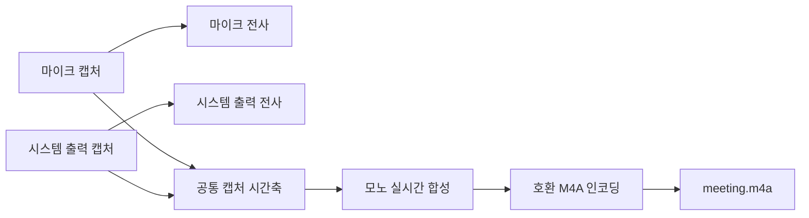

# ADR 0002: 회의 음성을 녹음 중 하나의 모노 M4A로 합성한다

Date: 2026-07-30

## Status

Proposed

## Context

전사 결과만 남기면 모델이 개선된 뒤 다시 전사하거나 회의 당시 음성을 확인할 수 없다.
그래서 회의 음성을 함께 보관한다.

마이크와 시스템 출력은 서로 다른 캡처 장치와 클럭에서 들어온다. 두 파일로 따로 저장한
뒤 나중에 합치면 캡처 시작 시차, 장치 전환, 콜백 지연을 복원할 공통 기준이 없어 실제
회의 순서를 정확히 재구성할 수 없다. 사용자는 사후 조립이 아니라 회의가 진행되는 동안
정렬된 하나의 파일을 원한다.

소스 분리도 실제 화자 수를 보존하지 않는다. 시스템 출력에는 원격 참석자 여러 명이 이미
섞여 있고, 대면 회의에서는 여러 사람이 마이크 하나로 들어온다. `마이크=나`,
`시스템 출력=상대방 한 명`이라는 파일 구분은 저장 음성의 실제 화자 구조를 나타내지
못한다.

파일 형식은 플랫폼이 직접 인코딩할 수 있어야 한다. mp3는 기본 API가 디코딩만 지원하고
인코딩하지 않아 외부 인코더가 필요하다. M4A는 외부 실행 파일이나 네트워크 없이 만들 수
있고 일반 재생기와 전사 도구에서 널리 읽힌다.

## Decision Drivers

- 사용자는 사후 타이밍 재조립 없이 바로 재생·재전사할 수 있는 음성 파일 하나를 원한다.
- 두 캡처 소스는 독립 클럭과 시작 시각을 가지므로 별도 파일만으로 정확한 정렬을 복원할
  수 없다.
- 시스템 출력과 마이크 각각에도 여러 실제 화자가 섞일 수 있어 소스별 파일이 실제 화자
  분리를 보장하지 않는다.
- 저장 처리 때문에 실시간 전사가 지연되거나 중단되어서는 안 된다.
- 장치의 네이티브 샘플레이트와 채널 구성이 달라도 재생 가능한 파일을 만들어야 한다.

## Decision

회의 음성은 녹음 중 **하나의 모노 `meeting.m4a`**로 합성한다. `me.m4a`와
`remote.m4a`는 만들지 않는다.

마이크와 시스템 출력은 캡처와 실시간 전사에서는 계속 독립 경로를 유지한다. 저장 분기만
두 소스의 캡처 시각을 공통 회의 시간축에 배치하고 모노로 합성한다. 따라서 파일을 닫은 뒤
별도 소스를 이어 붙이거나 길이를 추정하지 않는다.

합본은 플랫폼이 직접 지원하는 M4A 컨테이너를 사용한다. 장치의 네이티브 샘플레이트와
채널 수를 파일 인코더에 직접 넘기지 않고, 저장 경로에서 호환 가능한 고정 모노 포맷으로
명시적으로 변환한다. 손실 압축 파일을 기본으로 사용하고 플랫폼 인코더가 파일 생성을
거부하는 경우에만 같은 컨테이너의 무손실 형식으로 대체한다. mp3 외부 인코더와 네트워크
변환은 사용하지 않는다.

### Requirement contract

- 세션의 음성 산출물은 모노 `meeting.m4a` 하나이며 `me.m4a`와 `remote.m4a`는
  생성하지 않는다.
- 마이크와 시스템 출력은 파일을 닫은 뒤 재조립하지 않고 녹음 중 공통 캡처 시간축에
  배치해 합성한다.
- 마이크 음소거 중에는 마이크 음성을 합본에 넣지 않으며 시스템 출력은 계속 기록한다.
- 한 캡처 소스가 시작하지 못하거나 중간에 끊겨도 살아 있는 다른 소스의 음성은 합본과
  실시간 전사에 계속 남긴다.
- 동시 발화는 같은 시간 구간에 함께 합성하며, 비어 있는 시간과 빠진 소스 구간은
  무음으로 유지해 회의 시간축을 당기지 않는다.
- 저장용 변환·합성·파일 쓰기는 캡처 콜백과 전사 입력을 막지 않는다. 저장이 느리거나
  실패해도 전사 경로에 backpressure를 전달하지 않는다.
- 장치 샘플레이트와 채널 구성이 달라도 플랫폼이 재생할 수 있는 `.m4a`를 생성한다.
- 외부 인코더와 네트워크를 사용하지 않는다.
- 세션 종료와 세션 경계에서 컨테이너를 닫고 파일이 실제로 열리는지 확인한다.
- 합본 저장 실패는 회의록과 실시간 전사의 성공을 세션 실패로 바꾸지 않고 별도로 알린다.
- 음성 저장 설정은 세션 시작 시 고정하며, 저장을 끈 세션에는 `.m4a`를 만들지 않는다.

### 대안 검토

#### 소스별 파일만 저장하고 필요할 때 사후 합친다

각 캡처의 네이티브 신호를 보존하고 소스별 볼륨을 나중에 조정할 수 있다. 그러나 두 파일의
공통 시작 기준과 장치 전환 공백을 완전히 복원할 정보가 없어 실제 회의 타이밍을 보장할 수
없다. 사용자가 원하는 단일 재전사 입력도 별도 처리 없이는 얻지 못한다.

#### 한 파일의 좌우 채널에 마이크와 시스템 출력을 분리한다

파일 하나로 타이밍과 소스 구분을 함께 보존할 수 있다. 반면 일반 재생에서 참가자 음성이
좌우로 갈려 실제 회의처럼 들리지 않고, 시스템 출력이나 마이크 하나에도 여러 사람이 섞일
수 있어 채널 구분이 실제 화자 구분이 되지 않는다. 범용 전사 도구가 채널을 다루는 방식도
서로 달라 단일 입력이라는 목적에 맞지 않는다.

#### 모든 장치 포맷을 네이티브 무손실로 소스별 저장한다

재처리 정보는 가장 많이 보존된다. 하지만 파일이 여러 개이고 용량이 커지며, 사용자가
요구한 공통 타임라인의 단일 음성 파일을 제공하지 못한다. 실제 회의 재생과 범용 재전사
편의보다 원본 보존을 우선하는 다른 제품 목표다.

## Consequences

### Positive

- 세션마다 바로 재생·재전사할 수 있는 음성 파일이 하나만 남는다.
- 합성이 녹음 중 이뤄져 사후에 두 파일의 시작 시각과 공백을 추정할 필요가 없다.
- 장치 포맷을 저장 포맷으로 명시적으로 변환하므로 Bluetooth 통화 모드를 포함한
  다양한 샘플레이트가 파일 인코더 오류로 이어지지 않는다.
- 파일과 인코더가 하나로 줄어 소스별 저장보다 디스크 I/O와 파일 관리가 단순하다.
- 저장 실패가 전사 입력을 막지 않아 회의록은 계속 남는다.

### Negative

- 합성 뒤에는 마이크와 시스템 출력을 개별 파일로 다시 분리하거나 볼륨을 따로 조정할 수
  없다.
- 겹쳐 말한 음성은 하나의 신호가 되어 채널 기반 화자 분리를 사용할 수 없다.
- 네이티브 채널과 고샘플레이트 정보가 합본 변환 과정에서 사라진다.

### Risks

- 두 소스의 캡처 시각을 공통 시간축에 잘못 매핑하면 발화 순서가 어긋날 수 있다.
- 동시 발화의 합성 레벨을 잘못 다루면 클리핑되거나 한쪽 음성이 지나치게 작아질 수 있다.
- 저장 큐가 장시간 밀릴 때 메모리가 계속 증가하지 않도록 제한하면서도 전사를 막지 않아야
  한다.
- 합본만 남기므로 저장 실패 시 대체할 소스별 음성 파일이 없다.

## Related

- [회의록을 발화 확정 즉시 append 하고 종료를 시간 제한한다](./0001-transcript-durability.md)
- [두 캡처 소스의 실패를 서로 격리한다](../capture/0003-per-source-failure-isolation.md)
- [화자를 오디오 소스로 확정하고 2화자 상한을 수용한다](../transcription/0001-source-based-speaker-attribution.md)
