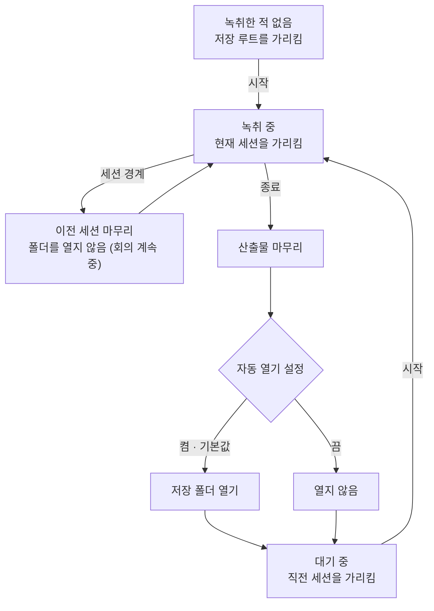

# ADR 0003: 녹취 중 산출물 위치를 보여주고 종료 시 자동으로 연다

Date: 2026-08-04

## Status

Proposed

## Context

산출물은 회의별 디렉터리에 저장되고, 그 이름은 세션 시작 시각에서 만들어진다. 그런데 이
앱은 메뉴바에서 동작하고 회의 중에는 좁은 창만 띄운 상태로 쓰인다. 그 화면에 지금 어느
디렉터리에 쓰이고 있는지 나타나지 않는다.

이 상태의 문제는 사용자가 **녹취가 실제로 저장되고 있는지 확인할 수 없다**는 것이다. 확인
수단이 없으므로, 회의가 끝날 때까지 그것을 알 방법이 없다. 그리고 회의는 한 번 일어나고
끝나므로, 저장되지 않았다는 사실을 나중에 알아도 되돌릴 수 없다. 화면에 발화가 흐르는 것과
그것이 디스크에 남는 것은 별개이며, 사용자에게는 후자가 산출물이다.

종료 이후에도 같은 문제가 남는다. 저장 폴더를 여는 수단은 이미 있지만 사용자가 눌러야
하고, 눌러야 한다는 것을 알아야 한다. 회의가 끝난 직후는 사용자가 회의록을 확인하는
시점이므로, 그 확인이 기본 동작이 아니라 발견해야 하는 기능으로 남아 있다.

디렉터리 이름은 시작 시각에서 만들어지므로 세션이 시작되기 전에는 존재하지 않고, 세션
경계를 끊으면 새 이름으로 바뀐다. 즉 표시할 값은 고정된 경로가 아니라 세션의 상태다.

## Decision Drivers

- 회의는 재생성 불가능하다 — 저장되지 않고 있다는 사실을 회의 후에 알면 대응할 방법이 없다.
- 앱은 메뉴바와 좁은 창으로 쓰이므로, 산출물 위치를 볼 다른 화면이 없다.
- 회의 직후는 사용자가 회의록을 확인하는 시점이다 — 확인이 기본 동작이 아니면 발견해야
  하는 기능이 된다.
- 회의 중에 다른 창이 앞으로 나오면 회의 화면을 가린다 — 회의 진행을 방해하는 것은
  이 앱이 회의 중에 하지 않아야 할 일이다.
- 디렉터리 이름은 세션에서 파생되고 경계에서 바뀐다 — 고정된 경로를 적어 두는 것으로는
  해결되지 않는다.

## Decision

**저장 위치를 전사 화면에 상시 표시하고, 눌러서 열 수 있게 한다.** 시작 시 한 번 알리고
사라지는 방식이 아니라 계속 보이게 한다 — 회의 도중 아무 때나 창을 봤을 때 지금 어디에
쓰이고 있는지 확인할 수 있어야 하고, 한 번 지나간 알림은 그 시점에 화면을 보지 않은
사용자에게 전달되지 않는다.

**이 표시는 앱 상태와 무관하게 항상 있다.** 가리키는 대상만 상태에 따라 바뀐다 — 녹취
중이면 지금 쌓이는 세션, 끝난 뒤면 직전 세션, 아직 한 번도 녹취하지 않았으면 세션들이 모이는
저장 루트다. **표시가 사라지는 상태를 두지 않는 것이 이 결정의 일부다**: 사라지는 UI는
사용자가 그 기능의 존재를 학습하지 못하게 만들고, 산출물이 어디에 저장되는지는 첫 녹취를
시작하기 *전에* 알고 싶은 것이기도 하다. 아직 산출물이 없다는 것이 위치를 감출 이유는 되지
않는다.

**녹취를 종료하면 저장 폴더를 자동으로 연다. 이 동작은 설정에서 끌 수 있고, 기본값은
켬이다.** 회의 직후는 사용자가 산출물을 확인하는 시점이므로 확인을 기본 동작으로 둔다.
자동으로 여는 것이 방해가 되는 사용자(연속된 회의를 녹취하는 경우)가 있으므로 끌 수 있게
하되, 기본값은 확인하는 쪽이다 — 산출물을 못 찾는 손실이 창 하나가 열리는 번거로움보다
크다.

### 요구사항 계약

- **저장 위치를 여는 수단은 전사 화면에 항상 있다.** 녹취 여부와 산출물 유무에 관계없이
  사라지지 않는다. 가리키는 대상은 상태에 따라 정해진다 — 녹취 중이면 현재 세션, 종료 후면
  직전 세션, 녹취한 적이 없으면 저장 루트. **어느 것을 가리키고 있는지 구분할 수 있어야
  한다**: 세 상태가 같은 모습이면 방금 끝난 회의와 지금 쌓이는 회의가 헷갈리고, 아직 아무것도
  없는 폴더를 회의록이 있는 폴더로 오인한다.
- **자동 열기의 기본값은 켬이다.** 사용자가 아무것도 정하지 않은 상태에서 종료하면 폴더가
  열린다. 저장된 값이 없을 때만 기본값이 쓰이고, 사용자가 정한 값은 그 값이 계약이 된다.
- **이 설정은 앱을 다시 켜도 유지된다.** 설정 창의 다른 항목과 같은 계약을 따른다.
- **녹취 중에도 바꿀 수 있다.** 이 값은 종료 시점에만 읽히므로 이미 만들어진 전사기나
  열려 있는 파일과 어긋나지 않는다. 녹취 중 잠기는 항목들과 성격이 다르다.
- **세션 경계에서는 열지 않는다.** 경계를 끊는 것은 회의를 계속하겠다는 뜻이므로 산출물을
  확인할 시점이 아니고, 경계를 여러 번 끊으면 그만큼 창이 열려 회의 화면을 가린다. 자동
  열기는 녹취 종료에만 결부된다.
- **폴더를 열지 못해도 종료는 성공이다.** 산출물은 이미 디스크에 있고, 여는 것은 편의
  기능이다. 이 실패로 종료를 실패로 보고하면 저장된 회의록을 잃은 것처럼 보인다.

세 상태 모두 표시가 존재한다는 것이 위 흐름의 요점이다 — 상태 전이가 바꾸는 것은 가리키는
대상뿐이고, 표시 자체가 없는 상태는 없다.

### 대안 검토

#### 시작할 때 한 번만 알리고 사라지게 한다

화면을 차지하지 않는다. 좁은 창에서 트랜스크립트에 줄 자리가 늘어나고, 알림은 사용자가
정보를 필요로 하는 시점(시작 직후)에 정확히 도달한다.

채택하지 않은 이유는 **확인이 필요한 시점이 시작 직후가 아니라 회의 중**이라는 것이다.
"저장되고 있나?"라는 의심은 회의가 한참 진행된 뒤에 든다. 지나간 알림은 그때 다시 볼 수
없고, 시작 시점에 화면을 보고 있지 않았던 사용자에게는 애초에 전달되지 않는다. 세션 경계로
위치가 바뀌면 알림은 더 낡는다. 이 기능의 목적이 상시 확인 가능성이므로 사라지는 표시로는
목적을 달성하지 못한다.

#### 자동으로 열지 않고 종료 후 안내만 남긴다

회의 중이든 후든 다른 창이 앞으로 나오지 않는다. 연속된 회의를 녹취하는 사용자에게 방해가
전혀 없고, 설정 항목을 추가하지 않아도 된다.

채택하지 않은 이유는 지금 상태가 이미 그것이고, 그것이 문제로 제기되었기 때문이다. 폴더를
여는 버튼은 이미 있지만 **눌러야 한다는 것을 알아야** 하고, 산출물을 못 찾는 사용자는
버튼의 존재를 모르는 사용자다. 안내를 추가하는 것은 같은 종류의 해결을 한 겹 더 얹는
것이다. 회의 직후에 확인이 기본이 되는 편이 낫고, 방해가 되는 사용자는 끌 수 있다.

#### 저장 위치를 사용자가 고르게 하는 것으로 대신한다

산출물을 어디에 둘지 사용자가 정하면 자기가 정한 곳이므로 찾지 못할 일이 없다.

이 결정의 대안이 되지 못하는 이유는 다른 문제를 푼다는 것이다. 사용자가 못 찾는 이유는 위치가
문서 폴더 아래인 것이 아니라 **회의별 디렉터리 이름이 화면에 없기** 때문이고, 위치를 고르게
해도 어느 회의가 어느 디렉터리인지는 여전히 보이지 않는다. 위치를 고르는 것 자체는 별개의
요구(동기화·용량·보안)에서 나오며 [별도 결정](./0004-transcript-root-location.md)으로 다룬다 —
그쪽이 채택돼도 위치를 상시 표시하고 종료 시 여는 이 결정은 그대로 필요하다.

## Consequences

### Positive

- 회의 중 아무 때나 산출물이 어디에 쌓이는지 확인할 수 있다 — 저장 여부에 대한 의심이
  회의 후로 미뤄지지 않는다.
- 회의 직후 산출물 확인이 기본 동작이 되어, 폴더 열기 기능을 몰라도 회의록에 도달한다.
- 표시가 사라지지 않으므로 사용자가 이 수단의 존재를 한 번 배우면 계속 쓸 수 있고, 첫 녹취를
  시작하기 전에도 산출물이 어디에 저장될지 알 수 있다.
- 자동 열기를 끌 수 있으므로 연속 회의를 녹취하는 사용자가 방해받지 않는다.
- 세션 경계에서 열지 않으므로 회의 중에 창이 반복적으로 끼어들지 않는다.

### Negative

- 전사 화면에 상시 표시할 줄이 하나 늘어난다 — 좁은 창에서 트랜스크립트 자리가 그만큼
  줄어든다.
- 종료 시 파일 탐색기가 앞으로 나오므로, 종료 직후 다른 작업을 하려던 사용자는 그 창을
  치워야 한다. 기본값이 켬이므로 이 비용은 설정을 바꾸지 않은 모든 사용자가 한 번씩
  지불한다.

### Risks

- 저장 위치를 상시 표시하면 그 경로가 회의 중 화면 공유에 노출될 수 있다. 사용자 이름이
  경로에 포함되는 환경에서는 의도치 않은 정보가 보인다.
- 자동 열기가 꺼진 상태를 사용자가 잊으면, 종료 후 폴더가 열리지 않는 것을 저장 실패로
  오인할 수 있다 — 표시된 위치가 그 오인을 푸는 유일한 단서가 된다.
- 녹취한 적 없는 상태에서 여는 저장 루트는 비어 있거나 아직 존재하지 않는다. 빈 폴더를
  보여주는 것이 산출물이 없다는 사실은 정확히 전달하지만, 무언가 잘못됐다는 인상을 줄 수
  있다 — 그래서 세 상태를 구분해 표시하는 것이 계약에 포함된다.

## Related

- [회의록을 발화 확정 즉시 append 하고 종료를 시간 제한한다](./0001-transcript-durability.md)
- [원본 오디오를 리샘플링 전 AAC로 보관한다](./0002-original-audio-format.md)
- [설정을 전사 화면에서 분리해 별도 창에 둔다](../session/0003-settings-surface-separation.md)
- [캡처를 끊지 않고 세션 경계를 끊는다](../session/0001-session-boundary-control.md)
