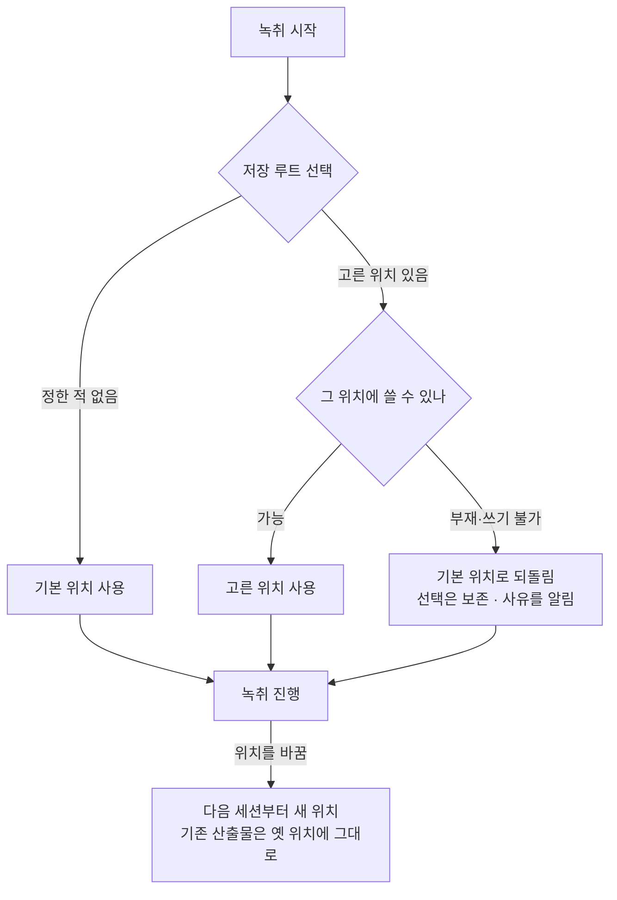

# ADR 0004: 산출물 저장 루트를 사용자가 고를 수 있게 한다

Date: 2026-08-05

## Status

Proposed

## Context

산출물은 문서 폴더 아래 앱 전용 폴더에 회의별 디렉터리로 쌓인다. 이 위치는 코드가 정하고
사용자는 바꿀 수 없다. 위치를 보여주고 열어주는 수단은 이미 있으므로 "못 찾는" 문제는 아니다.

바꿀 수 없다는 것 자체가 문제가 되는 상황이 있다.

**회의록을 다른 기기에서 보려면 동기화되는 폴더에 있어야 한다.** 클라우드 동기화 폴더나 외장
볼륨을 쓰는 사용자는 지금 회의가 끝날 때마다 손으로 옮겨야 하고, 옮기는 것을 잊으면 그 회의록은
그 기기에만 남는다. 회의는 한 번 일어나고 끝나므로 이 누락은 뒤늦게 발견해도 되돌릴 수 없다.

**문서 폴더가 동기화 대상인 환경에서는 반대 방향의 문제가 생긴다.** 회의 음성 원본은 모노
1시간에 약 54MB이고 회의마다 두 개씩 쌓인다. 문서 폴더 전체를 동기화하는 사용자는 회의를 녹취할
때마다 그만큼을 업로드하게 되는데, 그것을 원하지 않아도 끌 수단이 없다. 저장 위치가 고정이면
"동기화하지 않는 곳에 두겠다"는 선택 자체가 불가능하다.

**민감한 회의를 다루는 사용자에게는 위치가 보안 결정이다.** 암호화된 볼륨이나 별도 디스크에
두겠다는 요구가 있고, 그것을 앱이 막을 근거는 없다 — 이 앱은 전사를 전부 기기 안에서 하고
회의록도 기기에만 두므로, 그 "기기 안 어디"를 사용자가 정하는 것이 이 성격과 어긋나지 않는다.

이 앱은 App Sandbox를 쓰지 않으므로 임의 경로에 쓸 수 있다. 즉 제약은 기술적인 것이 아니라
**어느 실패를 어떻게 다루느냐**에 있다. 사용자가 고른 위치는 앱이 만든 위치와 달리 사라질 수
있고(외장 볼륨 분리, 동기화 폴더 삭제), 쓸 수 없을 수 있고(권한), 회의 중에 그 상태가 될 수도
있다. 고정 위치에는 없던 실패 모드다.

## Decision Drivers

- 회의는 재생성 불가능하다 — 저장 위치를 여는 어떤 실패도 녹취를 잃는 결과로 이어지면 안 된다.
- 음성 원본은 모노 1시간에 약 54MB, 회의당 두 개 — 동기화 대상 폴더에 두는지가 사용자에게
  실질적인 비용 차이다.
- 앱은 App Sandbox를 쓰지 않으므로 임의 경로 접근에 별도 권한 장치가 필요 없다.
- 사용자가 고른 위치는 앱이 만든 위치와 달리 **부재·쓰기 불가 상태가 될 수 있고**, 그 시점이
  회의 중일 수 있다.
- 이 앱은 사용자 파일을 옮기거나 지우는 동작을 지금 하나도 갖고 있지 않다 — 그 성질을
  유지하는 편이 실패 시 잃는 것을 작게 유지한다.

## Decision

**저장 루트를 설정에서 고를 수 있게 하고, 정하지 않으면 지금까지의 기본 위치를 쓴다.** 위치를
고르는 것은 선택이고, 아무것도 하지 않은 사용자의 동작은 바뀌지 않는다.

**고른 위치를 쓸 수 없으면 기본 위치로 되돌려 녹취를 진행하고, 그 사실을 알린다.** 접는 것이
아니라 되돌리는 것이 이 결정의 핵심이다 — 외장 볼륨을 뽑아 둔 것을 잊은 사용자가 회의를 시작할 때
앱이 시작을 거부하면 그 회의를 통째로 잃는다. 회의록이 예상한 곳에 없는 것은 회복 가능한 불편이고,
녹취되지 않은 것은 회복 불가능한 손실이다. **선택 자체는 지우지 않는다** — 외장 볼륨을 다시 연결하면
그 선택으로 돌아가야 하고, 되돌림을 이유로 선택을 지우면 사용자가 정한 것을 앱이 조용히 버리는 것이
된다.

**이미 저장된 산출물은 옮기지 않는다.** 새 위치는 다음 세션부터 적용되고 이전 회의록은 옛 위치에
그대로 남는다. 옮기는 편이 산출물을 한곳에 모으지만, 이동 중 실패하면 재생성 불가능한 회의록을 잃고
용량이 큰 원본 때문에 그 창이 길다. 이 앱이 사용자 파일을 옮기는 동작을 하나도 갖지 않는다는 성질을
유지하는 값이 산출물이 흩어지는 비용보다 크다. 대신 **옛 위치의 산출물에 도달할 수단이 남아야 한다** —
위치를 바꿨다는 사실만 알리고 옛 회의록을 찾을 방법을 주지 않으면 사용자는 그것을 잃은 것으로 여긴다.

**녹취 중에는 바꿀 수 없다.** 이미 열려 있는 회의록 파일 핸들과 오디오 컨테이너가 옛 경로를 가리키고
있어, 도중에 바꾸면 한 회의의 산출물이 두 폴더로 쪼개진다. 언어·원본 저장 항목과 같은 규칙이며,
자동 열기 항목과 다른 이유는 그쪽이 종료 시점에만 읽히는 값이라는 데 있다.

### 요구사항 계약

- **저장 루트의 기본값은 지금까지와 같은 위치다.** 사용자가 아무것도 정하지 않으면 문서 폴더
  아래 앱 전용 폴더를 쓴다. 저장된 값이 없을 때만 기본값이 쓰이고, 사용자가 정한 값은 그 값이
  계약이 된다.
- **이 선택은 앱을 다시 켜도 유지된다.** 설정 창의 다른 항목과 같은 계약을 따른다.
- **녹취 중에는 바꿀 수 없고, 잠긴 이유가 화면에 보여야 한다.** 잠긴 이유를 적지 않으면 사용자는
  고장으로 판단한다.
- **고른 위치에 쓸 수 없으면 기본 위치로 되돌려 녹취를 진행한다.** 세션 시작을 거부하지 않는다.
  되돌린 경우 **어디에 기록되는지와 왜 그렇게 됐는지를 알려야 한다** — 알리지 않으면 사용자는
  자기가 고른 곳을 계속 보며 회의록이 사라졌다고 판단한다.
- **되돌려도 사용자의 선택은 보존된다.** 위치가 다시 쓸 수 있게 되면 그 선택이 다시 적용된다.
- **위치를 바꿔도 이미 저장된 산출물은 이동하지 않는다.** 새 위치는 다음 세션부터 적용되고, 앱은
  기존 파일을 옮기거나 지우지 않는다.
- **옛 위치에 남은 산출물에 도달할 수단이 있어야 한다.** 위치를 바꾼 직후에도 직전 회의록을 열 수
  있어야 한다 — 산출물이 두 곳에 나뉘는 것을 받아들인 대가로, 어느 쪽도 접근 불가능해지지 않는 것이
  조건이다.
- **저장 위치를 확인·열람하는 수단은 위치 선택과 무관하게 항상 있다.** 표시 대상이 기본 위치든
  사용자가 고른 위치든 같은 계약을 지킨다.

되돌림 경로에서도 녹취가 진행된다는 것이 위 흐름의 요점이다 — 저장 위치를 여는 실패가 세션을 접는
분기로 이어지지 않는다.

### 대안 검토

#### 지금처럼 고정 위치로 둔다

실패 모드가 없다. 위치는 앱이 만들므로 부재·권한 문제가 발생하지 않고, 산출물이 언제나 한곳에
모여 있어 어느 회의록이 어디 있는지 고민할 일이 없다. 설정 항목도 늘지 않는다.

채택하지 않은 이유는 이것이 해결하지 못하는 요구가 실재한다는 것이다. 동기화되는 폴더에 두려는
사용자는 회의마다 손으로 옮겨야 하고 잊으면 그 회의록은 한 기기에만 남는다. 반대로 문서 폴더가
동기화 대상인 사용자는 회의당 100MB가 넘는 원본이 올라가는 것을 끌 수단이 없다. 두 요구 모두
위치가 고정인 한 앱 밖에서 해결해야 하고, 앱 밖의 해결은 사용자가 매번 기억해야 하는 절차다.

#### 위치를 고르게 하되, 쓸 수 없으면 녹취를 시작하지 않는다

사용자가 정한 곳이 아닌 데에 회의록이 생기는 일이 없다. 민감한 회의를 암호화 볼륨에 두려는
사용자에게는 이것이 오히려 맞는 동작이다 — 볼륨이 없는데 문서 폴더에 평문으로 남는 것이 그
사용자에게는 사고다.

채택하지 않은 이유는 **잃는 것의 크기가 비대칭**이라는 것이다. 시작을 거부하면 그 회의는 녹취되지
않고, 회의는 재생성 불가능하다. 반면 예상과 다른 곳에 저장된 회의록은 위치를 알려주기만 하면
회복된다. 외장 볼륨을 뽑아 둔 것을 잊는 것은 흔한 실수이고, 그 실수의 대가가 회의 하나를 통째로
잃는 것이어서는 안 된다. 암호화 볼륨 요구는 되돌림을 알리는 것으로 다룬다 — 사용자가 그 회의를
녹취할지 그 자리에서 판단할 수 있다.

#### 위치를 바꿀 때 기존 산출물을 새 위치로 옮긴다

산출물이 한곳에 모인다. 위치를 바꾼 뒤에도 "회의록은 여기 다 있다"가 유지되고, 사용자가 옛
위치를 기억할 필요가 없다.

채택하지 않은 이유는 이동이 실패할 수 있고 그 대가가 회의록이라는 것이다. 원본 오디오가 회의당
100MB를 넘으므로 이동 창이 길고, 그 사이의 중단·용량 부족·권한 오류가 재생성 불가능한 파일을
반쯤 옮겨진 상태로 남긴다. 이 앱은 지금 사용자 파일을 옮기거나 지우는 동작을 하나도 갖고 있지
않은데, 그 성질을 잃으면서 얻는 것이 "폴더가 하나"라는 정리 상태뿐이다. 옛 위치에 도달할 수단을
남기는 편이 훨씬 싸다.

## Consequences

### Positive

- 동기화되는 폴더나 외장 볼륨에 회의록을 둘 수 있어, 다른 기기에서 보기 위해 매번 손으로 옮기지
  않아도 된다.
- 문서 폴더가 동기화 대상인 사용자가 회의당 100MB가 넘는 원본을 업로드하지 않도록 위치를 옮길 수
  있다.
- 민감한 회의를 암호화 볼륨에 둘 수 있다 — 전사와 보관이 모두 기기 안에서 끝난다는 이 앱의 성격을
  사용자가 자기 기준으로 좁힐 수 있다.
- 되돌림이 세션을 접지 않으므로, 볼륨을 연결하지 않은 채 시작해도 회의는 기록된다.
- 앱이 사용자 파일을 옮기거나 지우지 않는 성질이 유지된다 — 위치 기능이 회의록을 잃는 경로를
  새로 만들지 않는다.

### Negative

- 위치를 바꾸면 산출물이 두 곳으로 나뉜다. 옛 회의록은 옛 위치에 남으므로 사용자가 두 곳을 알아야
  하고, 여러 번 바꾸면 그만큼 흩어진다.
- 되돌림이 일어난 세션은 사용자가 의도한 곳이 아닌 데에 저장된다. 알림을 보지 못하면 회의록을 잃은
  것으로 오해할 수 있다.
- 설정 창에 항목이 하나 늘고, 그 항목은 다른 항목과 달리 실패 상태(고른 위치가 없음)를 표시해야
  한다.

### Risks

- 사용자가 동기화 폴더를 고르면 동기화 클라이언트가 파일을 쓰는 중에 건드릴 수 있다. 회의록은
  발화마다 append되고 오디오 컨테이너는 종료 시 마무리되므로, 동기화가 중간 상태의 파일을
  올릴 수 있다 — 올라간 것이 열리지 않는 상태일 수 있다.
- 암호화 볼륨을 고른 사용자가 되돌림 알림을 놓치면, 민감한 회의록이 기본 위치에 평문으로 남는다.
  이 위험은 알림 하나에 의존한다.
- 외장 볼륨이 회의 중에 분리되면 그 시점부터의 기록이 실패한다. 녹취 중 위치를 바꾸지 못하게
  잠그는 것으로는 이 경우를 막을 수 없다 — 위치가 바뀐 것이 아니라 사라진 것이기 때문이다.

## Related

- [산출물 위치를 보여주고 종료 시 자동으로 연다](./0003-session-output-discoverability.md)
- [회의록을 발화 확정 즉시 append 하고 종료를 시간 제한한다](./0001-transcript-durability.md)
- [원본 오디오를 리샘플링 전 AAC로 보관한다](./0002-original-audio-format.md)
- [설정을 전사 화면에서 분리해 별도 창에 둔다](../session/0003-settings-surface-separation.md)
