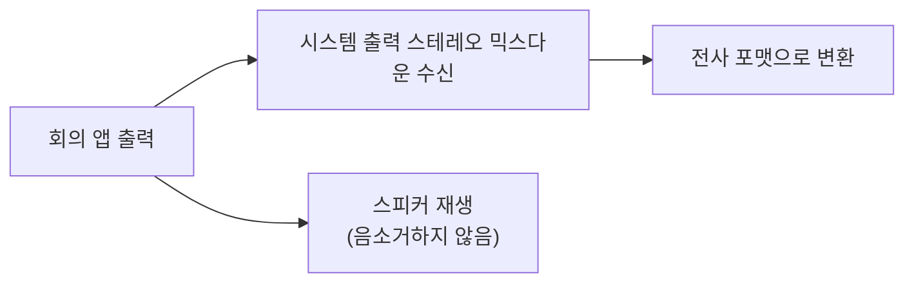

# ADR 0001: 시스템 오디오를 Core Audio Process Tap으로 캡처

Date: 2026-07-30

## Status

Proposed

## Context

회의 상대방의 목소리는 마이크로 들어오지 않는다. Zoom·Teams가 스피커로 재생하는
신호를 따로 잡아야 한다. macOS에서 이 신호를 얻는 경로는 여러 개인데, 각 경로가
요구하는 TCC 권한이 다르다.

이 앱은 메뉴바에 상주하며 회의 내내 켜져 있고, 전사·저장 전부를 온디바이스에서
처리한다는 것이 제품의 전제다. 그런 앱이 사용자에게 요구하는 권한의 범위는
신뢰와 직결된다. "회의 녹취기가 내 화면 전체를 볼 수 있다"는 상태는 기능적으로
필요하지 않다면 받아들일 이유가 없다.

## Decision Drivers

- 오디오만 필요하다 — 화면 픽셀은 이 제품의 어떤 기능에도 쓰이지 않는다.
- 화면 녹화 권한은 시스템 설정에서 "화면 및 시스템 오디오 녹음"이라는 하나의
  스위치이므로, 켜면 화면 접근까지 함께 열린다 — 부분 승인이 불가능하다.
- 추가 드라이버·커널 확장 설치 없이 단일 앱 번들로 배포돼야 한다.
- 사용자의 기존 오디오 장치 구성(기본 출력 장치 등)을 바꾸지 않아야 한다.
- 앱은 회의 시간 전체(수십 분~수 시간) 동안 상시 동작한다 — 유휴 비용이 누적된다.

## Decision

시스템 출력은 **Core Audio Process Tap**으로 받는다. 시스템 전체 출력을 스테레오로
믹스다운해 받으며, **재생을 음소거하지 않는다** — 사용자는 회의 소리를 계속 들어야
한다. 특정 프로세스를 제외하지 않는다. 이 앱은 소리를 재생하지 않으므로 자기 출력이
되돌아올 여지가 없다.

이 경로는 오디오 캡처 권한만 사용하고 **화면 녹화 권한을 요구하지 않는다.** 앱
번들의 권한 선언에도 화면 관련 항목을 두지 않으며, 권한 관련 안내도 화면 녹화 설정으로
사용자를 보내지 않는다.

플랫폼 제약 하나를 감수한다 — 탭 객체는 직접 읽을 수 없어 별도의 비공개 오디오 장치에
얹어야 샘플이 흐른다. 그래서 캡처 시작이 여러 단계로 나뉘고, 중간에 실패하면 부분
초기화 상태가 남을 수 있다. 실패 시 그 자리에서 자원을 되돌린다.

### 대안 검토

#### ScreenCaptureKit 스트림에서 오디오만 취한다

시스템 오디오와 마이크를 한 스트림에서 함께 받을 수 있어 코드가 단순해지고, 두 소스의
시간축이 같은 클럭에서 나온다는 이점이 있다. 화면 해상도를 최소로 낮추고 프레임레이트를
1fps로 묶으면 픽셀 처리 비용도 거의 없앨 수 있다.

채택하지 않은 이유는 권한이다. 이 프레임워크의 진입점이 창·디스플레이 목록을 반환하는
API라서, 오디오만 원해도 화면 권한부터 검사한다. 오디오 캡처 권한만 선언한 번들로
호출하면 `-3801 (userDeclined)`로 막힌다. 더 결정적으로, 백엔드 데몬이 참조하는 TCC
서비스가 화면 캡처 서비스뿐이고 오디오 캡처 서비스는 아예 보지 않는다 — 즉 이 경로를
쓰는 한 화면 권한 요구를 피할 방법이 없다. 첫 번째 driver를 정면으로 위반한다.

#### 가상 오디오 장치를 설치해 출력을 루프백한다

권한 모델이 가장 가볍다. 시스템 오디오를 입력 장치로 노출하므로 마이크 권한만으로 상대방
목소리를 받을 수 있고, 구현도 일반 입력 캡처와 동일해진다.

채택하지 않은 이유는 두 가지다. 첫째, 커널 확장 또는 별도 드라이버 설치를 사용자에게
요구한다 — 의존성 없는 온디바이스 앱이라는 성격과 어긋나고, 설치 실패 시 지원 비용이 앱
밖으로 나간다. 둘째, 사용자의 기본 출력 장치를 가상 장치로 바꿔야 하므로 회의 소리가
스피커로 나가지 않게 되는 구성 사고가 잦다. 이를 막으려면 멀티출력 장치를 추가로
구성해야 하는데, 그 설정을 앱이 대신 만들어 주면 사용자의 오디오 환경을 침습적으로
변경하는 셈이 된다.

## Consequences

### Positive

- 화면 권한을 요구하지 않으므로 권한 범위가 기능에 정확히 대응한다.
- 화면 프레임을 생성·폐기하는 경로가 없어 상시 동작 시 유휴 비용이 낮다.
- 별도 드라이버 설치가 없어 배포가 단일 앱 번들로 끝난다.
- 사용자의 기본 출력 장치 구성을 바꾸지 않으므로 회의 소리가 끊기는 사고가 없다.

### Negative

- 마이크와 시스템 오디오가 서로 다른 프레임워크에서 오므로 두 경로를 각각 관리해야
  하고, 공통 클럭이 없어 시간축을 각자 프레임 수로 쌓아야 한다.
- Core Audio 수준의 저수준 API를 다루므로 탭·aggregate device·IO 프로시저의 생성
  실패와 정리 누락을 직접 책임져야 한다. 부분 초기화 상태를 남기면 장치가 새어나간다.

### Risks

- 탭 생성과 aggregate device 구성이 **권한 없이도 성공을 반환**한다. 반환값만으로는
  캡처 성공을 판정할 수 없다 — 이 리스크의 대응은 별도 결정으로 다룬다.
- 애드혹 서명 번들에서는 오디오 캡처 권한 프롬프트가 뜨지 않는다. 실제 서명 신원이
  배포뿐 아니라 기능의 전제 조건이 된다.
- 기본 출력 장치가 회의 중 바뀌면(헤드폰 연결 등) 탭이 가리키는 장치와 어긋날 수
  있다.

## Related

- [무음 캡처를 진폭으로 검출한다](./0002-silent-capture-detection.md)
- [소스별 실패를 격리한다](./0003-per-source-failure-isolation.md)
