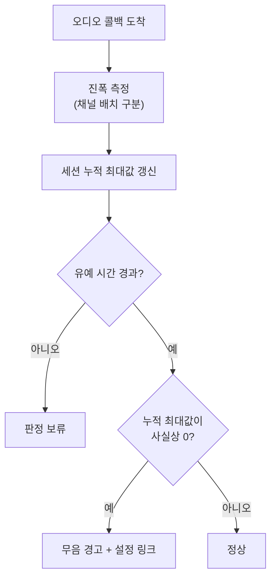

# ADR 0002: 캡처 성공을 반환값이 아니라 진폭으로 판정한다

Date: 2026-07-30

## Status

Accepted (2026-08-21)

## Context

macOS의 오디오 캡처 권한 거부는 **오류로 나타나지 않는다.** 권한이 없어도 캡처
시작은 성공하고 콜백도 정상 주기로 들어오며, 버퍼 내용만 0으로 채워진다. 시스템
오디오 경로에서는 더 심하다 — 탭 생성과 aggregate device 구성이 모두 성공 코드를
반환한다. 실측한 실패 모드는 이렇다.

```
탭 생성 status=0, aggregate status=0, 콜백 374회
→ 논제로 샘플 0개, 최대 진폭 0.00000
```

탭 구성을 다섯 가지(전역 탭 / PID 명시 / private 여부 / 서브디바이스 유무)로 바꿔
시험해도 결과가 동일했으므로 구성 문제가 아니라 권한 문제로 확정했다.

이 조합이 만드는 결과는 제품에 치명적이다. 앱은 "녹취 중"을 표시하고, 파일도
생성되고, 종료 시 저장까지 정상 완료된다. 사용자는 **회의가 끝난 뒤 파일을 열어
보고서야** 아무것도 녹음되지 않았음을 알게 된다. 그 시점에는 되돌릴 방법이 없다.

## Decision Drivers

- 캡처 API의 반환값과 콜백 도착 여부가 실제 캡처 성공과 무관하다 — 성공을 신뢰할 수
  있는 신호가 API 표면에 없다.
- 실패를 회의 종료 후에 알면 손실이 확정된다. 녹취 중에 알려야 조치할 수 있다.
- 반대로 오탐도 손실이다 — 상대방이 말하지 않는 조용한 구간에 "권한 없음" 경고를
  띄우면 사용자가 경고를 무시하는 습관이 생겨 진짜 실패도 놓친다.
- 마이크와 시스템 오디오는 "정상인데 조용할" 확률이 다르다. 시스템 출력은 아무도
  말하지 않으면 완전 무음이 정상이고, 그 구간이 마이크보다 길다.
- 진폭 측정은 오디오 콜백에서 매 버퍼마다 실행되므로 비용이 낮아야 한다.

## Decision

캡처 성공 여부를 **버퍼 진폭**으로 판정한다. API 반환값은 시작 실패만 걸러내는
1차 관문으로만 쓰고, "실제로 소리가 들어오는가"는 소스별로 세션 누적 최대 진폭을
추적해 별도로 판단한다. 최대 진폭이 사실상 0에 머무르면 무음 상태로 보고 팝오버에
경고와 해당 시스템 설정 링크를 띄운다.

오탐을 막기 위해 판정에 **유예 시간**을 둔다. 세션 시작 직후에는 아직 소리가 없을 수
있으므로 **수 초 단위**의 유예가 지난 뒤부터만 판정하며, 시스템 오디오는 "정상인데 조용한"
구간이 마이크보다 길기 때문에 마이크보다 더 긴 유예를 준다. 판정 기준을 순간
레벨이 아니라 **세션 누적 최대값**으로 둔 것도 같은 이유다 — 한 번이라도 소리가
들어왔다면 권한은 살아 있다.

진폭 측정은 버퍼 포맷을 해석하는 단일 경로로 통일한다. 이것이 중요한 이유는 흔한
측정 방식이 **디인터리브 배치를 가정**하는데 프로세스 탭은 Float32 **인터리브**로
주기 때문이다. 배치를 구분하지 않으면 엉뚱한 메모리 위치를 읽어 시스템 오디오가
항상 무음으로 오진된다. 측정 경로는 버퍼의 채널 배치를 구분해 읽는다. 채널
포인터로 직접 읽을 수 없는 포맷은 무음이 아니라 "소리 있음"으로 취급한다. 판정 불가를 실패로 보고하면 없는 문제를 알리게 된다.



### 대안 검토

#### 시작 시점에 권한 상태를 조회해 판정한다

캡처를 시작하기 전에 인증 상태를 물어 거부 상태면 아예 시작하지 않고 안내한다.
사용자에게 가장 이른 시점에 알릴 수 있고, 진폭 같은 간접 신호가 아니라 권한이라는 직접
신호를 쓰므로 오탐이 없다. 마이크 경로에는 실제로 이 방식을 함께 쓴다. 채택하지 않은
것은 이것만으로 충분하다는 가정이다. 프로세스 탭이 쓰는 오디오 캡처 권한에는 대응하는
상태 조회 API가 없어서 시작 전 판정이 불가능하다. 더 근본적으로, 권한이 있는데도 무음인
경우(출력 장치가 바뀌었거나 입력이 음소거된 경우)를 이 방법은 잡지 못한다 — 사용자
입장에서 증상이 같은데 원인만 다른 실패를 놓친다.

#### 콜백 도착 여부와 횟수로 판정한다

진폭을 읽지 않으므로 버퍼 포맷 해석이 전혀 필요 없고, 인터리브/디인터리브 같은 함정이
원천적으로 없다. 구현이 몇 줄로 끝난다.

채택하지 않은 이유는 위 실측이 정확히 이 가정을 반증했기 때문이다. 권한 없이도 콜백은
374회 정상 도착했다. 콜백 도착은 캡처 성공과 상관이 없으므로 이 신호로는 문제의 실패
모드를 전혀 검출할 수 없다.

## Consequences

### Positive

- 반환값이 거짓말을 하는 상황에서도 실패가 드러난다. 사용자가 회의 중에 조치할 수
  있다.
- 권한 외의 원인(입력 음소거, 출력 장치 변경, 볼륨 0)으로 인한 무음도 같은 경로로
  잡힌다 — 사용자 관점에서 증상이 같으므로 대응도 같은 것이 맞다.
- 판정 기준이 관측된 진폭이므로 OS 버전이 권한 처리 방식을 바꿔도 검출이 유지된다.

### Negative

- 진폭은 간접 신호이므로 원인을 특정하지 못한다. 경고 문구가 "권한이 거부됐거나
  입력 장치가 음소거일 수 있습니다" 식으로 가능성을 나열하게 된다.
- 유예 시간 동안은 실패를 알 수 없다. 즉시 통보가 불가능하다.
- 버퍼 포맷 해석이 측정 경로의 정확성에 종속된다. 새 포맷이 등장하면 그 경로를
  갱신해야 하며, 누락 시 무음 오진이라는 조용한 실패로 되돌아간다.

### Risks

- 임계값이 고정값이므로, 극단적으로 작게 녹음되는 환경에서는 정상 입력을 무음으로
  오진할 수 있다. 반대로 아주 미세한 잡음이 유입되는 환경에서는 권한 실패를 정상으로
  볼 수 있다.
- 채널 포인터로 읽을 수 없는 포맷을 "소리 있음"으로 처리하므로, 그런 포맷에서 실제
  권한 실패가 발생하면 검출되지 않는다. 오탐보다 미탐을 택한 의도된 트레이드오프다.

## Related

- [시스템 오디오를 Core Audio Process Tap으로 캡처](./0001-system-audio-process-tap.md)
- [입력 레벨을 세 관점으로 나눠 진단한다](./0004-input-level-diagnostics.md)
