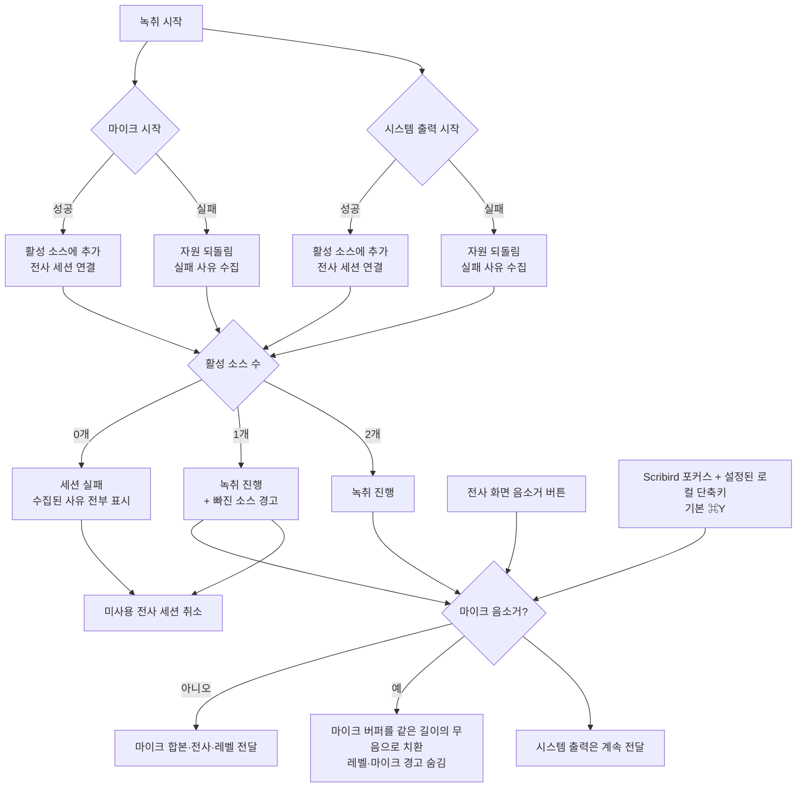

# ADR 0003: 두 캡처 소스의 실패를 서로 격리한다

Date: 2026-07-30

## Status

Accepted (2026-08-21)

## Context

이 앱은 두 개의 독립된 캡처 경로를 쓴다 — 마이크와 시스템 출력. 두 경로는 서로 다른
프레임워크와 서로 다른 TCC 권한을 쓰므로, **한쪽만 실패하는 상황이 예외가 아니라
일상적**이다. 마이크 권한은 허용했지만 오디오 캡처 권한은 아직 승인하지 않은 상태,
또는 그 반대가 자연스럽게 발생한다.

여기서 결정해야 할 것은 부분 실패를 무엇으로 취급하느냐다. 두 소스 중 하나가 죽었을
때 세션 전체를 실패로 접으면, 마이크만 살아 있는 사용자는 혼자 말하는 회의를 전혀
기록할 수 없다. 반대로 부분 실패를 조용히 넘기면 사용자는 상대방 발언이 왜 비어
있는지 알 수 없다.

부분 실패를 허용하기로 하면 파이프라인 조립 순서에도 제약이 생긴다. 전사 세션은
입력 스트림이 끝날 때까지 반환되지 않는 구조이므로, 캡처가 뜨지 않은 소스에 전사
세션을 물리면 그 세션은 영원히 끝나지 않는 스트림을 기다린다.

## Decision Drivers

- 두 경로의 권한이 독립적이라 한쪽만 승인된 상태가 흔하고, 혼자 말하는 회의(또는 대면
  회의)에서는 마이크만으로도 제품 가치가 성립한다.
- 부분 실패를 사용자가 모르면 회의록에서 상대방 발언 누락을 뒤늦게 발견한다.
- 전사 세션은 입력 스트림 종료를 기다리므로, 오지 않는 스트림에 물리면 세션 종료가
  영구 대기에 빠진다.
- 시작에 실패한 캡처가 부분 초기화 상태(열린 장치, 등록된 콜백)를 남기면 자원이
  새어나간다.
- 회의 앱의 음소거는 그 앱의 송출만 막으므로, 마이크를 직접 캡처하는 이 앱에는 적용되지
  않는다. 사용자가 자기 음성을 확실히 제외할 수 있는 별도 상태가 필요하다.

## Decision

두 소스를 **각각 독립적으로 시작**하고, 실패를 소스 단위로 수집한다. 세션을 접는
것은 **둘 다 실패했을 때뿐**이다. 하나라도 살아 있으면 녹취를 진행하되, 실패한
소스의 사유를 팝오버 경고로 노출한다.

핵심은 전사 세션을 **캡처가 실제로 뜬 뒤에** 물린다는 것이다. 세션 인스턴스는 모델
준비를 위해 미리 만들지만, 입력 스트림 연결은 해당 캡처의 시작이 성공한 소스에만
수행한다. 시작하지 못한 소스의 세션은 그 자리에서 취소해 폐기한다 — 남겨 두면
마무리 단계에서 끝나지 않는 분석기를 기다리게 되고, 이것이 앞의 driver가 가리키는
영구 대기다.

캡처 시작이 중간에 실패하면 그 소스의 자원을 그 자리에서 되돌린다. 부분 초기화
상태를 호출자에게 넘기지 않는다.

살아 있는 소스의 집합은 세션 동안 유지되어, 레벨 미터와 무음 판정이 "꺼진 소스"와
"켜졌지만 조용한 소스"를 구분하는 근거가 된다. 이 구분이 없으면 권한이 없어 꺼진
소스에 "무음입니다" 경고가 중복으로 뜬다.

마이크 소스는 녹취 중 **활성**과 **음소거** 상태를 오갈 수 있다. 음소거는 마이크
소스에만 적용하고 시스템 출력에는 영향을 주지 않는다. 세션·전사기·캡처 장치를 다시
시작하지 않고, 음소거 중 들어온 마이크 버퍼를 같은 길이의 무음으로 치환해 전사와 회의
음성 합본 양쪽에 전달한다. 이렇게 해야 자기 음성은 남지 않으면서 합본의 회의 시간축은
유지된다.

음소거는 전사 화면의 명시적인 버튼과 사용자가 설정한 로컬 단축키 두 경로에서 같은
상태를 토글한다. 단축키의 기본값은 `⌘Y`이며 설정 창에서 바꾸거나 기본값으로 되돌릴 수
있고, 앱을 다시 켜도 선택을 유지한다. Scribird가 포커스를 가진 동안에만 동작하며,
팝오버·전사 창·설정 창 중 어느 화면이 앞에 있어도 동일하다. 다른 앱이 앞에 있을 때까지
가로채는 전역 단축키로 등록하지 않는다.

### Requirement contract

- 마이크 음소거는 녹취 중에만 전환할 수 있고, 새 녹취는 항상 음소거 해제 상태로
  시작한다.
- 녹취 중 마이크 소스가 살아 있으면 전사 화면의 음소거 버튼과 사용자가 설정한 단축키가
  같은 음소거 상태를 토글한다. Scribird가 포커스를 가진 동안에만 동작하고 다른 앱의 같은
  조합은 가로채지 않는다.
- 마이크 음소거 단축키의 기본값은 `⌘Y`이며, 설정 창에서 바꾸거나 기본값으로 되돌릴 수
  있다. 사용자가 정한 조합은 앱을 다시 켜도 유지하고, 저장된 값을 해석할 수 없으면
  기본값으로 되돌린다.
- 단축키는 입력기 문자와 무관한 물리 키 코드와 정확한 수정자 조합으로 판정한다. 한글 입력
  중에도 동일하게 동작하고, 키 반복이나 설정한 것 외의 수정자가 함께 눌린 조합은 음소거로
  처리하지 않는다.
- 수정자가 없거나 Shift만 있는 조합은 일반 입력을 가로채므로 거부한다. 다른 Scribird
  단축키와 같은 조합은 충돌로 처리해 설정 화면에 사유를 표시하고, 충돌하는 동안 마이크
  음소거 단축키를 실행하지 않는다. 음소거 조합을 충돌하는 값으로 새로 입력하면 기존의
  유효한 조합을 유지한다.
- 녹취 중 단축키를 바꾸면 다음 키 입력부터 새 조합을 사용한다.
- 음소거 중 마이크 음성은 전사되지 않으며, 회의 음성 합본의 같은 시간 구간에는 마이크
  내용이 들어가지 않는다.
- 음소거 직전에 이미 받은 마이크 발화 결과는 정상적으로 확정·보존할 수 있다.
- 음소거 중에는 마이크 레벨 미터와 데시벨 값을 표시하지 않고, 의도된 음소거 상태를
  표시한다.
- 음소거 중에는 마이크 무음 경고와 낮은 레벨 경고를 내지 않는다.
- 마이크 음소거와 해제는 시스템 출력의 캡처·전사·합본 저장·레벨 표시를 중단하거나
  재시작하지 않는다.
- 시간축 연속성을 위해 마이크 캡처 장치는 계속 열어 둔다. 따라서 운영체제의 마이크 사용
  표시가 유지되는 것은 의도된 교환이다.

### 대안 검토

#### 한 소스라도 실패하면 세션을 시작하지 않는다

상태 공간이 단순해진다. 녹취 중이면 항상 두 소스가 살아 있으므로 회의록의 완전성이
보장되고, 부분 기록이라는 애매한 산출물이 생기지 않는다. 레벨 미터나 무음 판정도 소스
활성 여부를 따질 필요가 없어진다.

채택하지 않은 이유는 이것이 흔한 상태를 전면 차단하기 때문이다. 두 권한이 독립이라
한쪽만 승인된 상태는 특히 첫 실행 직후에 정상적으로 발생하는데, 그때 앱이 아무것도 하지
못한다. 특히 마이크만 승인된 사용자가 혼자 말하는 회의를 기록하려는 경우는 제품이 충분히
지원할 수 있는 시나리오인데도 막힌다. 완전성을 위해 가용성을 포기하는 교환인데, 이
제품에서는 "일부라도 기록된 회의록"이 "기록 없음"보다 확실히 낫다.

#### 부분 실패를 경고 없이 진행한다

실패 사유를 수집·표시하는 경로가 사라져 구현이 가장 단순하고, 팝오버에 경고 영역을 둘
필요도 없다. 사용자는 레벨 미터에서 어느 소스가 꺼졌는지 볼 수 있으니 정보가 아주 없는
것도 아니다.

채택하지 않은 이유는 미터만으로는 원인과 조치를 알 수 없다는 것이다. 소스가 꺼진 표시를
봐도 그것이 권한 문제인지 장치 문제인지, 어느 설정 화면으로 가야 하는지 알 수 없다.
그리고 이 앱의 주요 실패 모드가 조용한 실패라는 점을 감안하면(관련 결정 참조), 검출한
실패를 표시하지 않는 선택은 검출 자체를 무의미하게 만든다.

#### 음소거할 때 마이크 장치를 닫고 해제할 때 다시 연다

운영체제의 마이크 사용 표시까지 사라지므로 가장 강한 물리적 음소거처럼 보인다. 그러나
마이크 장치를 닫은 동안 마이크 소스의 프레임 시간축이 멈춰 시스템 출력과
어긋나고, 다시 열 때 장치 전환과 같은 공백·실패가 생긴다. 전사 입력 스트림까지 닫으면
해제 시 모델 준비와 전사 세션 조립을 다시 거쳐야 한다.

채택하지 않은 이유는 사용자가 요구한 경계가 자기 음성의 전사·저장 제외이며, 운영체제
표시를 없애기 위해 진행 중인 회의의 시간축과 소스 독립성을 훼손하는 교환이 더 크기
때문이다. 캡처는 유지하되 버퍼를 즉시 무음으로 치환하면 음성 내용은 남기지 않으면서
세션과 두 소스의 정렬을 보존한다.

## Consequences

### Positive

- 한쪽 권한만 승인된 상태에서도 제품이 동작한다 — 첫 실행 직후의 흔한 상태가
  막히지 않는다.
- 실패 사유가 사유별로 수집되므로, 두 소스가 다른 이유로 실패했을 때 둘 다 알린다.
- 시작 실패 시 자원을 되돌리므로 반복 시도가 장치 누수를 쌓지 않는다.
- 미사용 전사 세션을 즉시 폐기해 세션 종료가 영구 대기에 빠지지 않는다.
- 마이크 음소거가 시스템 출력에 영향을 주지 않아 상대방 발언은 계속 기록된다.
- 음소거 구간을 같은 길이의 무음으로 취급해 합본의 회의 시간축이 유지된다.
- 음소거 단축키를 바꿀 수 있어 사용자 환경의 충돌을 피하면서도 로컬 동작 범위를 유지한다.

### Negative

- 부분 기록이라는 산출물이 존재한다 — 회의록에 상대방 발언이 아예 없을 수 있고,
  나중에 파일만 보면 그것이 부분 실패였는지 알기 어렵다.
- 활성 소스 집합을 상태로 들고 다녀야 하므로, 레벨 미터·무음 판정·정리 경로가 모두
  이 집합을 참조한다.
- 시작 경로가 소스별로 분기하므로 두 경로의 실패 처리를 각각 검증해야 한다.
- 음소거 중에도 마이크 장치를 열어 두므로 운영체제의 마이크 사용 표시는 유지된다.
- 설정할 단축키가 하나 늘어나고, 다른 단축키와의 충돌 상태를 함께 검증해야 한다.

### Risks

- 부분 기록임을 산출물 자체에 남기지 않으므로, 저장된 회의록만 보는 사람은 상대방
  발언 누락을 캡처 실패가 아니라 회의 내용으로 오해할 수 있다.
- 활성 소스 집합과 실제 캡처 상태가 어긋나면(캡처가 시작 후 조용히 죽는 경우) 미터가
  "켜짐"을 유지한다. 이 경우의 검출은 진폭 판정에 의존한다.
- 음소거 상태가 버퍼 처리와 화면 진단에서 어긋나면 음성은 막혔는데 레벨이 보이거나,
  반대로 레벨만 숨기고 음성이 저장되는 오해를 부를 수 있다. 두 동작은 같은 상태를
  기준으로 검증해야 한다.
- 저장된 단축키끼리 충돌하는 상태를 놓치면 한 입력이 두 동작을 동시에 일으킬 수 있다.
  충돌 상태에서는 마이크 음소거 단축키를 실행하지 않고 설정 화면에서 원인을 보여야 한다.

## Related

- [시스템 오디오를 Core Audio Process Tap으로 캡처](./0001-system-audio-process-tap.md)
- [캡처 성공을 반환값이 아니라 진폭으로 판정한다](./0002-silent-capture-detection.md)
- [소스 분리로 화자를 확정한다](../transcription/0001-source-based-speaker-attribution.md)
- [언어 모델 확보를 녹취 시작의 게이트로 둔다](../transcription/0003-model-provisioning-gate.md)
