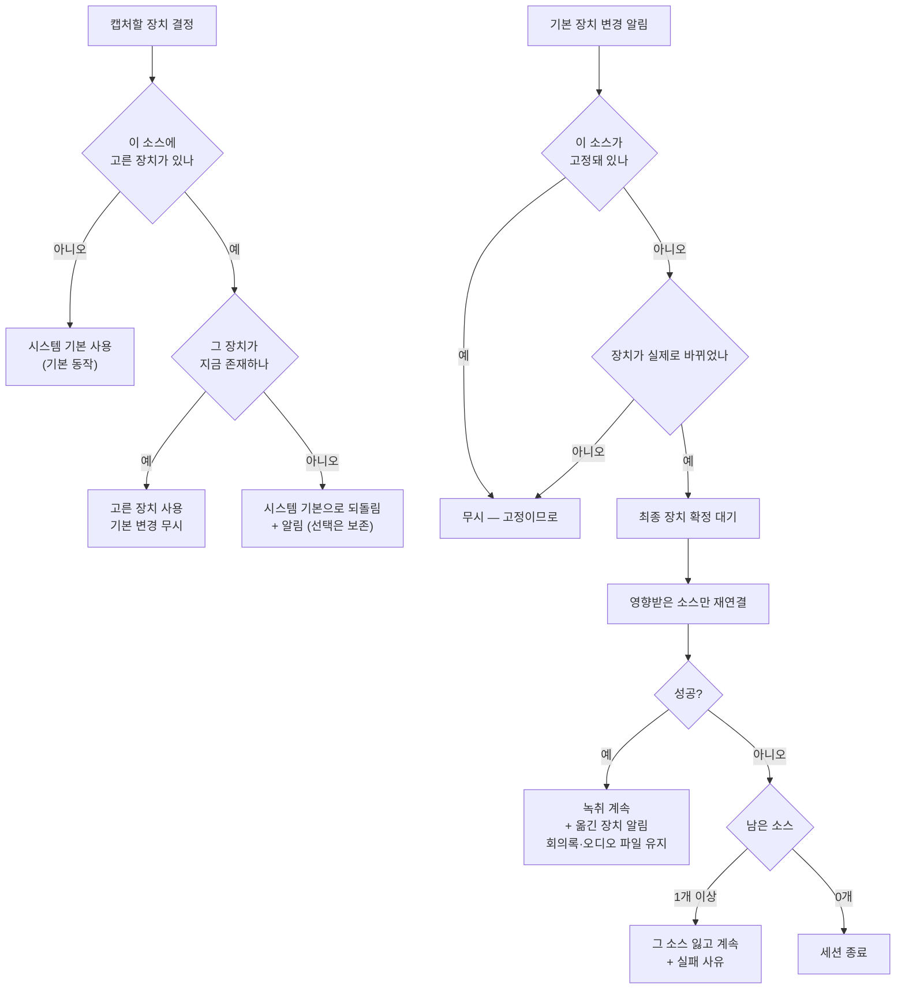

# ADR 0005: 캡처 장치는 시스템 기본을 따라가고, 사용자가 고르면 그 장치에 고정한다

Date: 2026-07-31

## Status

Accepted (2026-08-21)

## Context

지금은 캡처가 시작될 때의 장치에 묶인다. 시스템 출력 탭은 시작 시점의 기본 출력 장치 UID로
만들어지고, 마이크는 그 시점의 입력 노드를 연다. 그 뒤로 기본 장치가 바뀌어도 캡처는 옛
장치를 계속 본다.

**회의 직전에 이어폰을 끼는 것은 예외가 아니라 통상적인 순서다.** 회의 앱을 열고 녹취를
시작한 뒤 헤드셋을 연결하는 흐름에서, 사용자는 소리를 헤드셋으로 듣지만 탭은 내장 스피커로
나가는 (이제 아무것도 없는) 소리를 잡는다. 결과는 상대방 발언이 통째로 비는 회의록이다.

이것이 특히 나쁜 이유는 **기존 진단 경로가 이 상황을 오진하도록** 되어 있다는 것이다. 이
앱은 캡처 성공을 반환값이 아니라 진폭으로 판정하고(관련 결정 참조), 진폭이 0에 가까우면
권한 문제를 먼저 안내한다. 장치가 어긋나 무음이 흐르는 상황에서 사용자는 이미 허용한 권한
설정 화면으로 보내진다. 조용한 실패를 드러내려고 만든 장치가 틀린 원인을 가리킨다.

측정으로 드러난 사실이 결정의 폭을 좁힌다. macOS의 기본 출력 장치는 **하나가 아니라 둘**이고
서로 독립적으로 움직인다 — 프로세스 탭이 대상으로 삼는 "시스템 출력"과, 일반 재생이 따르는
"기본 출력"이다. 한쪽만 바꾸면 다른 쪽은 그대로 남는다:

```
초기            sysOut=94(내장 스피커)  defOut=94
sysOut만 변경   sysOut=106(헤드셋)      defOut=94    ← 서로 갈라진다
defOut만 변경   sysOut=106              defOut=106
```

각 셀렉터의 리스너는 **자기 셀렉터가 바뀔 때만 발화**했다. `defOut`을 바꿨을 때
`sysOut` 리스너는 울리지 않았고 그 반대도 같았다. 따라서 어느 셀렉터를 감시할지는 취향이
아니라 정확성 문제다 — 탭이 보는 값을 감시하지 않으면 알림이 오지 않거나, 오더라도 탭과
무관한 변경에 반응한다.

그런데 기본 장치를 따라가는 것이 항상 사용자의 의도와 맞지는 않는다. 회의 앱은 자기 전용
가상 장치를 만들고(실측: `Microsoft Teams Audio`, `ZoomAudioDevice`가 장치 목록에 존재),
사용자가 시스템 기본을 그쪽으로 두는 경우도 있다. 반대로 회의는 헤드셋으로 듣지만 시스템
기본은 다른 것으로 유지하고 싶은 경우도 있다. 이때 기본만 따라가면 잡는 대상이 사용자의
의도와 어긋나는데, 사용자에게 그것을 바로잡을 수단이 없다.

여기서 결정할 것은 장치 변경을 감지할지 여부, 감지했을 때 무엇을 다시 만들지, 그 과정에서
회의록과 원본 오디오에 무엇을 보장하느냐, 그리고 **사용자가 장치를 직접 고를 수 있게 할
것인지**다.

## Decision Drivers

- 회의 직전·도중의 장치 전환은 통상적인 사용 순서다. 드문 예외로 취급할 수 없다.
- 장치가 어긋난 무음은 기존 진단이 권한 문제로 오진한다 — 사용자를 틀린 조치로 보낸다.
- 기본 출력 셀렉터가 둘이고 독립적으로 움직이므로, 탭이 쓰는 값을 감시해야 알림이 온다.
- 캡처를 다시 만드는 동안 녹취가 끊기면 회의 도입부를 잃는다 — 세션 경계를 캡처와 분리한
  기존 결정과 같은 압력이다.
- 두 소스의 실패는 서로 격리되어야 한다 — 출력 장치 전환이 마이크 전사를 멈추면 안 된다.
- 장치 전환은 최종 장치가 확정되기까지 중간 장치를 거칠 수 있다 — 중간 장치로 재연결하면
  곧 무효가 되는 캡처를 만들고 그 사이 오디오를 잃는다.
- 시스템 기본이 사용자가 회의를 듣는 장치와 다를 수 있다 — 회의 앱이 만든 가상 장치가 기본이
  되거나, 사용자가 회의만 헤드셋으로 듣는 경우가 그렇다. 기본만 따라가면 그것을 바로잡을
  수단이 없다.
- 고른 장치는 사라질 수 있다 — 헤드셋을 뽑으면 저장된 선택이 존재하지 않는 장치를 가리킨다.
  그때 아무것도 잡지 못하면 회의가 통째로 비고, 사용자는 왜 비었는지 알 수 없다.

## Decision

**캡처 장치는 두 가지 방식 중 하나로 정해진다 — 시스템 기본을 따라가거나, 사용자가 고른
장치에 고정하거나.** 기본값은 따라가기다. 사용자가 설정에서 특정 장치를 고르면 그때부터 그
장치에 고정되고, 시스템 기본이 바뀌어도 움직이지 않는다.

두 방식 모두 **세션은 유지한다** — 재연결이 일어나도 회의록도 원본 오디오 파일도 끊지 않는다.

### 요구사항 계약

- **기본값은 시스템 기본 장치를 따라가는 것이다.** 사용자가 아무것도 고르지 않은 상태에서
  회의 직전에 이어폰을 껴도 캡처가 따라와야 한다. 이것이 이 결정의 출발점이고, 고정은 그
  위에 얹는 선택지다.
- **선택은 소스별로 독립이다.** 입력만 고정하고 출력은 따라가게 두는 조합이 가능하다 — 두
  소스는 서로 다른 이유로 고정되고(마이크는 품질, 출력은 회의 앱 라우팅), 한쪽 선택이 다른
  쪽을 강제하면 안 된다.
- **고정된 장치는 시스템 기본 변경에 반응하지 않는다.** 고정의 의미가 그것이다. 반응하면
  사용자가 고른 것이 무의미해진다.
- **선택은 앱을 다시 켜도 유지된다.** 설정 창의 항목이므로 그 창의 계약을 따른다. 저장하는
  것은 장치의 안정 식별자이며, 실행마다 바뀌는 값을 저장하지 않는다.
- **고른 장치가 없으면 시스템 기본으로 되돌아가고 그 사실을 알린다.** 헤드셋을 뽑으면 저장된
  선택이 존재하지 않는 장치를 가리킨다. 아무것도 잡지 못하는 것보다 기본 장치로 기록하는 편이
  낫고, 사용자는 자기가 고른 장치가 아니라는 것을 알아야 한다. 선택 자체는 지우지 않는다 —
  장치를 다시 꽂으면 그 선택으로 돌아간다.
- **선택은 녹취 중에도 바꿀 수 있다.** 장치를 잘못 골라 회의가 비어 있는 것을 발견하는 시점이
  회의 중이므로, 그때 고칠 수 없으면 이 기능의 목적을 잃는다. 바꾸면 그 소스만 재연결한다.
- **목록에는 그 소스로 쓸 수 있는 장치만 올린다.** 입력 채널이 없는 장치를 마이크 후보로
  보여주면 고르는 순간 실패한다. 실측에서 장치 목록은 입력 전용·출력 전용·양방향이 섞여
  있었으므로 채널 수로 걸러야 한다.
- **감시 대상은 탭이 실제로 대상으로 삼는 출력 셀렉터와 기본 입력 셀렉터다.** 두 출력
  셀렉터가 독립적으로 움직이므로, 탭이 쓰는 쪽을 감시한다. 감시 대상 셀렉터가 탭이 쓰는
  셀렉터와 어긋나면 이 결정 전체가 무효가 된다.
- **식별자를 장치로 되찾을 때 반환값을 믿지 않는다.** 실측: 존재하지 않는 식별자를 넘겨도
  `status=0`을 반환하고 장치 번호로 `0`을 줬다. 이 앱이 캡처에서 지키는 규칙과 같이, 성공
  반환이 아니라 값으로 판정한다.
- **재연결은 소스 단위로 한다.** 출력 장치가 바뀌면 시스템 출력 캡처만, 입력 장치가 바뀌면
  마이크 캡처만 다시 만든다. 한 소스의 재연결 실패가 다른 소스의 캡처를 멈추지 않는다.
- **재연결에 실패하면 그 소스를 잃되 세션은 계속한다.** 둘 다 잃었을 때만 세션을 접는다 —
  시작 시점의 실패 격리와 같은 규칙이다. 실패 사유는 사용자에게 알린다.
- **세션 경계는 만들지 않는다.** 장치가 바뀌었다는 것은 회의가 바뀌었다는 뜻이 아니다.
  회의록·원본 오디오 파일·발화 시간축이 모두 이어진다. 시간축은 계속 흐르므로 전환 전후의
  발화 시각이 단조 증가한다.
- **전환 구간의 손실은 허용하고 숨기지 않는다.** 장치를 다시 여는 사이의 오디오는 캡처되지
  않는다 — 복구할 방법이 없다. 사용자에게 어느 소스가 어느 장치로 옮겨졌는지 알린다.
- **한 장치 전환에 재연결은 한 번만 한다.** 최종 장치가 확정된 뒤에 옮긴다 — 중간 장치로
  재연결하면 곧 무효가 되는 캡처를 만들고 재연결이 겹쳐 장치를 잃는다. 실측으로는 기본
  장치를 한 번 바꿀 때 알림이 1회만 왔으나(전환 후 +0.052초), 연결이 여러 단계를 거치는
  장치는 중간 상태를 지나므로 최종 상태를 기다린다.
- **바뀐 장치가 이전과 같으면 아무것도 하지 않는다.** 알림은 실제 변경 없이도 오고, 갔다가
  되돌아온 전환은 재연결할 이유가 없다.
- **감시를 멈춘 뒤의 알림은 버린다.** 리스너 해제가 실효되지 않는 것이 실측으로 확인됐다 —
  `status=0`을 반환하고도 이후 장치 전환에 콜백이 발화했고, 해제를 3회 반복해도 같았다.
  따라서 해제에 의존하지 않고 통지 자체를 막는 수단을 함께 둔다. 이것이 없으면 중지 후
  도착한 알림이 이미 멈춘 캡처를 다시 연다.
- **녹취 중이 아니면 감시하지 않는다.** 다음 시작이 그 시점의 장치를 새로 읽으므로 대기
  중에 따라갈 대상이 없다.



전사 세션은 다시 만들지 않는다. 재연결은 캡처 계층에서 끝나고, 전사기에 흐르는 입력 스트림은
같은 스트림으로 유지된다 — 스트림을 갈아 끼우면 전사기가 마무리에 들어가고 모델 확보 관문을
다시 통과해야 한다. 새 장치의 캡처 포맷이 이전과 다를 수 있으므로, 포맷 변화는 캡처 계층에서
흡수한다.

### 대안 검토

#### 장치 변경을 감지하지 않고 사용자가 중지·재시작하게 한다

구현이 없다 — 상태를 추가하지 않으므로 재연결 실패, 알림 합치기, 포맷 변화 같은 새 실패
모드가 생기지 않는다. 사용자가 명시적으로 다시 시작하므로 무엇이 언제 바뀌었는지도 분명하다.

채택하지 않은 이유는 사용자가 다시 시작할 근거를 얻지 못한다는 것이다. 장치가 어긋난 무음은
조용하고, 기존 진단은 그것을 권한 문제로 오진해 이미 허용한 설정 화면으로 보낸다. 스스로
원인을 짐작할 수 있는 사용자만 회복할 수 있는 상황을 남기는 셈이다. 게다가 중지·재시작은
세션을 끊어 회의록이 둘로 갈라지는데, 장치를 바꾼 것은 회의가 바뀐 것이 아니므로 산출물의
경계가 회의와 어긋난다.

#### 장치 변경을 감지하되 세션을 끊고 새로 시작한다

기존 경로를 재사용하므로 재연결 로직이 필요 없다. 시작 경로가 이미 장치를 새로 읽고 실패
격리도 갖췄으므로, 감지 후 정지·시작만 호출하면 된다.

채택하지 않은 이유는 모델 확보 관문을 다시 통과한다는 것이다. 시작 경로는 로케일 예약과
모델 설치 확인을 거치므로 즉시 끝나지 않고, 그 사이의 발화가 사라진다 — 이어폰을 끼는
시점은 회의가 시작되는 시점이라 정확히 도입부가 손실된다. 세션이 갈라져 회의록과 오디오
파일이 둘로 나뉘는 문제도 위 대안과 같다. 캡처를 끊지 않고 경계만 끊는다는 기존 결정이
반대 방향으로 세운 것과 같은 이유로, 경계를 끊지 않고 캡처만 바꾸는 쪽이 이 결정에 맞다.

#### 사용자 선택 없이 시스템 기본만 따라간다

설정에 항목이 늘지 않고, 저장할 식별자도 없으며, 고른 장치가 사라졌을 때의 처리도 필요 없다.
"항상 지금 듣고 있는 장치를 잡는다"는 한 문장으로 동작이 설명된다.

채택하지 않은 이유는 시스템 기본이 사용자가 회의를 듣는 장치와 다를 수 있다는 것이다. 실측에서
장치 목록에는 회의 앱이 만든 가상 장치(`Microsoft Teams Audio`, `ZoomAudioDevice`)가 함께
있었고, 그중 하나가 시스템 기본이 되는 구성이 존재한다. 그때 잡는 대상이 의도와 어긋나는데
사용자에게 바로잡을 수단이 없다 — 시스템 설정을 바꾸면 회의 소리를 듣는 경로까지 바뀌므로
회의를 희생해야 한다. 마이크 쪽은 더 분명하다: 여러 마이크가 있는 환경에서 품질이 좋은 것을
고르고 싶어도 시스템 기본에 묶인다.

#### 사용자 선택만 두고 시스템 기본은 따라가지 않는다

동작이 하나뿐이라 예측 가능하다. 사용자가 고른 장치를 쓰거나, 고르지 않았으면 시작 시점의
기본을 끝까지 쓴다. 고정과 따라가기가 공존해 생기는 "지금 어느 방식인가"라는 상태가 없다.

채택하지 않은 이유는 이 결정의 출발점을 버린다는 것이다. 회의 직전에 이어폰을 끼는 통상적인
순서에서, 아무 설정도 하지 않은 사용자가 여전히 빈 회의록을 얻는다. 기본값이 안전하지 않은
설정은 그것을 모르는 사용자에게 손실을 남기고, 그 손실은 회의가 끝난 뒤에야 드러난다.

#### 여러 출력 장치를 동시에 탭해 사용자가 무엇을 듣든 잡는다

전환 순간의 손실이 없다. 어느 장치로 옮겨도 이미 그 장치를 잡고 있으므로 재연결 자체가
필요 없고, 알림 합치기나 재연결 실패도 다룰 일이 없다.

채택하지 않은 이유는 잡은 소리가 회의 내용이라는 보장이 사라진다는 것이다. 활성이 아닌 장치로
나가는 소리까지 전사되면 상대방 발언에 다른 앱의 소리가 섞이고, 그 혼입은 화자 라벨이
소스로 확정된다는 성질을 무너뜨린다. 장치 수만큼 탭과 집계 장치를 유지하는 비용도 실제
사용에서 쓰이지 않는 경로에 지불된다.

## Consequences

### Positive

- 회의 직전·도중에 이어폰을 껴도 상대방 발언이 계속 기록된다 — 가장 흔한 손실 경로가 막힌다.
- 장치 어긋남을 권한 문제로 오진해 사용자를 틀린 설정 화면으로 보내는 일이 줄어든다.
- 회의록과 원본 오디오가 장치 전환을 가로질러 하나로 이어진다 — 산출물 경계가 회의와 일치한다.
- 소스 단위 재연결이라 출력 전환이 마이크 전사에 영향을 주지 않는다.
- 시스템 기본이 회의를 듣는 장치와 다른 구성(회의 앱 전용 가상 장치 등)에서도 사용자가 잡을
  대상을 정할 수 있다 — 시스템 설정을 건드려 회의 소리 경로까지 바꾸지 않아도 된다.
- 기본값이 안전한 쪽이다. 아무 설정도 하지 않은 사용자가 이어폰을 껴도 캡처가 따라온다.

### Negative

- 녹취 중 감시·재연결 상태가 늘어난다. 알림 합치기와 재연결 실패 처리가 새로 필요하다.
- 전환 구간의 오디오는 잃는다. 재연결이 즉시 끝나지 않으므로 그 사이 발언은 회의록에 없다.
- 새 장치의 캡처 포맷이 다를 수 있어, 포맷 변화를 흡수하는 경로가 실제로 동작해야 한다.
- 캡처가 세션 중에 교체되므로, "시작 시점의 장치로 끝까지 간다"는 단순한 불변식을 잃는다.
- 리스너 해제를 믿을 수 없어 통지 차단 수단을 따로 유지해야 한다 — 감시의 수명이 등록·해제
  호출만으로 표현되지 않는다.
- 캡처 대상을 정하는 방식이 두 가지가 되어, "지금 어느 장치를 왜 잡고 있는가"가 설정과 시스템
  상태 양쪽에 달린다. 고정된 소스는 시스템 기본이 바뀌어도 움직이지 않으므로, 사용자가 고정한
  것을 잊으면 왜 따라오지 않는지 알기 어렵다.
- 장치 목록을 사용자에게 보여줘야 하므로, 소스별로 쓸 수 있는 장치를 걸러내는 경로가 필요하다.
- 고른 장치가 사라진 상태를 다뤄야 한다 — 선택은 보존하면서 기본으로 되돌리는 중간 상태다.

### 검증

- 셀렉터 일치, 두 소스 셀렉터 구분, 등록·해제 반복, 중지 후 무통지, 실제 장치 전환 통지,
  되돌아온 전환의 무통지, 한 전환당 1회 통지를 자동 테스트로 덮는다. 장치가 둘 이상인
  기기에서만 전환 테스트가 판별력을 가지므로, 하나뿐이면 건너뛴다.
- 중지 후 무통지 테스트는 통지 차단 수단을 제거하면 실패하는 것을 확인했다. 셀렉터 일치
  테스트는 감시 셀렉터를 일반 재생 셀렉터로 바꾸면 실패한다.
- 재연결이 회의록·오디오 파일·시간축을 잇는지는 실기 확인이 필요하다 — 녹취 중 출력 장치를
  바꿨을 때 세션 디렉터리가 하나로 유지되고 발화 시각이 단조 증가해야 한다.
- 장치 선택 쪽은 기본값(따라가기), 소스별 독립, 영속화(저장값이 UID인지), 고른 장치가 사라진
  경우의 되돌림·선택 보존·경고, 방향별 목록 필터, 없는 UID 판정을 자동 테스트로 덮는다.
- 판별력 확인: 고정 상태를 따라가게 바꾸면 고정 테스트 두 개가 실패하고, 존재 판정을 반환값
  기준으로 되돌리면 사라진 장치 테스트 세 개가 실패한다.
- 마이크의 장치 전환은 엔진 하부 유닛에 직접 설정해야 하며, 실측에서 설정 후 되읽기가 같은
  장치를 반환하고 채널 수도 그 장치의 것으로 바뀌었다(내장 1ch → USB 헤드셋 2ch). **포맷을
  읽기 전에 장치를 설정해야 한다** — 순서를 바꾸면 이전 장치의 포맷으로 탭을 걸어 어긋난다.
- 고정된 소스가 시스템 기본 변경을 실제로 무시하는지, 그리고 녹취 중 선택 변경이 세션을 끊지
  않는지는 실기 확인이 필요하다.

### Risks

- 감시하는 셀렉터가 탭이 실제로 쓰는 셀렉터와 어긋나면 알림이 오지 않는다. 두 출력 셀렉터가
  독립적으로 움직이므로 이 어긋남은 조용하다 — 코드를 읽어서는 드러나지 않고, 장치를 실제로
  전환해 봐야 알 수 있다. 그래서 두 곳이 값을 각자 적는 대신 한 출처를 참조하게 두고, 그
  일치를 테스트가 지킨다.
- **리스너 해제가 성공을 반환하고도 실효되지 않는다.** 이 앱이 캡처에서 이미 지키는 규칙
  ("성공 반환을 증거로 믿지 않는다")이 감시 해제에도 적용된다. 해제만 믿고 통지 차단 수단을
  두지 않으면, 중지된 세션의 캡처가 다시 열리는 경로가 남는다.
- 재연결 도중 다시 장치가 바뀌면 재연결이 겹칠 수 있다. 최종 상태를 기다리는 것이 이 경우를
  덮어야 한다.
- 전환 손실을 사용자가 알아채지 못하면, 그 구간의 공백을 회의 내용으로 오해할 수 있다.
- 고정한 사용자가 그 사실을 잊으면, 이어폰을 껴도 캡처가 따라오지 않는 것을 고장으로 오해할
  수 있다. 그래서 지금 잡고 있는 장치가 화면에서 읽혀야 한다.
- 존재하지 않는 식별자를 되찾을 때 API가 성공을 반환하므로, 값으로 판정하지 않으면 장치 번호
  `0`을 그대로 써서 캡처가 조용히 실패한다.
- 가상 장치(회의 앱이 만든 것)도 목록에 올라오므로, 사용자가 그것을 골라 의도와 다른 결과를
  얻을 수 있다. 다만 그 선택을 막지는 않는다 — 회의 앱 출력만 잡고 싶은 구성이 실제로 있다.

## Related

- [시스템 오디오를 Core Audio Process Tap으로 캡처](./0001-system-audio-process-tap.md)
- [캡처 성공을 반환값이 아니라 진폭으로 판정한다](./0002-silent-capture-detection.md)
- [두 캡처 소스의 실패를 서로 격리한다](./0003-per-source-failure-isolation.md)
- [입력 레벨을 세 값으로 나눠 추적한다](./0004-input-level-diagnostics.md)
- [세션 경계를 캡처와 분리한다](../session/0001-session-boundary-control.md)
