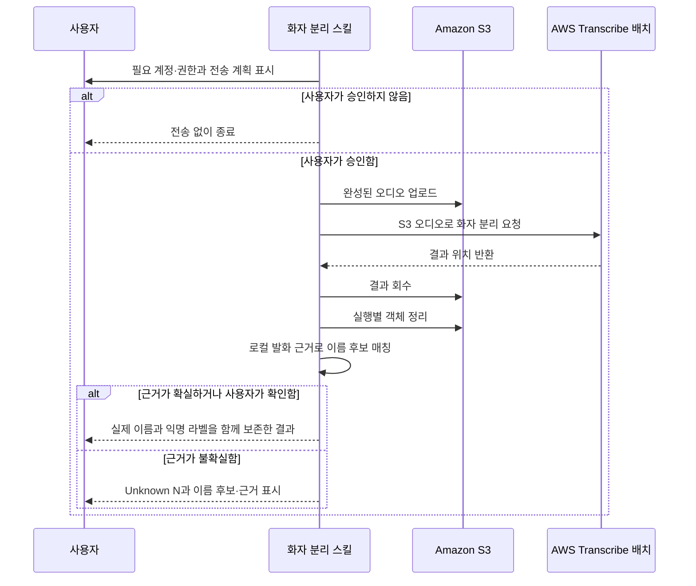

# ADR 0001: 회의 후 화자 분리는 S3 배치 작업으로 실행한다

Date: 2026-08-20

## Status

Accepted (2026-08-20)

## Context

Scribird 본체는 오디오와 전사를 기기 안에서 처리하지만, 선택적인 회의 후 화자 분리는
원격 참석자들이 섞인 오디오를 외부 서비스로 보내 개인별 경계를 추정한다. 이 과정은
앱의 온디바이스 경계를 의도적으로 벗어나므로, 사용자는 필요한 계정과 권한, 전송 대상,
임시 저장 위치를 실행 전에 알아야 한다.

화자 분리 대상은 이미 완성된 회의 오디오다. 실시간 결과가 필요하지 않으므로 오디오
재생 속도에 맞춘 전송은 처리 시간을 늘리고, 화자 수 지정과 다국어 식별도 제한한다.
완성된 오디오를 한 번 업로드해 비동기 작업으로 처리하는 편이 이 사용 흐름에 맞다.

## Decision Drivers

- 입력은 회의가 끝난 뒤 존재하는 완성된 오디오이므로 실시간 지연을 줄일 이유가 없다.
- 화자 수를 2명에서 30명 사이로 지정하고 다국어 회의를 식별할 수 있어야 한다.
- 회의 오디오가 기기 밖으로 나가 임시 저장된다는 사실을 사용자가 전송 전에 알아야 한다.
- 성공한 작업은 결과를 회수한 뒤 임시 객체를 기본적으로 정리해야 한다.

## Decision

회의 후 화자 분리는 Amazon S3에 오디오를 업로드하고 AWS Transcribe 배치 작업으로만
실행한다. 스트리밍 전사 경로를 지원하지 않으며, 배치 작업이 실패해도 스트리밍으로
전환하지 않는다.

스킬은 실행 전에 AWS 계정과 자격 증명, S3와 Transcribe 권한이 필요하다는 사실을
사용자에게 알린다. 또한 회의 오디오가 선택한 계정과 리전의 S3에 임시 저장된다는
사실을 알리고 명시적인 승인을 받은 뒤에만 업로드한다.

기본 분석 대상은 원격 소스 오디오다. 마이크 소스는 대면 회의처럼 한 입력에 여러 사람이
담긴 경우에만 사용자가 명시적으로 선택한다. 언어를 알면 그 언어를 사용하고, 여러 후보
언어가 있으면 다국어 식별을 사용하며, 언어 정보가 없으면 자동 식별한다.

버킷이 없으면 선택한 계정과 리전에 비공개 버킷을 만들고 공개 접근을 차단한다. 작업이
성공하면 결과를 세션에 저장한 뒤 해당 실행에서 만든 S3 객체를 삭제한다. 사용자가
명시적으로 보존을 선택한 경우에만 객체를 남긴다. 정리에 실패해도 이미 받은 결과를
폐기하지 않고 남은 객체의 위치를 알린다.

원본 오디오와 온디바이스 전사는 수정하지 않는다. 클라우드 결과는 화자 경계와 전사 차이
검토에만 사용한다.

분석 전에 사용자가 아는 참석자 수와 이름을 소스별로 받는다. 마이크 소스를 분석한다면
기기 사용자와 같은 공간의 참석자를 함께 받고, 원격 소스를 분석한다면 원격 참석자만
받는다. 역할, 소속, 자기소개 표현처럼 식별에 도움이 되는 정보는 선택적으로 받을 수 있다.
이 이름과 힌트는 AWS에 전송하지 않고 로컬의 이름 매칭에만 사용한다.

AWS가 반환한 익명 화자와 실제 이름은 화자별 발화 근거로 매칭한다. 화자가 직접 밝힌
자기소개와 그 사람만 가질 수 있는 1인칭 역할·소속 진술을 우선한다. 다른 사람의 이름을
부른 발화는 그 이름의 화자라는 근거로 사용하지 않는다. 직접적이고 모순 없는 근거가
있거나 사용자가 확인한 매칭만 최종 이름으로 적용하며, 불확실한 매칭은 근거 시각과 함께
후보로 보여준다. 이름을 확정하지 못한 화자는 감지된 화자마다 `Unknown 1`부터 시작하는
익명 이름을 부여한다.

참석자 목록 순서나 발화량 순서만으로 이름을 붙이지 않는다. 한 소스 안에서 한 이름은
한 익명 화자에만 대응하며, 최종 산출물은 실제 이름을 적용하더라도 원래 오디오 소스와
AWS 익명 화자 라벨을 함께 보존한다. 감지한 화자 수와 제공받은 참석자 수가 다르면 어느
쪽도 조용히 버리거나 합치지 않고 차이를 알린다. 참석자 정보나 이름 매칭 정보가 없거나
일부 항목이 잘못됐거나 서로 충돌해도 병합 자체를 실패시키지 않는다. 사용할 수 있는
검증된 매칭만 적용하고 나머지는 `Unknown N`으로 유지하며 문제를 경고한다.

### Requirement contract

#### Required guarantees

- 모든 클라우드 화자 분리는 S3 입력을 사용하는 AWS Transcribe 배치 작업으로 실행한다. 완성된 오디오를 재생 속도와 분리해 처리하기 위한 요구이며, 실행 시 S3 업로드와 배치 작업이 발생하고 스트리밍 연결은 발생하지 않아야 한다.
- 화자 수 상한은 2명부터 30명까지 지정할 수 있다. AWS 배치 화자 분리의 지원 범위이며, 범위 안의 값은 작업 설정에 반영되고 범위 밖의 값은 업로드 전에 거부되어야 한다.
- 업로드 전에 필요한 AWS 계정·권한과 오디오의 외부 전송·임시 저장 사실을 알린다. 온디바이스 제품 경계를 벗어나는 동작에 대한 사용자 통제를 위해 승인 화면에서 필요 조건과 전송 경계를 확인할 수 있어야 한다.
- 전송 대상 소스, 파일 크기, 계정, 리전, 버킷, 작업 후 보존 여부를 보여준 뒤 명시적 승인을 받는다. 사용자가 실제 전송 범위를 알고 결정해야 하며, 승인하지 않으면 AWS에 객체나 작업이 생기지 않아야 한다.
- 기본 분석 대상은 원격 소스이며 마이크 소스는 명시적으로 선택할 때만 포함한다. 기기 사용자의 화자는 오디오 경로로 이미 확정되므로 기본 실행 계획에는 원격 소스만 표시되고 선택한 경우에만 마이크 소스가 추가되어야 한다.
- 성공한 작업은 결과를 회수한 뒤 실행별 S3 객체를 삭제하며, 명시적으로 보존한 경우에만 남긴다. 회의 오디오의 불필요한 클라우드 잔존을 막기 위해 기본 성공 경로 뒤에는 실행별 객체가 없어야 하고 보존을 선택한 경우에는 위치를 보고해야 한다.
- 분석 전에 소스별 참석자 수와 이름을 물으며 역할·소속·자기소개 표현 같은 식별 힌트는 선택적으로 받는다. 이름과 힌트는 실제 화자 매칭의 입력이며 AWS에는 전송하지 않고 로컬에서만 처리해야 한다.
- 익명 화자와 이름은 화자 본인의 직접 자기소개 또는 그 사람만 가질 수 있는 1인칭 맥락을 근거로 매칭한다. 직접적이고 모순 없는 근거가 있거나 사용자가 확인한 매칭만 최종 이름으로 적용해야 한다.
- 불확실한 이름 매칭은 후보 이름, 근거 발화와 시각을 보여주고 해당 화자는 `Unknown N`으로 유지한다. 사용자가 확인하면 같은 로컬 결과를 다시 생성해 실제 이름을 적용할 수 있어야 한다.
- 최종 이름을 적용한 산출물도 원래 오디오 소스와 AWS 익명 화자 라벨을 보존한다. 이름 매칭을 잘못했을 때 원래의 추정 없는 소스 구분과 익명 경계로 되돌릴 수 있어야 한다.
- 감지한 화자 수와 제공받은 참석자 수가 다르면 차이를 알리고, 목록에 없거나 매칭되지 않은 화자를 소스별 `Unknown 1`부터 순서대로 표시해야 한다.

#### Prohibitions

- AWS Transcribe Streaming을 제공하거나 호출하지 않는다. 배치 전용 처리 요구에 따라 지원 명령과 실행 로그 어디에도 스트리밍 경로가 없어야 한다.
- 배치 실패를 스트리밍으로 우회하지 않는다. 사용자 승인을 받은 전송 방식을 예측 가능하게 유지하기 위해 오류를 보고하고 추가 전송을 시작하지 않아야 한다.
- 명시적 승인 전에는 오디오를 업로드하지 않는다. 회의 오디오 외부 전송에 대한 사용자 통제를 위해 승인하지 않은 실행은 전송 계획만 표시하고 종료해야 한다.
- 원본 오디오와 온디바이스 전사를 덮어쓰지 않는다. 확정된 원본과 로컬 전사를 보존하기 위해 결과는 별도 산출물로 생성되어야 한다.
- 참석자 목록 순서, 발화량 순서, 다른 사람을 호명한 문장만으로 실제 이름을 확정하지 않는다. 근거 없는 확정은 익명 라벨보다 잘못된 정보를 만들기 때문이다.
- 한 소스 안에서 같은 이름을 여러 익명 화자에 적용하지 않는다. 한 사람을 여러 사람으로 표시하는 모순을 최종 산출물에 만들면 안 된다.

#### Failure guarantees

- S3 객체 정리가 실패해도 회수한 화자 분리 결과를 유지하고 남은 객체 위치를 알린다. 정리 실패가 이미 완료된 분석 가치를 파기하지 않도록 결과는 읽을 수 있어야 하고 사용자가 정리할 S3 위치를 출력해야 한다.
- 필요한 AWS 조건을 충족하지 못하면 업로드 전에 가능한 한 원인을 알리고 스트리밍으로 전환하지 않는다. 외부 의존 실패를 예측 가능하게 처리하기 위해 자격 증명·리전·파일 검증 실패를 오류로 보고하고 다른 전송 경로를 시작하지 않아야 한다.
- 참석자 정보나 이름 매칭 정보가 없거나 일부 항목이 잘못됐거나 충돌해도 이미 받은 화자 분리 결과의 병합을 중단하지 않는다. 이름 매칭 문제는 경고하고 적용 가능한 검증된 매칭만 사용하며, 나머지 감지 화자는 `Unknown N`으로 출력해야 한다.

### 대안 검토

#### 스트리밍 전사만 사용한다

S3 저장을 피하고 오디오를 직접 전송할 수 있다. 그러나 완성된 오디오를 프레임 단위로
보내는 속도가 전체 처리 시간을 제한하고, 화자 수 상한 지정과 다국어 식별을 제공하지
못한다. 회의 후 처리라는 입력 성격과 맞지 않는다.

#### 배치와 스트리밍을 조건에 따라 자동 선택한다

단일 언어와 적은 화자 수에는 스트리밍을 사용하고 나머지는 배치를 사용할 수 있다.
하지만 같은 스킬이 서로 다른 전송·저장 경계를 가지게 되어 사용자가 실제 동작을 실행
전까지 예측하기 어렵고, 실패 시 전송 경로를 바꿀지에 대한 별도 정책도 필요하다.

#### 온디바이스 화자 분리 모델을 사용한다

오디오 외부 전송과 클라우드 비용을 없앨 수 있다. 반면 모델 배포, 기기별 성능, 한국어
회의와 겹침 발화의 정확도를 별도로 검증해야 하며 현재 선택한 외부 분석 경계와 다른
제품 결정이다.

#### 참석자 목록 순서나 발화량 순서로 이름을 붙인다

별도 확인 없이 모든 익명 화자에 실제 이름을 채울 수 있다. 그러나 AWS 익명 라벨 번호와
발화량은 사람의 신원을 나타내지 않으므로, 이름 목록이 정확해도 서로 다른 사람에게 이름이
붙을 수 있다. 잘못된 실명은 익명 라벨보다 신뢰하기 어려워 근거 기반 매칭을 선택한다.

#### 모든 이름 매칭을 사용자에게 맡긴다

오배정을 최소화할 수 있지만 긴 회의에서 화자별 발화를 사용자가 처음부터 다시 읽어야 한다.
직접 자기소개처럼 시스템이 설명 가능한 근거까지 버릴 이유가 없으므로, 근거가 강한 매칭은
적용하고 불확실한 부분만 사용자 확인으로 남긴다.

## Consequences

### Positive

- 완성된 오디오를 비동기 작업으로 처리하므로 재생 속도에 맞춘 전송이 전체 시간을
  제한하지 않는다.
- 화자 수 상한 지정과 다국어 식별을 한 경로에서 제공한다.
- 실행 전 사용자가 클라우드 전송 범위와 임시 저장 위치를 확인한다.
- 지원 경로가 하나라 실패와 권한 문제를 일관되게 진단할 수 있다.
- 참석자 이름을 아는 회의에서는 익명 라벨 대신 실제 이름을 적용할 수 있다.
- 이름을 적용한 이유와 익명 라벨이 함께 남아 잘못된 매칭을 검토하고 되돌릴 수 있다.

### Negative

- S3와 Transcribe 권한이 모두 필요하다.
- 처리 중 회의 오디오가 선택한 AWS 리전의 S3에 저장된다.
- 네트워크 업로드 시간과 S3·Transcribe 사용 비용이 발생한다.
- S3를 사용할 수 없는 환경에서는 클라우드 화자 분리를 실행할 수 없다.
- 이름이나 식별 가능한 발화가 없으면 실제 이름을 확정하지 못하고 `Unknown N`이 남는다.
- 참석자 이름과 역할 힌트는 클라우드로 보내지 않지만 로컬 파생 산출물에 포함될 수 있다.

### Risks

- 권한 부족이나 리전 설정 오류가 있으면 분석을 시작할 수 없다.
- 프로세스 종료나 정리 권한 부족으로 S3 객체가 남을 수 있으므로 남은 위치를 반드시
  알려야 한다.
- 온디바이스 전사를 클라우드 전사로 자동 교체하면 의미가 바뀔 수 있으므로 두 결과의
  차이는 사용자 판단 대상으로 남겨야 한다.
- 자기소개가 잘못 전사되거나 같은 이름의 참석자가 있으면 자동 후보가 틀릴 수 있으므로
  근거와 익명 라벨을 보존하고 모순이 있으면 확정하지 않아야 한다.

## Related

- [화자를 오디오 소스로 확정하고 2화자 상한을 수용한다](../transcription/0001-source-based-speaker-attribution.md)
- [원본을 소스별로 리샘플링 전 AAC로 저장한다](../archive/0002-original-audio-format.md)
