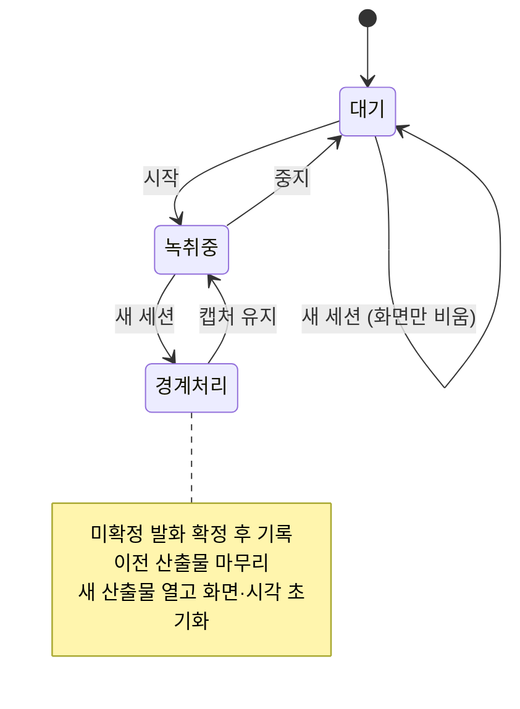

# ADR 0001: 세션 경계를 사용자가 녹취 중에도 끊을 수 있게 한다

Date: 2026-07-30

## Status

Proposed

## Context

세션 경계는 지금까지 녹취의 시작·중지와 같은 것이었다. 한 번 시작하면 중지할 때까지가
한 세션이고, 산출물도 그 단위로 하나 생긴다.

이 등식이 실제 사용에서 깨진다. 사용자는 앱을 켜 두고 하루의 회의를 연달아 치른다.
회의가 바뀌어도 녹취를 멈추지 않으면 서로 다른 회의의 발화가 한 산출물에 쌓이고,
화면도 계속 길어진다. 회의록의 소비 단위는 **회의 하나**인데 산출물의 단위는
**앱을 켜 둔 시간**이 되어 버린 것이다.

경계를 끊으려면 지금은 중지하고 다시 시작해야 한다. 그 사이에 캡처가 끊기고 언어 모델
확보 단계를 다시 통과해야 하므로, 회의가 이미 시작된 상황에서는 앞부분을 놓친다.
즉 **경계를 끊는 행위의 비용이 회의 내용의 손실**이라서, 사용자는 경계를 포기하고
누적을 감수하는 쪽을 택한다.

여기서 결정할 것은 세션 경계를 녹취 상태와 분리할 것인지, 그리고 분리한다면 경계에서
아직 확정되지 않은 발화를 어떻게 처리할 것인지다.

## Decision Drivers

- 회의록의 소비 단위는 회의 하나인데, 녹취를 멈추지 않으면 산출물 단위가 앱 가동
  시간으로 늘어난다.
- 캡처를 껐다 켜면 언어 모델 확보 단계를 다시 통과해야 하므로 회의 도입부를 놓친다 —
  경계를 끊는 비용이 회의 내용이면 사용자는 경계를 포기한다.
- 전사기는 확정 전 잠정 결과를 여러 번 보내므로, 임의 시점에는 항상 미확정 발화가
  남아 있다.
- 회의록은 재생성 불가능한 산출물이므로 경계를 끊는 조작이 발화를 잃으면 안 된다.
- 이미 저장된 세션의 산출물은 완결돼야 한다 — 읽기용 회의록과 오디오 컨테이너가
  마무리되지 않으면 파일이 열리지 않는다.

## Decision

**세션 경계를 녹취 상태에서 분리한다.** 사용자는 녹취를 유지한 채 현재 세션을 닫고 다음
세션을 열 수 있다. 녹취 중이 아닐 때도 같은 조작으로 화면을 비우고 다음 세션을
준비한다.

경계를 끊을 때 **캡처는 끊지 않는다.** 이것이 이 결정의 핵심이다 — 캡처를 유지하므로
언어 모델 확보를 다시 통과하지 않고, 회의 도입부를 놓치지 않는다. 바뀌는 것은 발화가
어느 산출물에 기록되는지이며, 오디오를 받는 경로는 그대로 흐른다.

경계에서 지켜야 하는 계약은 다음과 같다.

- **이전 세션의 산출물은 완결된다.** 미확정 발화를 확정 처리해 기록하고, 읽기용 회의록과
  오디오 컨테이너를 마무리한 뒤 경계를 넘는다. 불완전한 발화가 누락된 발화보다 낫다는
  기존 종료 정책을 그대로 따른다.
- **경계 이후 발화는 새 산출물에만 기록된다.** 두 세션의 발화가 어느 쪽에도 중복되지
  않고, 어느 쪽에서도 누락되지 않는다.
- **화면은 새 세션의 발화만 보여준다.** 경계를 끊는 목적이 누적 해소이므로 이전 세션의
  발화를 화면에 남기지 않는다.
- **경과 시간은 새 세션 기준으로 다시 시작한다.** 발화 시각이 새 산출물 안에서 0부터
  세는 상대 시각이어야 회의록이 그 회의만의 문서가 된다.
- **살아 있는 소스 구성은 그대로 유지된다.** 경계는 기록 대상만 바꾸므로, 한쪽 소스만
  켜진 세션에서 경계를 넘어도 그 구성과 경고가 유지된다.

**경계에서 발화가 짧게 끊길 수 있음을 수용한다.** 임의 시점에는 항상 미확정 발화가
있으므로, 경계 직전의 한 발화는 확정을 기다리지 못한 상태로 이전 세션에 기록된다.
이것을 없애려면 확정될 때까지 경계를 미뤄야 하는데, 그러면 사용자가 누른 시점과 실제
경계가 어긋나 어느 회의록에 들어갔는지 예측할 수 없게 된다. 예측 가능한 경계를 택하고
한 발화의 정확도를 내놓는다.

### 대안 검토

#### 세션 경계를 녹취 시작·중지에만 두고, 중지→시작을 빠르게 만든다

경계 개념이 하나로 유지되므로 상태가 단순하다. 세션 마무리 경로가 지금 하나뿐이라 검증
대상도 늘지 않고, "녹취 중이면 한 세션"이라는 불변식이 그대로 남아 산출물과 화면의
관계를 추론하기 쉽다. 확보한 언어 모델을 세션 사이에 유지하면 재시작 지연을 상당히
줄일 수도 있다.

채택하지 않은 이유는 지연을 줄여도 **끊김 자체가 남는다**는 것이다. 재시작 사이의 오디오는
어느 세션에도 기록되지 않으므로, 회의가 진행 중인 상황에서 경계를 끊으면 그 구간의 발언이
사라진다. 사용자가 경계를 끊고 싶은 시점은 바로 다음 회의가 시작되는 순간이라, 손실이
가장 아쉬운 지점과 정확히 겹친다. 회의록이 재생성 불가능한 산출물이라는 전제 아래에서는
"조금 빠른 끊김"도 끊김이고, 사용자는 다시 누적을 택하게 된다.

#### 하나의 산출물로 계속 기록하고 회의 경계는 표시만 남긴다

기록 경로가 하나뿐이라 경계 처리 중 발화를 잃을 위험이 원리적으로 없다. 산출물을 여는
시점이 세션 시작 한 번뿐이므로 마무리 실패 경로도 늘지 않는다. 회의별로 보고 싶으면
나중에 표시를 기준으로 나눌 수 있으니 정보 자체가 사라지는 것도 아니다.

채택하지 않은 이유는 사용자가 겪는 문제를 해결하지 못한다는 것이다. 이 결정이 다루는
불편은 "회의별로 파일을 열고 싶다"와 "화면이 계속 길어진다" 두 가지인데, 표시만 남기는
방식은 둘 다 그대로 남긴다. 회의 하나를 읽으려면 여전히 하루치 문서에서 해당 구간을
찾아야 하고, 화면은 계속 쌓인다. 나눠 읽는 일을 사용자나 별도 도구에 넘기면 앱이
회의록 도구가 아니라 기록 수집기가 된다.

## Consequences

### Positive

- 하루 종일 켜 두어도 산출물이 회의 단위로 나뉜다 — 화면 누적도 함께 해소된다.
- 경계를 끊는 비용이 회의 내용이 아니게 되어, 사용자가 경계를 포기하지 않는다.
- 회의가 이미 시작된 뒤에도 경계를 끊을 수 있다 — 캡처를 유지하므로 도입부를 놓치지
  않는다.
- 각 세션의 산출물이 그 자리에서 완결되므로, 다음 회의 중에도 이전 회의록을 열 수 있다.

### Negative

- 세션 마무리 경로가 종료와 경계 두 곳이 되어, 두 경로 모두에서 산출물 완결을 검증해야
  한다.
- 경계 직전의 한 발화가 미확정 상태로 이전 세션에 기록되어 정확도가 낮을 수 있다.
- 경계를 자주 끊으면 짧은 세션 디렉터리가 늘어난다 — 회의 단위 분할의 대가다.

### Risks

- 경계 처리 중 이전 산출물 마무리가 실패하면, 녹취는 계속되지만 닫힌 세션의 파일이
  불완전하게 남는다. 사용자는 다음 회의에 집중하고 있어 이를 즉시 알아채기 어렵다.
- 경계에서 미확정 발화를 이전 세션에 확정해 넣은 뒤에도 전사기는 같은 구간의 확정 결과를
  계속 보낸다. 걸러내지 않으면 같은 말이 두 회의록에 모두 남는다. 판정은 발화가 끝난
  시점으로 해야 하며, 시작 시점으로 하면 경계에 걸친 발화까지 버려져 새 세션의 도입부가
  사라진다.
- 사용자가 회의 사이에 경계를 끊는 것을 잊으면 누적이 다시 발생한다 — 경계는 수동
  조작이므로 이 결과를 수용한다.
- 경계를 발화 도중에 끊으면 한 문장이 두 회의록에 나뉘어 각각 불완전한 문장으로 남을 수
  있다.

## Related

- [회의록을 발화 확정 즉시 append 하고 종료를 시간 제한한다](../archive/0001-transcript-durability.md)
- [원본 오디오를 리샘플링 전 AAC로 보관한다](../archive/0002-original-audio-format.md)
- [두 캡처 소스의 실패를 서로 격리한다](../capture/0003-per-source-failure-isolation.md)
- [언어 모델 확보를 녹취 시작의 게이트로 둔다](../transcription/0003-model-provisioning-gate.md)
- [전사 화면을 전역 단축키로 어디서든 띄운다](./0002-global-hotkey-floating-window.md)
