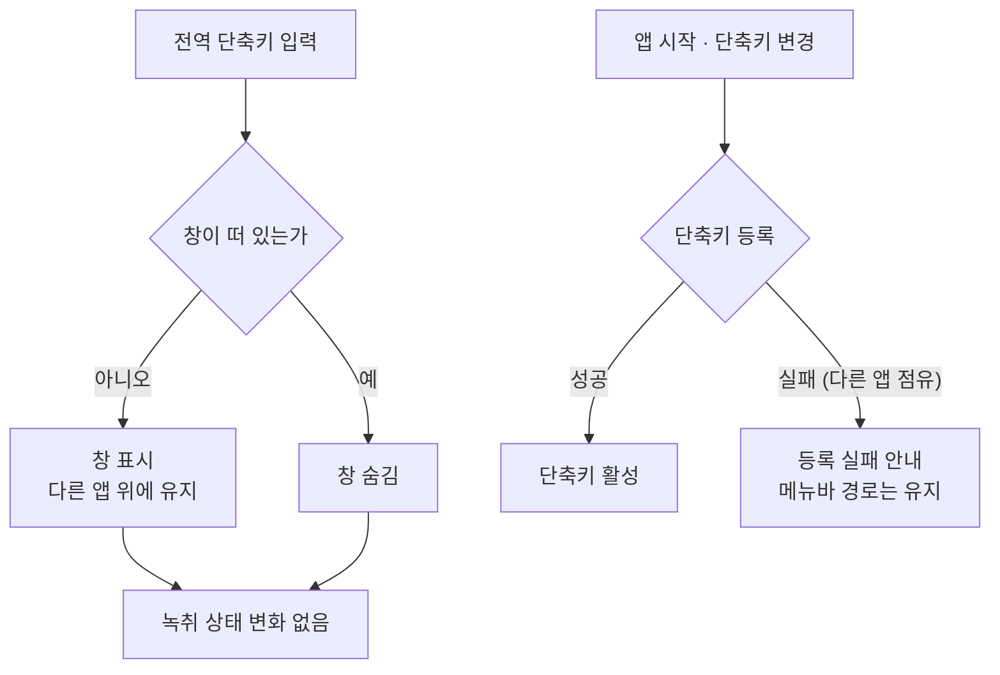

# ADR 0002: 전사 화면을 전역 단축키로 어디서든 띄운다

Date: 2026-07-30

## Status

Proposed

## Context

전사 화면에 도달하는 경로가 메뉴바 아이콘 클릭 하나다. 이 앱은 Dock에 뜨지 않는 메뉴바
상주 앱이므로 창 전환이나 Dock 클릭으로는 화면에 갈 수 없다.

녹취 중에 화면을 보는 목적이 이 경로와 맞지 않는다. 사용자는 회의 앱을 앞에 두고 회의에
참여하면서 "지금 제대로 받아쓰고 있는지", "레벨이 살아 있는지"를 확인하려 한다. 확인은
잦고 짧다. 그런데 메뉴바 아이콘은 화면 상단 끝에 있고 다른 메뉴바 항목들 사이에서 찾아야
하므로, 회의에 집중한 상태에서 마우스로 조준하는 비용이 확인의 가치보다 크다.

메뉴바 팝오버에는 성질상의 제약도 있다. 팝오버는 포커스를 잃으면 닫히므로 회의 화면을
보면서 전사를 곁에 띄워 둘 수 없다. 즉 지금 구조로는 **확인이 잦은 상황을 지원하지
못한다** — 볼 때마다 조준하고, 다른 창을 만지면 사라진다.

여기서 결정할 것은 화면에 도달하는 두 번째 경로를 어떤 성격으로 둘 것인지, 그리고 그
경로의 단축키를 누가 정하는지다.

## Decision Drivers

- 녹취 중 확인은 잦고 짧다 — 메뉴바 아이콘 조준 비용이 확인의 가치를 넘는다.
- Dock에 뜨지 않는 메뉴바 상주 앱이라 창 전환·Dock 클릭 경로가 없다.
- 회의 앱을 앞에 둔 상태로 전사를 곁에 두고 봐야 하는데, 포커스를 잃으면 닫히는 화면은
  이를 지원하지 못한다.
- 전역 단축키는 시스템·다른 앱의 단축키와 충돌할 수 있고, 충돌 여부는 사용자의 환경에
  따라 다르다.
- 확인 목적의 화면 조작이 녹취에 영향을 주면 안 된다.

## Decision

전사 화면을 **전역 단축키로 어디서든 띄운다.** 다른 앱이 활성인 상태에서도 동작하며,
같은 단축키로 다시 눌러 닫는다.

이 창은 **포커스를 잃어도 닫히지 않는다.** 회의 앱을 앞에 두고 전사를 곁에 두는 것이
목적이므로, 이것이 메뉴바 팝오버와 구분되는 핵심 성질이다. 다른 앱 위에 머무를 수 있어
회의 화면에 가려지지 않는다.

**녹취 상태와 창의 표시 여부는 서로 독립이다.** 창을 닫아도 녹취는 계속되고, 녹취 중이
아니어도 창을 열 수 있다. 화면은 상태를 보는 수단이지 녹취를 제어하는 조건이 아니다.
창을 띄우는 조작이 진행 중인 세션에 어떤 영향도 주지 않아야 한다.

**기존 메뉴바 경로는 유지한다.** 단축키는 경로를 대체하지 않고 추가한다 — 단축키를
모르거나 충돌로 못 쓰는 사용자에게 메뉴바가 유일한 도달 경로로 남아야 한다.

**단축키는 사용자가 바꿀 수 있어야 하고, 설정은 앱을 다시 켜도 유지된다.** 전역 단축키는
사용자가 이미 쓰는 다른 앱과 충돌할 수 있고 어떤 조합이 비어 있는지는 환경마다 다르므로,
고정값으로 두면 일부 사용자에게는 아예 동작하지 않는 기능이 된다.

**기본 단축키는 ⌥⌘S다.** 사용자가 바꾸지 않은 상태에서 바로 쓸 수 있어야 하고, 이 조합은
macOS 기본 단축키와 충돌하지 않는다. 사용자가 바꾼 값은 그 값이 계약이 된다.

**단축키가 등록되지 않으면 그 사실을 사용자에게 알린다.** 다른 앱이 같은 조합을 이미
점유하면 등록이 실패하는데, 조용히 실패하면 사용자는 단축키를 눌러 보고 앱이 고장 났다고
판단한다. 등록 실패는 기능 일부의 손실이므로 녹취를 막지 않는다.

**단축키는 앱이 시작된 시점부터 동작한다.** 등록을 화면이 그려지는 시점에 매달면 안 된다 —
이 단축키의 목적이 화면에 도달하는 것이므로, 화면을 먼저 열어야 단축키가 준비되는 구조는
기능을 무의미하게 만든다. 사용자가 메뉴바를 한 번도 클릭하지 않은 상태에서도 동작해야 한다.

### 대안 검토

#### 메뉴바 팝오버를 유지하고 단축키로 그 팝오버를 연다

도달 경로만 추가되고 화면은 하나로 유지되므로, 화면 상태·레이아웃·갱신 로직이 한 곳에
머문다. 창의 위치·크기·표시 상태 같은 새 상태를 들지 않아도 되고, 팝오버가 자동으로
닫히므로 사용자가 창을 정리할 필요도 없다.

채택하지 않은 이유는 이 결정이 다루는 불편의 절반만 없어진다는 것이다. 조준 비용은
사라지지만 **포커스를 잃으면 닫히는 성질이 그대로 남는다.** 사용자의 목적은 회의 앱을
앞에 두고 전사를 곁에 두는 것인데, 회의 화면을 클릭하는 순간 전사가 사라지므로 확인할
때마다 단축키를 다시 눌러야 한다. 잦은 확인이라는 전제 아래에서는 조준을 단축키로
바꾼 것에 그치고, 곁에 두고 보는 사용은 여전히 불가능하다.

#### 상시 표시되는 창을 두고 단축키 없이 운영한다

녹취 중에는 항상 보이므로 도달이라는 개념 자체가 없어진다. 단축키 등록·충돌·설정 지속이
모두 필요 없어 실패 지점이 크게 줄고, 사용자가 단축키를 배우지 않아도 된다.

채택하지 않은 이유는 이 앱이 회의 중에 쓰인다는 점이다. 회의 화면과 공유 자료가 화면을
채우는 상황에서 상시 창은 가려지거나 방해가 되고, 화면 공유 중이라면 전사 내용이 참석자
전원에게 노출된다. 사용자가 창을 치우려면 결국 숨기는 수단이 필요하므로 표시·숨김 조작이
다시 등장하는데, 그러면 단축키 없이 운영한다는 이득이 사라진다. 필요할 때만 띄우는 편이
회의라는 사용 맥락에 맞는다.

## Consequences

### Positive

- 다른 앱을 쓰는 중에도 조준 없이 전사 상태를 확인할 수 있다.
- 회의 화면을 앞에 두고 전사를 곁에 둘 수 있다 — 포커스를 잃어도 닫히지 않으므로 확인마다
  다시 열 필요가 없다.
- 단축키를 바꿀 수 있어 충돌하는 환경에서도 기능을 쓸 수 있고, 설정이 유지되므로 한 번만
  정하면 된다.
- 메뉴바 경로가 남아 있어 단축키를 못 쓰는 상태에서도 화면에 도달할 수 있다.

### Negative

- 화면 도달 경로가 둘이 되어, 같은 내용을 두 표시 방식에서 각각 검증해야 한다.
- 창의 표시 상태와 단축키 설정을 앱 실행 사이에 유지해야 하므로 지속되는 설정이 늘어난다.
- 다른 앱 위에 머무르는 창은 사용자가 직접 치워야 한다 — 자동으로 닫히지 않는 대가다.

### Risks

- 사용자가 고른 조합도 나중에 설치한 앱과 충돌할 수 있다. 등록 실패를 알리더라도 사용자가
  그 안내를 놓치면 단축키가 동작하지 않는 이유를 모른 채로 남는다.
- 등록 시점을 화면 생명주기에 묶으면 조용히 무력화된다. 메뉴바 팝오버의 내용은 사용자가
  팝오버를 처음 열 때 만들어지므로, 그 안에서 등록하면 아이콘을 한 번 클릭하기 전까지
  단축키가 동작하지 않는다 — 실측으로 확인한 증상이고, 등록 실패가 아니라 등록 자체가
  일어나지 않는 상태라 실패 안내로도 드러나지 않는다.
- 단축키 표시는 활성 입력 소스가 아니라 물리 키 자리 기준이어야 한다. 활성 입력 소스로
  읽으면 한글 입력 중에 어긋난다 — 실측으로 `⌥⌘S`가 `⌥⌘ㄴ`으로, `⌘T`가 `⌘ㅅ`으로
  표시됐다. 사용자가 실제로 눌러야 하는 키와 다른 이름을 보여주는 상태다.
- 창이 다른 앱 위에 머무르므로, 화면 공유 중에 띄우면 전사 내용이 참석자에게 노출될 수
  있다.
- 창을 띄워 둔 채로 회의를 진행하면 화면 갱신이 계속되어, 사용자가 전사 내용을 읽느라
  회의 자체에 집중하지 못할 수 있다.

## Related

- [세션 경계를 사용자가 녹취 중에도 끊을 수 있게 한다](./0001-session-boundary-control.md)
- [입력 레벨을 세 관점으로 나눠 추적하고 원본은 보정하지 않는다](../capture/0004-input-level-diagnostics.md)
- [두 캡처 소스의 실패를 서로 격리한다](../capture/0003-per-source-failure-isolation.md)
