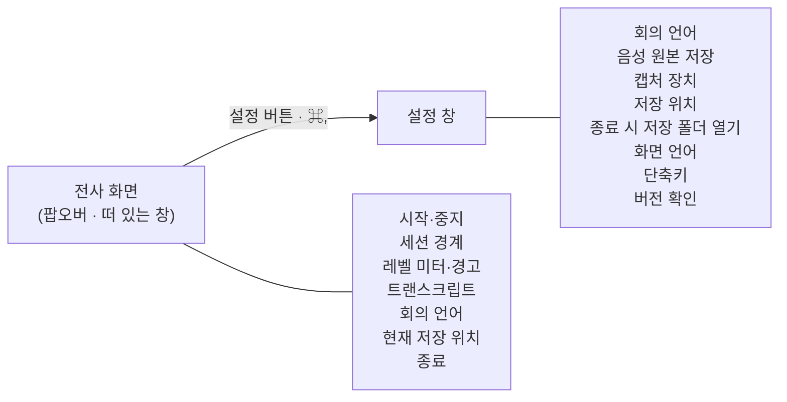

# ADR 0003: 설정을 전사 화면에서 분리해 별도 창에 둔다

Date: 2026-07-30

## Status

Proposed

## Context

설정 항목이 전사 화면 푸터에 늘어서 있다. 음성 원본 저장 토글, 단축키 필드, 언어
선택이 실시간 트랜스크립트와 같은 화면을 나눠 쓰는 상태다.

두 종류의 내용이 섞여 있다는 것이 문제다. 트랜스크립트는 **회의 중 계속 보는 것**이고
설정은 **한 번 정하고 잊는 것**이다. 후자가 전자의 자리를 차지하면 회의 중에 볼 것이
줄어들고, 설정이 하나 늘어날 때마다 트랜스크립트가 더 밀린다. 항목을 더 넣을 자리도
남아 있지 않다.

전사 화면은 이제 메뉴바 팝오버와 떠 있는 창 양쪽에서 쓰인다. 설정이 그 화면 안에 있으면
같은 설정 UI가 두 표시 방식에서 각각 동작해야 하고, 회의 화면 곁에 띄워 둔 좁은 창에도
설정이 따라 들어온다.

여기서 결정할 것은 설정을 어디에 둘 것인지, 그리고 무엇을 설정으로 옮기고 무엇을 전사
화면에 남길 것인지다.

## Decision Drivers

- 트랜스크립트는 회의 중 계속 보는 것이고 설정은 한 번 정하고 잊는 것이다 — 같은 화면을
  나눠 쓰면 전자의 자리가 줄어든다.
- 전사 화면이 팝오버와 떠 있는 창 양쪽에서 쓰이므로, 그 안의 설정 UI는 두 표시 방식에서
  각각 동작해야 한다.
- 녹취 중 상태를 바꿀 수 없는 항목(원본 저장 여부, 저장 위치)과 언제든 바꿀 수 있는 항목이
  섞여 있다.
- 설정 항목은 늘어나는 방향이다 — 지금 자리가 없으면 다음 항목을 넣을 곳이 없다.
- 사용자는 macOS 앱의 설정이 별도 창에서 `⌘,`로 열린다고 기대한다.

## Decision

**설정을 별도 창으로 분리한다.** 전사 화면에는 회의 중에 보는 것만 남긴다.

여는 경로는 두 가지다. 전사 화면의 설정 버튼, 그리고 **단축키(기본 `⌘,`)** — macOS 앱의 설정
단축키 관례다. 관례를 따르는 것이 이 결정의 일부다. 사용자가 이미 아는 조작을 다시 배우게
하지 않는다.

**단축키는 사용자가 바꿀 수 있다.** 관례를 기본값으로 두는 것과, 그 조합을 강제하는 것은 다른
문제다. 다른 앱이 `⌘,`를 전역으로 점유하면 이 앱 안에서는 이길 방법이 없다 — 실측으로
확인했다(메뉴바 유틸리티가 `⌘,`를 전역 등록한 환경에서 그 앱을 종료하자 즉시 동작했다).
고정값으로 두면 그런 환경의 사용자에게는 없는 기능이 되고, 원인이 다른 앱이라는 것을 알 방법도
없다. 전역 단축키에 적용한 것과 같은 판단이다.

**전사 화면에 남기는 것**은 회의 중에 보거나 만지는 것뿐이다 — 녹취 시작·중지, 세션 경계
끊기, 소스별 레벨 미터와 경고, 트랜스크립트, 현재 세션의 저장 위치, 회의 언어. 이 목록이 곧
"회의 중 필요한 것"의 정의다. 저장 위치가 여기 있는 이유는 그것이 설정값이 아니라 진행 중인
세션의 상태이기 때문이다 — 세션마다 바뀌고, 녹취가 실제로 저장되고 있는지 확인하는 근거다.

회의 언어가 여기 있는 이유는 **그 값이 틀렸다는 것을 발견하는 화면이 이 화면**이기
때문이다. 빠진 발화로 신호가 나타나므로, 고치는 조작이 다른 창에 있으면 발견과 수정이 분리된다.
설정 창에도 같은 항목을 두어 회의 전에 정할 수 있게 한다 — 한 값을 두 화면에서 다루지만 잠금
규칙이 같으므로 어긋나지 않는다.

**설정 창으로 옮기는 것**은 한 번 정하고 잊는 것이다 — 회의 언어, 음성 원본 저장 여부, 캡처
장치, 산출물 저장 위치, 종료 시 저장 폴더를 자동으로 열지 여부, 화면 언어, 단축키. 그리고 앱
자체에 대한 정보(버전 확인)도 여기에 둔다. 앱을 끝내는 조작은 전사 화면에 남긴다 — 그것은
설정이 아니라 즉시 실행되는 동작이고, 사용자가 앱을 치우려는 시점에 설정 창을 먼저 열게 하는
것은 한 단계를 더 요구하는 일이다.

**설정 창의 항목이 모두 녹취 중 잠기는 것은 아니다.** 잠금의 근거는 "이미 만들어진 전사기와
열려 있는 파일에 반영되지 않는다"이므로, 그 근거가 없는 항목은 잠그지 않는다 — 종료 시점에만
읽히는 값이나 소스별로 다시 연결하면 되는 값은 회의 중에 바꿀 수 있다. 잠글 이유가 없는
항목을 잠그면 회의 중에 발견한 문제를 고칠 수 없게 된다.

**회의 언어는 두 화면 모두에 둔다.** 회의 전에 정하는 값이라는 점에서 설정 창의 항목이고,
녹취 중에 고쳐야 하는 값이라는 점에서 전사 화면의 항목이다. 한쪽만 두면 각각 잃는 것이
분명하다 — 설정 창에만 두면 회의 중에 발견한 문제를 고치려고 다른 창을 열어야 하고, 전사
화면에만 두면 회의 전에 정하는 경로가 사라진다. 어느 화면에서 바꾸든 **현재 유효한 언어
구성이 전사 화면에서 읽혀야 한다** — 어느 언어로 인식되는지 모르면 결과를 해석할 수 없다.

**녹취 중에 바꿀 수 없는 항목은 설정 창에서도 잠그고 그 이유를 알린다.** 잠긴 이유를
적지 않으면 사용자는 앱이 고장 났다고 판단한다.

**설정 창은 전사 창과 독립적으로 열고 닫힌다.** 설정을 보는 동안 녹취와 트랜스크립트가
멈추거나 가려지지 않는다.

### 요구사항 계약

**설정을 여는 단축키의 기본값은 `⌘,`이고 사용자가 바꿀 수 있다.** 기본값은 macOS 관례를
따르므로 사용자가 배울 것이 없고, 바꿀 수 있으므로 그 조합이 점유된 환경에서도 기능을 잃지
않는다. 사용자가 정한 조합은 그 값이 계약이 된다.

- **이 단축키는 전역이 아니다.** 전사 창이 앞에 있을 때만 동작한다. 전역으로 등록하면 다른 앱을
  쓰는 중에도 `⌘,`를 가로채 그 앱의 설정이 열리지 않는다 — 남의 앱 단축키를 빼앗는 것은 이
  기능의 목적을 넘어선다. 전사 창을 어디서든 띄우는 전역 단축키와는 성격이 다르다.
- **수정자가 없거나 Shift만 있는 조합은 거부한다.** 일반 타이핑을 가로채기 때문이다. 전역
  단축키와 같은 규칙을 쓴다.
- **저장된 값을 해석할 수 없으면 기본값으로 되돌린다.** 설정 하나가 손상됐을 때 설정 창에 도달할
  수 없게 되는 것이 최악이다.

**설정 창은 전사 창보다 앞에 보인다.** 사용자가 설정을 열었다는 것은 지금 그것을 보려는
것이므로, 전사 창이 그 위를 덮으면 열리지 않은 것과 구분되지 않는다. 전사 창이 다른 앱 위에
떠 있어야 한다는 성질(회의 화면에 가려지지 않기)은 같은 앱 안의 설정 창까지 덮으라는 뜻이
아니다 — 두 창은 같은 층에 두고, 그 안에서 사용자가 마지막에 부른 창이 앞에 온다.

**설정 창에 있는 모든 항목은 앱을 다시 켜도 유지된다.** 이 창의 정의가 "한 번 정하고 잊는
것"이므로, 유지되지 않는 항목은 그 정의를 만족하지 못한다. 항목 사이에 예외를 두지 않는다 —
어느 것이 유지되는지를 사용자가 항목별로 기억해야 하는 상태가 이 계약이 막는 것이다.

- **기본값은 회의 언어 `English`, 음성 원본 저장 켬, 종료 시 저장 폴더 열기
  켬이다.** English는 필수 기본 모델이고, 사용자가 아무것도 정하지 않은 상태에서도 원본이 남고,
  회의가 끝나면 산출물을 볼 수 있어야 한다. 저장된 값이 없을 때만 기본값이 쓰이고, 사용자가
  정한 값은 그 값이 계약이 된다.
- **저장된 값을 해석할 수 없으면 기본값으로 되돌린다.** 사용자가 이해할 수 없는 상태로
  녹취를 시작하는 것보다, 알려진 기본값으로 시작하는 것이 낫다. 언어 항목은 허용된 값
  집합(한국어 / English / 한국어 + English) 밖의 값을 거부한다.
- **끔과 정한 적 없음을 구분한다.** 기본값이 켬인 항목에서 이 구분이 없으면 정한 적 없는
  상태가 끔으로 읽혀 첫 실행부터 기본값이 지켜지지 않는다.

값은 사용자별 설정 저장소에 둔다. 회의록·음성과 달리 이 값들은 사용자 환경 설정이지 회의
산출물이 아니므로, 세션 디렉터리에 남기지 않는다. 앱을 삭제하면 함께 사라지는 것이 맞다 —
회의 기록은 남지만 설정은 남을 이유가 없다.

### 대안 검토

#### 설정을 유지하지 않고 실행마다 기본값에서 시작한다

저장할 것이 없으니 값의 손상·마이그레이션을 다룰 필요가 없고, 사용자가 지난번 설정을
기억하지 못해 예상과 다르게 녹취되는 일도 없다. 매 실행이 같은 상태에서 출발한다.

채택하지 않은 이유는 설정 창의 정의와 모순된다는 것이다. "한 번 정하고 잊는 것"을 모아 둔
창인데 매번 다시 정해야 하면 그 분류가 무의미해진다. 특히 손실이 조용하다 — 원본 저장을
끈 사용자가 다음 회의에서 그것이 켜진 것을 모른 채 녹취하면, 남기지 않으려던 음성이
디스크에 남는다. 반대로 단일 언어를 고른 사용자는 다중 언어로 되돌아간 것을 모르고
코드스위칭 경계 손실을 겪는다. 어느 쪽도 회의가 끝난 뒤에야 드러난다.

#### 설정을 파일이나 데이터베이스로 직접 관리한다

설정 파일을 사용자가 직접 열어 보고 편집할 수 있고, 형식과 위치를 앱이 완전히 통제한다.
값이 늘어나 구조가 생기면 스키마를 명시적으로 다룰 수 있다.

채택하지 않은 이유는 규모가 맞지 않는다는 것이다. 저장할 것은 독립적인 스칼라 값 몇 개이고
관계도 질의도 없다 — 데이터베이스는 여기서 쓰이지 않는 능력에 대해 파일 핸들·스키마
버전·손상 복구를 지불하게 한다. 직접 만든 설정 파일도 macOS가 이미 제공하는 사용자별
설정 저장소를 다시 구현하는 것이고, 그 저장소는 이 앱이 단축키 저장에 이미 쓰고 있다. 세
항목이 서로 다른 방식으로 저장되면 어느 것이 유지되는지가 코드를 읽어야 알 수 있게 된다.

#### 같은 창 안에서 전사 화면과 설정 화면을 전환한다

창을 하나로 유지하므로 창 관리가 늘지 않는다. 팝오버 안에서도 그대로 동작하고, 설정 창의
위치·크기를 따로 기억할 필요도 없다. 사용자가 창을 여러 개 정리할 일도 없다.

채택하지 않은 이유는 두 화면이 서로를 밀어낸다는 것이다. 설정을 보는 동안 트랜스크립트가
가려지므로, 녹취 중에 단축키를 바꾸거나 저장 설정을 확인하려면 회의 내용을 보지 못한다.
떠 있는 창을 회의 화면 곁에 두고 쓰는 사용 방식과 특히 충돌한다 — 그 창의 목적이 전사를
계속 보는 것인데 설정이 그 자리를 덮는다. 그리고 `⌘,` 관례를 따를 수 없어 사용자가 이
앱만의 전환 조작을 배워야 한다.

#### 설정을 메뉴바 아이콘의 우클릭 메뉴에 둔다

별도 창을 만들지 않아도 되고, 메뉴바 앱에서 흔히 보는 형태라 발견하기 쉽다. 항목이 적을
때는 메뉴 하나로 충분하고 구현도 가장 가볍다.

채택하지 않은 이유는 담을 수 있는 UI가 제한된다는 것이다. 메뉴 항목은 토글과 선택에는
맞지만, 단축키를 눌러 입력받거나 버전 확인 결과와 오류를 보여주기에는 맞지 않다 — 메뉴는
결과를 표시하고 머무를 수 있는 표면이 아니다. 설정이 늘어나는 방향이라는 driver를 감안하면
지금 담기는 항목만 보고 고를 수 없다.

## Consequences

### Positive

- 전사 화면이 회의 중에 보는 것만 담아 트랜스크립트에 쓸 자리가 넓어진다.
- 설정이 늘어나도 전사 화면이 영향을 받지 않는다.
- `⌘,` 관례를 따르므로 사용자가 설정을 여는 방법을 배우지 않아도 되고, 그 조합이 점유된
  환경에서도 바꿔서 쓸 수 있다.
- 설정을 보는 동안에도 떠 있는 전사 창이 그대로 보인다 — 두 창이 독립이기 때문이다.
- 설정 창의 모든 항목이 같은 계약("다시 켜도 유지된다")을 따르므로, 어느 항목이 유지되는지
  사용자가 항목별로 기억하지 않아도 된다.

### Negative

- 창이 하나 늘어나 표시 상태를 더 관리해야 한다.
- 설정을 바꾸려면 화면을 옮겨야 한다 — 푸터에서 바로 만지던 것보다 조작이 한 단계 늘었다.
- 언어 구성을 두 화면에서 바꿀 수 있으므로, 한쪽에서 바꾼 값이 다른 쪽에 즉시 보여야 한다.
  전환이 실패했을 때는 두 화면 모두 사용자가 고른 값이 아니라 실제 유효한 구성을 보여야 한다.
- 앱 실행 사이에 유지되는 상태가 늘어난다. 값을 읽을 때마다 해석 실패를 다뤄야 하고, 항목이
  추가되면 그 항목의 기본값과 손상 시 거동도 함께 정해야 한다.
- 단축키가 두 개가 되어 사용자가 둘을 구분해야 한다 — 전사 창을 띄우는 전역 단축키와, 전사 창이
  앞에 있을 때만 듣는 설정 단축키다. 동작 범위가 다른데 같은 화면에 나란히 놓이므로 설명이
  필요하다.

### Risks

- 설정을 별도 창으로 옮기면 사용자가 그 존재를 발견하지 못할 수 있다. 푸터에 있던 항목은
  보였지만 이제는 찾아 들어가야 한다.
- 녹취 중 잠긴 항목의 이유를 사용자가 읽지 않으면, 설정이 반영되지 않는다고 오해할 수 있다.
- 설정이 유지되므로 사용자가 지난번에 정한 값을 잊고 녹취를 시작할 수 있다. 원본 저장을 껐던
  것을 잊으면 남기려던 음성이 없다 — 그 항목은 녹취 중에 되돌릴 수 없으므로 이 위험이 남는다.
  회의 언어는 전사 화면에서 읽고 그 자리에서 고칠 수 있어 같은 위험이 회복 가능하다.

## Related

- [세션 경계를 사용자가 녹취 중에도 끊을 수 있게 한다](./0001-session-boundary-control.md)
- [전사 화면을 전역 단축키로 어디서든 띄운다](./0002-global-hotkey-floating-window.md)
- [새 버전 확인은 사용자가 요청할 때만 조회한다](./0004-user-initiated-update-check.md)
- [회의 언어를 녹취 중에도 바꾼다](../transcription/0004-in-session-language-switch.md)
