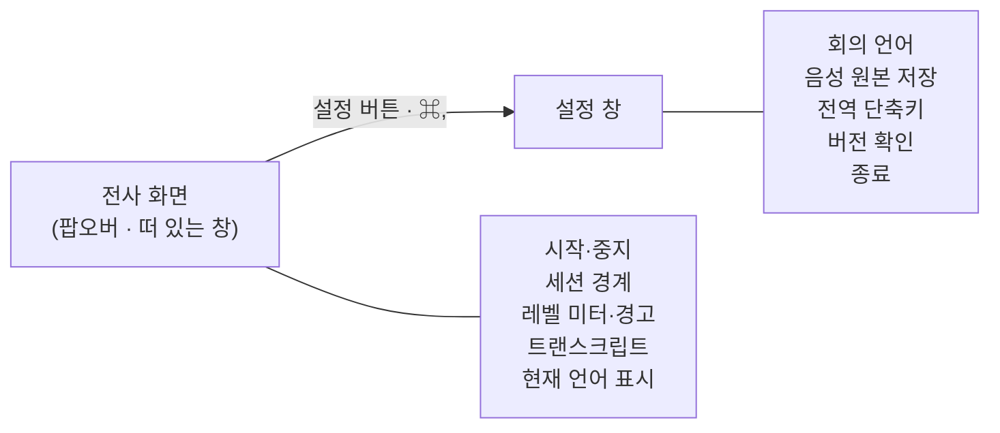

# ADR 0003: 설정을 전사 화면에서 분리해 별도 창에 둔다

Date: 2026-07-30

## Status

Proposed

## Context

설정 항목이 전사 화면 푸터에 늘어서 있다. 음성 원본 저장 토글, 단축키 필드, 언어
선택이 실시간 트랜스크립트와 같은 화면을 나눠 쓰는 상태다.

두 종류의 내용이 섞여 있다는 것이 문제다. 트랜스크립트는 **회의 중 계속 보는 것**이고
설정은 **한 번 정하고 잊는 것**이다. 후자가 전자의 자리를 차지하면 회의 중에 볼 것이
줄어들고, 설정이 하나 늘어날 때마다 트랜스크립트가 더 밀린다. 항목을 더 넣을 자리도
남아 있지 않다.

전사 화면은 이제 메뉴바 팝오버와 떠 있는 창 양쪽에서 쓰인다. 설정이 그 화면 안에 있으면
같은 설정 UI가 두 표시 방식에서 각각 동작해야 하고, 회의 화면 곁에 띄워 둔 좁은 창에도
설정이 따라 들어온다.

여기서 결정할 것은 설정을 어디에 둘 것인지, 그리고 무엇을 설정으로 옮기고 무엇을 전사
화면에 남길 것인지다.

## Decision Drivers

- 트랜스크립트는 회의 중 계속 보는 것이고 설정은 한 번 정하고 잊는 것이다 — 같은 화면을
  나눠 쓰면 전자의 자리가 줄어든다.
- 전사 화면이 팝오버와 떠 있는 창 양쪽에서 쓰이므로, 그 안의 설정 UI는 두 표시 방식에서
  각각 동작해야 한다.
- 녹취 중 상태를 바꿀 수 없는 항목(언어, 원본 저장 여부)과 언제든 바꿀 수 있는 항목이
  섞여 있다.
- 설정 항목은 늘어나는 방향이다 — 지금 자리가 없으면 다음 항목을 넣을 곳이 없다.
- 사용자는 macOS 앱의 설정이 별도 창에서 `⌘,`로 열린다고 기대한다.

## Decision

**설정을 별도 창으로 분리한다.** 전사 화면에는 회의 중에 보는 것만 남긴다.

여는 경로는 두 가지다. 전사 화면의 설정 버튼, 그리고 **`⌘,`** — macOS 앱의 설정 단축키
관례다. 관례를 따르는 것이 이 결정의 일부다. 사용자가 이미 아는 조작을 다시 배우게 하지
않는다.

**전사 화면에 남기는 것**은 회의 중에 보거나 만지는 것뿐이다 — 녹취 시작·중지, 세션 경계
끊기, 소스별 레벨 미터와 경고, 트랜스크립트. 이 목록이 곧 "회의 중 필요한 것"의 정의다.

**설정 창으로 옮기는 것**은 한 번 정하고 잊는 것이다 — 회의 언어, 음성 원본 저장 여부,
전역 단축키. 그리고 앱 자체에 대한 정보와 조작(버전 확인, 종료)도 여기에 둔다.

언어 선택을 옮기는 것이 유일하게 저울질이 필요한 항목이었다. 회의마다 바뀔 수 있어
보이지만, 실제로는 녹취 중에 바꿀 수 없고(전사기가 이미 만들어져 있다) 사용자의 회의
언어 구성은 대개 고정이다. 회의 중에 볼 이유가 없으므로 설정으로 옮긴다. 대신 **현재
언어 구성은 전사 화면에서 읽을 수 있어야 한다** — 어느 언어로 인식되는지 모르면 결과를
해석할 수 없다.

**녹취 중에 바꿀 수 없는 항목은 설정 창에서도 잠그고 그 이유를 알린다.** 잠긴 이유를
적지 않으면 사용자는 앱이 고장 났다고 판단한다.

**설정 창은 전사 창과 독립적으로 열고 닫힌다.** 설정을 보는 동안 녹취와 트랜스크립트가
멈추거나 가려지지 않는다.

### 대안 검토

#### 같은 창 안에서 전사 화면과 설정 화면을 전환한다

창을 하나로 유지하므로 창 관리가 늘지 않는다. 팝오버 안에서도 그대로 동작하고, 설정 창의
위치·크기를 따로 기억할 필요도 없다. 사용자가 창을 여러 개 정리할 일도 없다.

채택하지 않은 이유는 두 화면이 서로를 밀어낸다는 것이다. 설정을 보는 동안 트랜스크립트가
가려지므로, 녹취 중에 단축키를 바꾸거나 저장 설정을 확인하려면 회의 내용을 보지 못한다.
떠 있는 창을 회의 화면 곁에 두고 쓰는 사용 방식과 특히 충돌한다 — 그 창의 목적이 전사를
계속 보는 것인데 설정이 그 자리를 덮는다. 그리고 `⌘,` 관례를 따를 수 없어 사용자가 이
앱만의 전환 조작을 배워야 한다.

#### 설정을 메뉴바 아이콘의 우클릭 메뉴에 둔다

별도 창을 만들지 않아도 되고, 메뉴바 앱에서 흔히 보는 형태라 발견하기 쉽다. 항목이 적을
때는 메뉴 하나로 충분하고 구현도 가장 가볍다.

채택하지 않은 이유는 담을 수 있는 UI가 제한된다는 것이다. 메뉴 항목은 토글과 선택에는
맞지만, 단축키를 눌러 입력받거나 버전 확인 결과와 오류를 보여주기에는 맞지 않다 — 메뉴는
결과를 표시하고 머무를 수 있는 표면이 아니다. 설정이 늘어나는 방향이라는 driver를 감안하면
지금 담기는 항목만 보고 고를 수 없다.

## Consequences

### Positive

- 전사 화면이 회의 중에 보는 것만 담아 트랜스크립트에 쓸 자리가 넓어진다.
- 설정이 늘어나도 전사 화면이 영향을 받지 않는다.
- `⌘,` 관례를 따르므로 사용자가 설정을 여는 방법을 배우지 않아도 된다.
- 설정을 보는 동안에도 떠 있는 전사 창이 그대로 보인다 — 두 창이 독립이기 때문이다.

### Negative

- 창이 하나 늘어나 표시 상태를 더 관리해야 한다.
- 설정을 바꾸려면 화면을 옮겨야 한다 — 푸터에서 바로 만지던 것보다 조작이 한 단계 늘었다.
- 언어 구성을 두 곳에서 다룬다 — 설정에서 바꾸고 전사 화면에서 읽으므로, 표시가 설정과
  어긋나지 않게 유지해야 한다.

### Risks

- 설정을 별도 창으로 옮기면 사용자가 그 존재를 발견하지 못할 수 있다. 푸터에 있던 항목은
  보였지만 이제는 찾아 들어가야 한다.
- 녹취 중 잠긴 항목의 이유를 사용자가 읽지 않으면, 설정이 반영되지 않는다고 오해할 수 있다.

## Related

- [세션 경계를 사용자가 녹취 중에도 끊을 수 있게 한다](./0001-session-boundary-control.md)
- [전사 화면을 전역 단축키로 어디서든 띄운다](./0002-global-hotkey-floating-window.md)
- [새 버전 확인은 사용자가 요청할 때만 조회한다](./0004-user-initiated-update-check.md)
