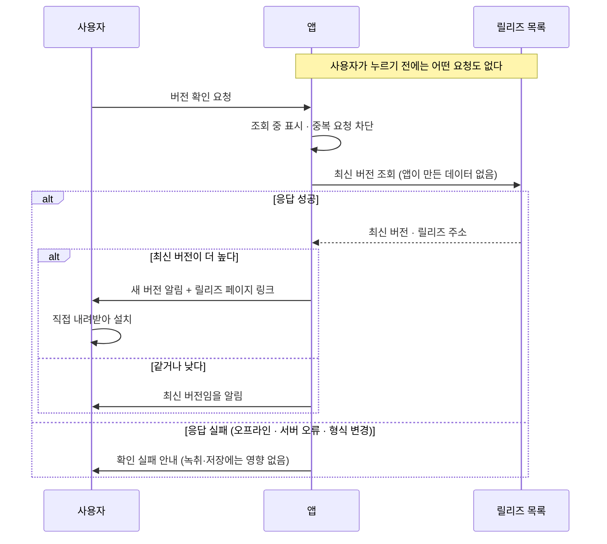

# ADR 0004: 새 버전 확인은 사용자가 요청할 때만 조회한다

Date: 2026-07-30

## Status

Proposed

## Context

이 앱은 배포 채널이 없다. App Store를 거치지 않고 서명된 번들을 내려받아 쓰는 형태이므로,
새 버전이 나와도 사용자가 알 방법이 없다. 릴리즈 페이지를 스스로 다시 방문해야 한다.

동시에 이 앱의 성립 근거가 **모든 처리가 기기 안에서 끝난다**는 것이다. 회의 음성과
회의록이 외부로 나가지 않는다는 전제 위에서 사용자가 민감한 회의를 녹취한다. 지금 코드에는
네트워크 호출이 한 줄도 없다.

버전 확인은 그 성질상 외부 서버에 요청을 보낸다. 즉 **"네트워크로 나가는 데이터가 없다"는
성질과 정면으로 만나는 첫 기능**이다. 요청 자체에 회의 내용이 담기지 않더라도, 요청이
발생한다는 사실만으로 사용자의 기기가 특정 시점에 외부와 통신했다는 기록이 남는다.

여기서 결정할 것은 조회를 언제 일으킬 것인지, 그리고 조회 결과로 앱이 무엇까지 할
것인지다.

## Decision Drivers

- 배포 채널이 없어 사용자가 새 버전을 알 방법이 없다.
- 이 앱의 성립 근거가 온디바이스 처리이며, 사용자는 그 전제 위에서 민감한 회의를 녹취한다.
- 회의 내용이 담기지 않더라도 자동 조회는 사용자 기기가 주기적으로 외부와 통신한 기록을
  남긴다.
- 앱이 스스로 코드를 내려받아 바꾸면 서명된 번들을 검증하는 책임이 앱으로 넘어온다.
- 네트워크 조회는 실패한다 — 오프라인, 서버 오류, 응답 형식 변경.

## Decision

**사용자가 요청할 때만 조회한다.** 설정 창에서 버전 확인을 누른 그 순간에 한 번 조회하고,
그 외에는 어떤 시점에도 네트워크를 쓰지 않는다. 앱 시작 시 조회도, 주기적 조회도, 조회
여부를 켜는 설정조차 두지 않는다.

이것이 이 결정의 핵심이다. 자동 조회를 기본 꺼진 설정으로 두는 선택도 가능했지만, 그러면
**"이 앱은 네트워크를 쓰지 않는다"가 설정에 따라 달라지는 조건부 서술이 된다.** 사용자가
누를 때만 조회하면 그 서술이 사실로 남는다 — 사용자가 명시적으로 요청하지 않은 통신은
일어나지 않는다.

**앱은 새 버전을 알려주기만 하고 내려받지 않는다.** 설치는 사용자가 릴리즈 페이지에서
한다. 앱이 코드를 스스로 교체하면 내려받은 번들의 서명을 검증할 책임이 앱으로 넘어오는데,
그 검증을 잘못 구현하면 자동 업데이트 경로 자체가 공격 표면이 된다. 알림과 링크까지가
이 기능의 범위다.

지켜야 하는 계약은 다음과 같다.

- **조회 요청에는 앱이 만든 어떤 데이터도 담지 않는다** — 회의 내용, 사용 통계, 기기
  식별자를 보내지 않는다. 버전 확인이 사용자 추적 경로가 되지 않아야 한다.
- **현재 버전은 번들이 선언한 값을 그대로 쓴다.** 코드에 버전 문자열을 따로 두면 번들과
  어긋나 사용자에게 틀린 버전을 보여준다.
- **버전 비교는 자리별 숫자 비교로 한다.** 문자열 비교는 `0.10.0`을 `0.9.0`보다 낮게
  판정한다.
- **최신 버전일 때도 결과를 알린다.** 아무 반응이 없으면 사용자는 조회가 실패한 것인지
  최신인 것인지 구분할 수 없다.
- **조회 실패는 실패로 알리고 앱 동작에 영향을 주지 않는다.** 오프라인이거나 서버가
  응답하지 않는 것은 정상적인 결과이며, 녹취나 저장을 막지 않는다.
- **조회 중임을 표시하고 중복 요청을 막는다.** 응답이 오기까지 사용자는 무엇이 일어나는지
  알아야 한다.

### 대안 검토

#### 시작 시 자동으로 조회하고 설정으로 끌 수 있게 한다

사용자가 아무것도 하지 않아도 새 버전을 알게 되므로, 업데이트 알림의 목적을 가장 잘
달성한다. 대부분의 데스크톱 앱이 이렇게 동작해 사용자에게도 익숙하고, 끄는 설정을 두면
원하지 않는 사용자는 빠져나갈 수 있다.

채택하지 않은 이유는 이 앱의 성립 근거를 조건부로 만든다는 것이다. 기본이 켜져 있으면
사용자 대다수의 기기가 앱을 열 때마다 외부와 통신하고, "네트워크로 나가는 데이터가 없다"는
설명은 설정을 확인해야 성립하는 말이 된다. 민감한 회의를 녹취하는 도구에서 그 전제가
흔들리는 대가는 업데이트 편의보다 크다. 기본을 꺼진 상태로 두면 자동 조회의 이점 자체가
대부분 사라지므로, 그 경우엔 사용자가 누를 때만 조회하는 것과 실질적으로 같아진다 —
설정 항목 하나와 자동 조회 코드만 늘어난다.

#### 새 버전을 앱이 직접 내려받아 설치한다

사용자가 릴리즈 페이지를 방문하고 압축을 풀어 옮기는 과정이 사라진다. 업데이트 적용률이
올라가므로 고쳐진 버그가 실제로 사용자에게 도달한다.

채택하지 않은 이유는 책임의 무게다. 내려받은 번들이 진짜인지 검증하는 일이 앱의 몫이
되는데, 이 검증을 잘못 구현하면 업데이트 경로가 임의 코드 실행 통로가 된다. 이 앱은 마이크와
시스템 오디오에 접근하는 권한을 이미 갖고 있어 그 경로가 특히 위험하다. 사용자가 릴리즈
페이지에서 직접 내려받으면 검증은 여전히 macOS의 Gatekeeper와 서명 검사가 담당한다 —
이미 신뢰할 수 있는 주체가 하는 일을 앱이 대신할 이유가 없다.

## Consequences

### Positive

- "사용자가 요청하지 않은 통신은 없다"가 조건 없는 사실로 남는다 — 설정을 확인할 필요가 없다.
- 새 버전을 알 방법이 생기면서도 앱이 코드를 교체하지 않아 서명 검증 책임이 늘지 않는다.
- 조회 실패가 정상 결과로 다뤄지므로 오프라인 사용에 영향이 없다.
- 조회 요청에 앱이 만든 데이터가 없으므로 버전 확인이 추적 경로가 되지 않는다.

### Negative

- 사용자가 확인을 누르지 않으면 새 버전을 계속 모른다 — 업데이트 도달률이 낮다.
- 알림에서 설치까지 사용자가 직접 해야 하므로, 새 버전을 알고도 적용하지 않을 수 있다.
- 네트워크 코드가 처음 들어오면서 실패 처리와 응답 해석이라는 새 경로가 생긴다.

### Risks

- 릴리즈 목록의 응답 형식이나 버전 표기 방식이 바뀌면 조회가 조용히 실패하거나 버전을
  잘못 판정할 수 있다.
- 앱을 오래 쓰는 사용자가 확인을 한 번도 누르지 않으면, 고쳐진 문제를 계속 겪는다.
- 조회는 사용자가 요청할 때만 일어나지만, 그 시점에 기기가 외부와 통신한 기록은 남는다 —
  이 기능을 아예 쓰지 않는 것과 완전히 같지는 않다.

## Related

- [설정을 전사 화면에서 분리해 별도 창에 둔다](./0003-settings-surface-separation.md)
