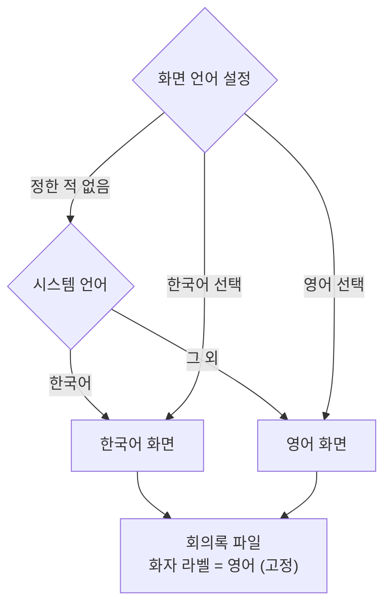

# ADR 0005: 화면 언어를 한국어·영어에서 고르게 하고 산출물 라벨은 영어로 고정한다

Date: 2026-08-05

## Status

Proposed

## Context

화면에 보이는 모든 문구가 한국어로 코드에 박혀 있다. 메뉴, 설정, 상태 표시뿐 아니라 실패를
알리는 문구와 진단 안내까지 그렇다.

이 앱이 다루는 회의는 한국어 회의가 아니다. 전사는 한국어와 영어를 함께 인식하도록 만들어져
있고, 코드스위칭 회의를 위해 토큰 단위 언어 중재까지 넣었다. 즉 **제품이 상정하는 사용자는
영어 회의를 하는 사람을 포함하는데, 그 사람이 앱을 쓸 수 없다.** 화면을 읽지 못하면 시작
버튼조차 찾지 못한다.

특히 문제가 되는 것은 **실패 안내**다. 이 앱의 실패 대부분은 권한 문제이고, 권한은 조용히
실패한다 — 마이크 권한이 거부돼도 콜백은 계속 오고 내용만 0으로 채워진다. 그래서 무엇이
잘못됐는지 알려주는 문구가 사용자가 녹취를 시작할 수 있게 되는 유일한 경로다. 그 문구를 읽지
못하는 사용자에게는 앱이 이유 없이 동작하지 않는 것으로 보인다.

산출물 쪽은 사정이 다르다. 회의록 파일(`transcript.md`)의 화자 라벨과 머리말도 한국어인데,
이것은 화면과 달리 **파일에 남아 나중에 다른 도구가 읽는다.** 이 저장소의 화자 세분화
플러그인이 그 어휘에 맞춰 자기 출력 라벨을 정하고 있고, 회의록은 회의가 끝난 뒤 사람과 도구가
함께 다루는 물건이다. 기계가 읽는 경로(`transcript.jsonl`의 화자 필드)는 이미 언어 중립적인
식별자를 쓰고 있어, 언어에 묶인 것은 사람이 읽는 형식뿐이다.

## Decision Drivers

- 전사가 한국어·영어를 함께 다루므로 **제품이 상정하는 사용자에 영어권이 포함된다** — 화면만
  한국어인 것은 기능의 절반을 쓸 수 없게 만든다.
- 이 앱의 실패는 대부분 권한 문제이고 조용히 실패하므로, **실패 문구가 유일한 복구 경로다** —
  읽지 못하면 앱이 이유 없이 고장 난 것으로 보인다.
- 회의록 파일은 **회의 후 다른 도구가 읽는다** — 화자 세분화 플러그인이 이미 그 어휘에 맞춰
  라벨을 정하고 있다.
- 산출물은 재생성 불가능하고 한 폴더에 누적된다 — 설정에 따라 형식이 바뀌면 같은 폴더 안에서
  형식이 섞인다.
- 화면 문구는 100개를 넘고 실패 문구가 그 안에 섞여 있다 — 일부만 번역된 상태는 언어가 섞인
  화면을 만든다.

## Decision

**화면 언어를 한국어·영어에서 고를 수 있게 하고, 정하지 않으면 시스템 언어를 따른다.**
시스템이 한국어면 한국어, 그 외에는 영어다. 한국어 사용자가 설정을 만지지 않으면 지금과 같은
화면을 본다. 시스템 언어 추종이 기본인 이유는 영어권 사용자가 **한국어 화면에서 언어 설정을
찾아내야 하는 상태**를 만들지 않기 위해서다 — 읽을 수 없는 화면에서 설정을 찾는 것이 이
기능이 풀려는 문제 그 자체다.

**번역 범위는 화면에 보이는 것 전부다.** 메뉴·설정·상태 표시뿐 아니라 실패 문구와 진단 안내를
포함한다. 실패 문구를 빼면 이 결정이 풀려는 문제의 핵심이 남는다 — 정작 문제가 생겼을 때
읽을 수 없는 화면이 된다.

**회의록 파일의 화자 라벨과 머리말은 화면 언어와 무관하게 영어로 고정한다.** 설정에 따라
바뀌지 않는다. 이유는 산출물이 파일로 남아 다른 도구와 사람이 나중에 함께 읽는다는 것이다 —
형식이 설정에 의존하면 한 폴더 안에서 회의록 형식이 섞이고, 회의록을 읽는 도구는 어느 설정으로
만들어졌는지 알 수 없어 두 어휘를 모두 다뤄야 한다. 영어를 고른 이유는 이 저장소의 화자 세분화
도구가 회의록과 같은 어휘를 써야 하고, 언어 중립적인 기준이 필요할 때 기계가 읽는 경로가 이미
쓰고 있는 어휘(화자 식별자)와 같은 계열이라는 것이다.

**전사 언어 설정과 화면 언어 설정은 별개다.** 한국어 회의를 영어 화면으로 녹취하는 것과 그
반대가 모두 가능해야 한다 — 화면을 읽는 언어와 회의에서 말하는 언어는 같을 이유가 없다.

### 요구사항 계약

- **화면 언어의 기본값은 시스템 언어 추종이다.** 시스템이 한국어면 한국어, 그 외에는 영어.
  사용자가 명시적으로 고르면 그 값이 계약이 되고, 시스템 언어가 바뀌어도 따라가지 않는다.
- **이 선택은 앱을 다시 켜도 유지된다.** 설정 창의 다른 항목과 같은 계약을 따른다.
- **화면에 보이는 모든 문구가 두 언어를 갖는다.** 실패 문구와 진단 안내를 포함한다. 한 언어에만
  존재하는 문구를 두지 않는다 — 언어가 섞인 화면은 번역이 없는 것보다 나쁘다.
- **회의록 파일의 화자 라벨과 머리말은 항상 영어다.** 화면 언어 설정이 이 형식을 바꾸지 않는다.
  기계가 읽는 화자 식별자는 지금과 같이 유지된다 — 이 결정은 사람이 읽는 형식에만 적용된다.
- **화자 세분화 도구의 라벨은 회의록과 같은 어휘를 쓴다.** 두 산출물이 한 회의를 설명하므로,
  어휘가 갈라지면 같은 화자가 두 이름으로 불린다.
- **전사 언어와 화면 언어는 독립적으로 정해진다.** 한쪽을 바꾸는 것이 다른 쪽을 바꾸지 않는다.
- **화면 언어는 녹취 중에도 바꿀 수 있다.** 이 값은 표시에만 쓰이므로 이미 만들어진 전사기나
  열려 있는 파일과 어긋나지 않는다. 녹취 중 잠기는 항목들과 성격이 다르다.

화면 언어가 무엇이든 산출물이 한 형식으로 모인다는 것이 위 흐름의 요점이다.

### 대안 검토

#### 지금처럼 한국어만 둔다

문구가 한 벌이므로 번역 누락이라는 실패 모드가 없다. 언어가 섞인 화면이 나올 수 없고, 새 문구를
추가할 때 한 곳만 고치면 된다. 설정 항목도 늘지 않는다.

채택하지 않은 이유는 제품이 이미 영어 회의를 상정한다는 것이다. 한·영 동시 인식과 코드스위칭
중재를 넣어 둔 앱의 화면을 한국어로만 두면, 그 기능을 필요로 하는 사용자의 일부가 앱을 쓸 수
없다. 특히 실패 문구를 읽을 수 없으면 권한 문제를 스스로 고칠 수 없는데, 이 앱의 실패는 대부분
권한 문제다.

#### 시스템 언어만 따르고 설정을 두지 않는다

설정 항목이 늘지 않고, 사용자가 고를 것이 없으므로 잘못 고를 일도 없다. macOS 앱의 통상적인
동작이기도 하다.

채택하지 않은 이유는 두 언어를 오가는 사용자가 실재한다는 것이다. 시스템을 영어로 쓰면서
한국어 회의를 녹취하는 경우, 화면은 영어인데 회의록의 내용은 한국어다 — 그 사용자가 화면만
한국어로 바꾸고 싶을 수 있다. 반대 방향도 같다. 시스템 언어를 바꾸는 것은 앱 하나를 위해
치르기에는 큰 비용이고, 이 앱은 회의 중에 곁에 두는 도구라서 그 불편이 매 회의마다 반복된다.

#### 회의록 파일도 화면 언어를 따르게 한다

읽는 사람에게 자연스럽다. 한국어 화면을 쓰는 사용자의 회의록이 한국어로 남으므로 지금 동작이
유지되고, 영어 화면 사용자는 영어 회의록을 얻는다.

채택하지 않은 이유는 산출물 형식이 설정에 의존하게 된다는 것이다. 회의록은 한 폴더에 누적되고
재생성할 수 없으므로, 설정을 바꾸면 같은 폴더 안에 두 형식이 섞인다. 그것을 읽는 도구는 어느
설정으로 만들어졌는지 알 수 없어 두 어휘를 모두 처리해야 하고, 이 저장소의 화자 세분화 도구가
정확히 그 처지가 된다. 화면은 지금 보는 것이고 파일은 나중에 다루는 것이라는 차이가, 언어를
따르는 것과 고정하는 것을 가른다.

## Consequences

### Positive

- 영어권 사용자가 앱을 쓸 수 있다 — 한·영 동시 인식이라는 기능과 화면의 도달 범위가 일치한다.
- 실패 문구가 번역되므로, 권한 문제를 사용자가 스스로 고칠 수 있다. 이 앱의 실패 대부분이
  거기에 해당한다.
- 시스템 언어 추종이 기본이므로, 영어권 사용자가 읽을 수 없는 화면에서 설정을 찾아야 하는
  상태가 생기지 않는다. 한국어 사용자의 화면은 바뀌지 않는다.
- 회의록 형식이 설정과 무관하게 하나이므로, 회의록을 읽는 도구가 한 어휘만 다루면 된다.
- 전사 언어와 화면 언어가 독립적이라, 시스템을 영어로 쓰면서 한국어 회의를 녹취하는 구성이
  가능하다.

### Negative

- 화면 문구가 두 벌이 된다. 새 문구를 추가할 때 두 언어를 함께 넣지 않으면 언어가 섞인 화면이
  나오고, 그 누락은 그 언어로 앱을 쓰는 사람에게만 보인다.
- 한국어 사용자의 회의록 화자 라벨이 영어로 바뀐다. 지금까지의 회의록과 새 회의록이 다른 어휘를
  쓰게 되며, 앱은 기존 파일을 고치지 않으므로 이 경계는 남는다.
- 화자 세분화 도구의 라벨도 함께 바뀌어야 하므로, 그 도구의 문서·테스트가 쓰는 어휘도 따라
  움직인다.
- 설정 창에 항목이 하나 늘어난다.

### Risks

- 번역 누락이 조용하다. 한 언어로만 존재하는 문구는 그 언어를 쓰지 않는 사용자에게만 보이므로,
  개발 중에는 드러나지 않는다.
- 영어 문구가 길어져 좁은 창에서 잘릴 수 있다. 전사 화면은 폭이 고정이고 실패 문구가 길다.
- 회의록 라벨이 바뀌는 것을 기존 사용자가 자기 파이프라인의 고장으로 볼 수 있다 — 회의록을
  직접 파싱하는 스크립트를 쓰고 있었다면 그렇다.

## Related

- [설정을 전사 화면에서 분리해 별도 창에 둔다](./0003-settings-surface-separation.md)
- [소스별 독립 분석기로 화자를 확정한다](../transcription/0001-source-based-speaker-attribution.md)
- [다국어 결과를 토큰 단위로 중재한다](../transcription/0002-token-level-language-arbitration.md)
- [회의록을 발화 확정 즉시 append 하고 종료를 시간 제한한다](../archive/0001-transcript-durability.md)
