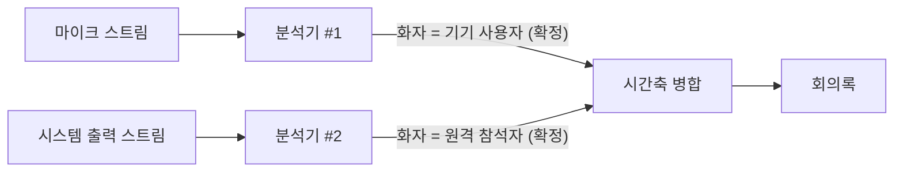

# ADR 0001: 화자를 오디오 소스로 확정하고 2화자 상한을 수용한다

Date: 2026-07-30

## Status

Proposed

## Context

회의록의 가치는 "누가 말했는가"에 크게 의존한다. 화자 구분이 없는 전사는 대화의
흐름을 잃는다.

일반적인 접근은 하나의 오디오 스트림을 받아 음성 특징으로 화자를 추론하는
것(diarization)이다. 그러나 Apple의 음성 프레임워크에는 diarization API가 없다 —
SDK 심볼 레벨에서 확인했다. 온디바이스를 유지하면서 화자를 나누려면 다른 근거가
필요하다.

이 앱이 가진 근거는 **오디오가 물리적으로 두 갈래로 들어온다**는 사실이다. 마이크로
들어온 소리는 이 기기를 쓰는 사람의 것이고, 시스템이 재생하는 소리는 원격
참석자의 것이다. 추론이 아니라 경로가 화자를 결정한다.

동시에 이 근거의 한계도 분명하다. 회의 앱은 참석자별 스트림을 **믹스다운한 뒤**
시스템 오디오로 넘기므로, 우리가 탭하는 지점은 이미 섞인 다음이다. 참석자별 화자
정보(WebRTC의 SSRC, active-speaker 이벤트)는 회의 앱 프로세스 내부에만 있다.

## Decision Drivers

- 사용 가능한 온디바이스 음성 프레임워크에 diarization API가 없다.
- 시스템 오디오는 회의 앱이 믹스다운한 뒤 넘어오므로 참석자별 분리 정보가 이미 소실된
  상태다.
- 전사·저장 전부를 온디바이스에서 처리한다는 것이 제품의 전제다 — 네트워크로 나가는
  데이터가 없어야 한다.
- 화자 라벨이 틀리면 회의록의 신뢰가 무너진다 — 부정확한 다화자 분리는 정확한 2화자
  분리보다 나쁘다.

## Decision

**오디오 소스 하나당 독립된 전사 분석기를 둔다.** 마이크 스트림을 담당하는 분석기의
결과는 이 기기 사용자, 시스템 출력을 담당하는 분석기의 결과는 원격 참석자로 확정한다. 각
분석기는 자기 소스만 보므로 화자 라벨이 **추론 없이 확정**된다 — 신뢰도나 음성
특징을 따질 필요가 없다.

산출물에 적히는 화자 이름은 화면 언어와 무관하게 한 벌이다 — 회의록을 읽는 도구가 어느 설정으로
만들어졌는지 알 수 없으므로, 형식이 설정에 의존하면 두 어휘를 모두 다뤄야 한다. 표기 규칙은
[화면 언어 결정](../session/0005-interface-language.md)이 정한다.

이 결정의 필연적 결과로 **화자 분리는 기기 사용자 vs 원격 참석자 전원 2분리가 상한**이다.
원격 참석자를 개인별로 구분하지 않는다. 이것은 구현의 미완성이 아니라 오디오 경로가
정한 상한이며, 위 driver들 아래에서는 이 상한을 수용하는 것이 부정확한 다화자 추정을
시도하는 것보다 낫다.

두 소스의 결과는 하나의 시간축으로 합쳐 대화 순서를 복원한다.

향후 다화자 확장을 위해 **화자 표현을 확장 지점으로 남긴다.** 원본 오디오를 소스별로
따로 저장하는 결정도 이 확장을 염두에 둔 것이다 — 나중에 화자분리 모델을 붙여
재처리할 수 있다.

다화자까지 가는 경로는 여러 개이고, 각각 이 제품의 전제와 상충하는 지점이 다르다.

| 방법 | 실시간 | 참석자 이름 | 제약 |
|---|---|---|---|
| 화자 임베딩 클러스터링 | O | X (`화자 A/B/C`) | 온디바이스 유지, 목소리 비슷하면 섞임 |
| 접근성 API로 화면의 활성 발화자 읽기 | O | O | 회의 앱 UI 구조 의존, 업데이트마다 깨짐 |
| 회의 앱의 참석자별 개별 녹음 | X (회의 후) | O | 파일이 회의 종료 후 생성 |
| 회의 플랫폼의 통신 봇 API | O | O | 테넌트 관리자 동의 + 서버 필요 |
| 클라우드 STT diarization | O | X | 오프라인·프라이버시 포기 |

### 대안 검토

#### 두 소스를 믹스하고 화자 임베딩 클러스터링을 적용한다

온디바이스를 유지하면서 원격 참석자를 개인별로 나눌 수 있는 유일한 현실적 경로다. 외부
모델을 변환해 번들에 넣으면 네트워크 없이 동작하고, 참석자 수가 늘어도 `화자 A/B/C`
수준의 구분이 가능하다.

채택하지 않은 이유는 정확성과 비용 양쪽이다. 클러스터링은 목소리가 비슷한 참석자를 섞고,
참석자 수를 미리 모르면 클러스터 수 추정 오차가 그대로 라벨 오류가 된다. 지금 얻고 있는
**100% 정확한 2화자 분리를 확률적 다화자 분리로 교환**하는 셈인데, 회의록에서 화자
라벨이 틀리는 것은 발언이 누락되는 것보다 나쁘다 — 잘못된 정보가 사실로 기록되기
때문이다. 게다가 소스를 믹스하면 지금은 공짜로 얻는 기기 사용자 vs 원격 참석자 구분까지 추론
대상이 되어, 가장 확실한 정보를 스스로 버리게 된다. 외부 모델 의존이 추가되는 것도
의존성 없는 앱이라는 성격과 어긋난다.

#### 접근성 API로 화면의 활성 발화자를 읽는다

유일하게 실시간으로 **참석자 실명**까지 얻을 수 있는 방법이다. 회의 앱이 화면에 이미
"누가 말하는 중"을 표시하므로 그 정보를 읽어 시스템 오디오 결과에 붙이면 된다.

채택하지 않은 이유는 결합의 성질이다. 회의 앱의 UI 트리 구조에 의존하므로 앱
업데이트마다 깨지고, 회의 앱마다 별도 구현이 필요하며, 창이 최소화되거나 다른 레이아웃
모드일 때 읽히지 않는다. 즉 회의록 정확도가 우리가 통제할 수 없는 외부 UI의 안정성에
종속된다. 또한 화면 내용을 읽기 위해 접근성 권한을 요구해야 하는데, 이는 화면 권한을
피하려고 캡처 방식까지 선택한 결정과 방향이 어긋난다.

## Consequences

### Positive

- 화자 라벨이 추론 없이 확정되므로 오류 가능성이 원리적으로 없다.
- 화자 분리에 추가 모델이나 네트워크가 필요 없어 온디바이스 전제가 유지된다.
- 각 분석기가 하나의 소스만 처리하므로 다른 소스의 음성이 인식 품질에 간섭하지 않는다.
- 소스별 원본 보관과 화자 표현의 확장 지점이 남아 있어 나중에 다화자 재처리가 가능하다.

### Negative

- 원격 참석자를 개인별로 구분하지 못한다 — 여러 명이 참석한 회의록에서 상대방 발언이
  한 화자로 뭉친다.
- 분석기를 소스 수만큼 띄우므로 모델 메모리와 연산이 소스 수에 비례한다.
- 두 분석기의 결과가 비동기로 도착하므로 시간축 병합에서 순서를 복원해야 한다.

### Risks

- 대면 회의에서 상대방이 내 마이크로 함께 들어오면 그 발언이 기기 사용자로 라벨된다. 소스가
  화자를 결정한다는 전제가 물리적으로 깨지는 경우다.
- 회의 앱의 에코 제거가 내 목소리를 시스템 출력 쪽에 일부 남기면 같은 발언이 두 화자로
  중복될 수 있다.

## Related

- [두 캡처 소스의 실패를 서로 격리한다](../capture/0003-per-source-failure-isolation.md)
- [다국어 결과를 토큰 단위 신뢰도로 중재한다](./0002-token-level-language-arbitration.md)
- [원본 오디오를 리샘플링 전 AAC로 보관한다](../archive/0002-original-audio-format.md)
- [화면 언어를 고르게 하고 산출물 라벨은 고정한다](../session/0005-interface-language.md)
