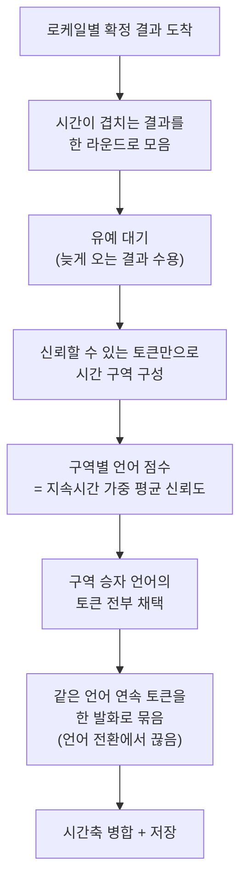

# ADR 0002: 다국어 결과를 토큰 단위 신뢰도로 중재한다

Date: 2026-07-30

## Status

Proposed

## Context

한국어와 영어가 섞이는 회의를 지원해야 한다. 하나의 분석기에 로케일별 전사기를 함께
물리는 것은 가능하지만, 실측에서 드러난 문제는 **양쪽 전사기가 모두 결과를 낸다**는
것이다. 자기 언어가 아닌 오디오에도 침묵하지 않고 엉뚱한 텍스트를 만든다.

```
영어 오디오 "Good morning everyone. Let's review the deployment schedule."
  en 전사기: conf=0.84~0.97  "Good morning, everyone." / "Let's review..."
  ko 전사기: conf=0.558      "Goodmorning everyone et' reve t Deploen cel."   ← 쓰레기
```

다행히 신뢰도가 뚜렷하게 갈리므로 판정 근거는 있다. 문제는 **판정 단위**다. 세그먼트
단위로 비교하면 코드스위칭 회의에서 발화가 통째로 사라진다. 한→영→한 오디오에서
한국어 전사기가 전체를 하나의 긴 세그먼트로 뭉갰고, 그 평균(0.823)이 영어
전사기(0.877)에 지면서 한국어 발언 전체가 버려졌다.

같은 오디오를 토큰 단위로 보면 정보가 남아 있다.

```
ko 전사기: 0.00~8.54s 하나의 세그먼트로 뭉갬
   run 0.00~0.78s conf=0.905 '안녕하세요.'      ← 진짜 한국어
   run 2.70~6.00s conf=0.562 ' 네,'             ← 영어 구간을 뭉갠 쓰레기
   run 6.48~6.96s conf=0.903 ' 그럼'            ← 진짜 한국어
```

## Decision Drivers

- 로케일별 전사기가 자기 언어가 아닌 오디오에도 결과를 낸다 — 침묵으로 판별할 수 없다.
- 신뢰도가 정답과 오답 사이에서 뚜렷하게 갈린다(0.9 대 0.56 수준) — 판정 근거로 쓸 수
  있다.
- 코드스위칭 회의에서 한 전사기가 여러 언어 구간을 하나의 세그먼트로 뭉갠다 — 세그먼트
  평균은 구간별 정보를 잃는다.
- 개별 토큰의 신뢰도는 출렁인다 — 정답 모델의 특정 단어가 오답 모델보다 낮게 나오는
  경우가 실제로 있다.
- 두 전사기의 결과 도착 시점이 다르다 — 먼저 온 것을 즉시 확정하면 나중에 도착한 더
  좋은 결과를 버리지만, 확정을 마냥 기다리면 실시간 표시가 비어 앱이 멈춘 것처럼 보인다.

## Decision

확정 결과를 **토큰 단위로 중재**한다. 세 규칙은 모두 실측 실패 사례에서 나왔다.

**1. 구역(region) 단위로 언어를 정한다.** 토큰을 하나씩 겨루게 하면 개별 단어의
신뢰도가 출렁여 문장 중간에서 언어가 뒤집힌다. 실측 예 — 영어 오디오의 "morning"
구간에서 `en ' morning,' c=0.617` vs `ko ' morning' c=0.691`로 오답인 한국어가
이겼고, 영어 문장 가운데 구멍이 났다. 그래서 시간이 겹치는 토큰들을 하나의 구역으로
묶고, 구역 전체의 평균으로 승자 언어를 정한 뒤 그 언어의 토큰을 전부 살린다.

**2. 긴 단일 토큰은 구역 경계 계산에서 제외한다.** 오답 모델은 알아듣지 못한 구간을
한 단어로 길게 때운다 — `2.70~6.00s c=0.562 ' 네,'`에서 한 음절이 3.3초를 덮었다.
이런 토큰을 경계에 넣으면 인접 구역까지 하나로 삼켜서 멀쩡한 발화가 함께 휩쓸려
나간다. 사람의 한 단어가 차지할 수 있는 그럴듯한 길이를 넘는 토큰은 경계를 그리는 데
쓰지 않는다.

**3. 신뢰도는 지속 시간으로 가중 평균한다.** 단순 평균은 짧은 조각 하나가 긴 발화와
같은 무게를 갖는다. 오답 모델은 모르는 구간을 짧은 토큰 여러 개로 흩뿌리는 경향이
있어 시간 가중이 더 정확하다.

승자 토큰을 이어 붙일 때는 **언어가 바뀌는 지점에서 발화를 끊는다.** 그래야 회의록에
코드스위칭이 보인다.

결과 도착 시점 차이는 **짧은 유예**로 흡수한다. 시간이 겹치는 확정 결과들을 한
라운드로 모아 유예 후 함께 판정하므로, 먼저 도착한 결과가 나중 결과를 밀어내지
않는다. 세션 종료 시에는 대기 중인 라운드를 모두 확정해 마지막 발화를 잃지 않는다.

**잠정 결과는 중재하지 않고 통과시킨다.** 잠정 결과는 화면 표시 전용이고 저장되지
않으므로, 반응성을 위해 유예 없이 흘린다.

**단일 언어를 선택하면 중재기를 아예 만들지 않는다.** 경쟁이 없으므로 중재로 인한
손실도 없다.



### 대안 검토

#### 세그먼트 단위로 신뢰도를 비교해 승자를 고른다

판정 단위가 전사기가 내보내는 결과 단위와 같으므로 구현이 단순하다. 토큰 시간 정보나
구역 구성이 전혀 필요 없고, 두 결과의 평균 신뢰도만 비교하면 끝난다. 단일 언어
발화에서는 이 방식으로도 정확한 결과가 나온다.

채택하지 않은 이유는 위 실측이 이 방식의 실패를 직접 보여줬기 때문이다. 코드스위칭
오디오에서 한국어 전사기가 전체를 하나의 세그먼트로 뭉개자 평균이 0.823으로 희석되어
영어(0.877)에 졌고, **한국어 발언 전체가 사라졌다**. 발화가 누락되는 것은 회의록에서
가장 나쁜 실패다. 토큰 수준에는 구간별 정보가 남아 있는데(한국어 부분 0.9, 영어 부분
0.56) 세그먼트 평균이 그 정보를 버린다. **기본 판정 단위로는 기각한다** — 토큰 시간
정보를 얻을 수 없을 때의 fallback 으로만 남긴다. 판정 근거가 아예 없을 때 아무것도
채택하지 않는 것보다는 낫기 때문이다.

#### 단일 언어만 지원하고 사용자가 회의마다 고르게 한다

경쟁이 없으므로 중재기가 필요 없고, 오답 전사기가 개입하지 않아 각 언어의 인식 품질이
최상이다. 코드스위칭 경계에서 발생하는 손실도 원리적으로 없다.

**유일한 지원 모드로는 기각한다** — 선택 가능한 구성으로만 제공하고, 그때는 중재기를
아예 만들지 않는다. 유일한 모드로 삼지 않은 이유는 한국어·영어가 섞이는 회의가 실제
사용 시나리오이고, 언어 구성은 세션 시작 시점에 고정되므로(관련 결정 참조) 회의 도중
바꿀 수 없다는 것이다. 한 문장 안에서 언어가 바뀌는 발화는 어느 한쪽을 골라도 절반을
잃는다. 그래서 기본값은 양쪽을 함께 돌리되, 회의 언어가 하나로 정해져 있다면 단일
언어를 고르는 것이 더 정확하다는 것을 문서로 안내한다.

## Consequences

### Positive

- 코드스위칭 회의에서 두 언어 발화가 모두 살아남는다 — 세그먼트 단위 판정이 잃던
  정보를 보존한다.
- 회의록에 언어 전환 지점이 드러나므로 어느 언어로 인식됐는지 확인할 수 있다.
- 잠정 결과를 중재에서 제외해 실시간 표시의 반응성을 유지한다.
- 단일 언어 선택 시 중재 경로가 아예 생성되지 않아 중재로 인한 손실이 없다.

### Negative

- 언어 수만큼 전사기를 돌리므로 연산과 메모리가 비례해 증가한다.
- 확정 결과에 유예가 붙어 저장까지의 지연이 생긴다.
- 판정 규칙이 세 가지 임계(구역 겹침 비율, 단일 토큰 최대 길이, 유예 시간)에 의존하며,
  이 값들은 관측된 실패 사례에 맞춰 정한 것이라 다른 발화 패턴에서 재검증이 필요하다.

### Risks

- 코드스위칭 경계에서 발화가 잘릴 수 있다 — 검증에서 언어 전환 직전 토큰이 다음
  구역으로 휩쓸려 한 단어가 소실됐다. 단일 언어 회의에서는 발생하지 않는다.
- 두 언어가 모두 낮은 신뢰도를 보이는 구간에서는 승자가 사실상 무작위로 정해진다.
- 토큰 시간 정보가 제공되지 않으면 세그먼트 단위 대비책으로 떨어지므로, 그 경우 위
  실측이 보여준 발화 누락이 재현될 수 있다.

## Related

- [화자를 오디오 소스로 확정하고 2화자 상한을 수용한다](./0001-source-based-speaker-attribution.md)
- [언어 모델 확보를 녹취 시작의 게이트로 둔다](./0003-model-provisioning-gate.md)
