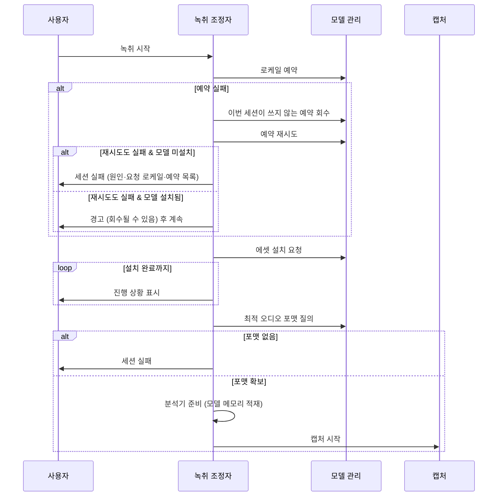

# ADR 0003: 언어 모델 확보를 녹취 시작의 게이트로 둔다

Date: 2026-07-30

## Status

Proposed

## Context

온디바이스 전사는 로케일별 모델이 기기에 설치돼 있어야 동작한다. 모델은 앱 번들에
들어 있지 않고 시스템이 관리하며, 필요할 때 내려받는다.

이 의존이 만드는 제약이 하나 있다. 분석기가 받아들일 수 있는 최적 오디오 포맷을
질의하면, 모델이 하나라도 설치되지 않은 상태에서는 답이 나오지 않는다. 즉 캡처
파이프라인의 목표 포맷을 정하려면 **모델 설치가 먼저 끝나 있어야** 한다. 포맷은 캡처
변환기와 파일 저장 형식을 모두 결정하므로, 이 순서를 지키지 않으면 파이프라인을 조립할
수 없다.

시스템의 모델 관리에는 두 가지 성질이 더 있다. 첫째, 예약하지 않은 모델은 시스템이
정리할 수 있다. 둘째, 동시에 예약할 수 있는 로케일 수에 플랫폼이 정한 한도가 있다
(값은 시스템이 런타임에 알려준다. 실측 기기에서 5, 한도는 앱 단위로 계산된다 — 한 앱이
5개를 채운 상태에서 다른 앱이 추가로 예약하는 데 성공했다).

예약과 설치는 별개다. **모델이 이미 설치돼 있으면 예약 없이도 전사 파이프라인을 조립할
수 있다** — 실측에서 예약이 0개인 상태로 최적 오디오 포맷 질의가 `16000 Hz, Int16`을
정상 반환하고 분석기 준비도 성공했다. 예약이 지키는 것은 조립 가능성이 아니라 **이미 확보한
모델이 세션 도중 시스템에 회수되지 않는 것**이다. 반대로 모델이 미설치라면 다운로드가
필요하고, 그 다운로드를 붙잡아 두려면 예약이 반드시 앞서야 한다.

예약은 프로세스 수명을 넘어 남는다 (실측: 한 실행에서 예약한 로케일이 종료 후 별개 실행에서
그대로 조회됐다). 그러므로 비정상 종료가 남긴 예약은 다음 실행에서 한도를 잠식한 상태로
시작한다. 이 앱이 한 번에 필요한 로케일은 최대 2개이므로 앱 단독으로는 한도에 닿지
않지만, 남은 예약이 자리를 채우고 있으면 닿을 수 있다.

예약 실패의 원인은 한도 초과만이 아니다. 시스템은 실패 원인을 구분해 알려준다 (한도 초과는
`SFSpeechErrorDomain` 코드 11, "Too many allocated locales, 5 maximum."). 원인을
버리고 한도 초과로 단정하면 사용자가 해결할 수 없는 오진을 본다 — 실제로 그 오진이
관측됐고, 그 시점의 실제 예약 수는 0이었다.

## Decision Drivers

- 모델이 미설치면 최적 오디오 포맷 질의가 답을 내지 않는다 — 포맷 없이는 캡처 변환기와
  저장 형식을 정할 수 없다.
- 예약하지 않은 모델은 시스템이 정리할 수 있어 세션 중 사라질 수 있다.
- **모델이 이미 설치돼 있으면 예약 없이도 파이프라인을 조립할 수 있다** — 예약 실패가
  곧 전사 불가를 뜻하지는 않는다.
- 동시 예약 로케일 수에 플랫폼 한도가 있고, 예약은 프로세스 수명을 넘어 남는다 — 비정상
  종료가 남긴 예약이 다음 실행의 자리를 잠식한다.
- 모델 다운로드는 네트워크 상태에 따라 수 분이 걸릴 수 있다 — 진행 상황을 알리지 않으면
  앱이 멈춘 것으로 보인다.
- 회의는 시작 시각이 정해져 있다 — 앞부분을 놓치는 대가가 크므로, 전사가 가능한 상황에서
  시작을 막는 실패는 최소여야 한다.

## Decision

녹취 시작을 **모델 확보가 끝난 뒤로 게이트**한다. 이 게이트가 강제하는 순서 불변식은
두 개다.

- **예약이 다운로드보다 먼저다.** 내려받은 모델이 시스템에 정리되지 않도록 먼저
  붙잡는다. 순서가 뒤집히면 방금 받은 모델이 사라질 수 있다.
- **설치가 끝난 뒤에만 오디오 포맷을 질의한다.** 답이 없으면 세션을 실패로 접는다 —
  포맷 없이 파이프라인을 조립하지 않는다.

캡처를 시작하기 전에 분석기를 준비 상태로 만들어 모델을 메모리에 올린다. 그러지 않으면
첫 발화가 잘린다.

모델 다운로드가 진행되는 동안 진행 상황을 UI에 보고한다. 여러 로케일이 필요하면 에셋을
묶어 한 번에 요청한다.

세션 종료 시 예약을 해제한다. 예약 한도가 있으므로 붙잡은 채로 두면 다른 언어 구성으로
전환할 수 없게 된다.

### 예약 실패는 게이트를 닫지 않는다

**예약 실패 자체는 세션 실패 사유가 아니다.** 게이트를 닫는 것은 오디오 포맷을 얻지 못한
경우뿐이다. 예약이 실패하면 아래 순서로 복구를 시도하고, 그래도 실패하면 결과에 따라 갈린다.

1. **불필요한 잔여 예약을 회수한다.** 이번 세션이 쓰지 않는 로케일의 예약을 해제해 자리를
   만든 뒤 다시 예약한다. 비정상 종료가 남긴 예약이 자리를 잠식하는 경우를 앱이 스스로
   푼다 — 사용자에게 앱 재시작을 요구하지 않는다.
2. **재시도도 실패하면 설치 상태로 갈린다.** 필요한 모델이 이미 설치돼 있으면 예약 없이
   녹취를 진행하고, 모델이 회수될 수 있다는 사실을 경고로 알린다. 미설치라면 다운로드를
   붙잡을 수 없으므로 세션을 실패로 접는다.

**예약 실패를 사용자에게 알릴 때는 시스템이 준 실제 원인을 보존한다.** 원인을 버리고 한도
초과로 단정하지 않는다 — 한도에 닿지 않은 실패까지 한도 초과로 보고하면 사용자는 해결할 수
없는 안내를 받는다. 한도 초과일 때는 그 사실과 현재 한도값을, 다른 원인일 때는 시스템이 준
원인을 알린다. 예약 실패로 세션을 접는 경우에는 진단에 필요한 상태 — 실패 원인, 요청한
로케일, 그 시점에 예약된 로케일 목록 — 를 함께 남긴다. 관측된 오진이 상태를 남기지 않아
원인을 사후에 좁힐 수 없었다.

**언어 구성은 세션 시작 시점에 고정한다.** 녹취 중 변경은 이미 만들어진 전사기와
어긋나므로 잠근다. 이 잠금은 모델·전사기 생애주기에서 파생되므로 이 결정이 소유한다.

### 대안 검토

#### 캡처를 먼저 시작하고 모델은 백그라운드로 받는다

사용자가 시작을 누른 즉시 녹음이 시작되므로 회의 앞부분을 놓치지 않는다. 모델이 준비되기
전 구간은 원본 오디오만 저장해 두고, 준비가 끝나면 그 지점부터 전사를 붙이거나 저장된
앞부분을 나중에 재전사할 수 있다.

채택하지 않은 이유는 목표 오디오 포맷을 정할 수 없다는 것이다. 캡처 변환기와 원본 저장
형식이 모두 이 포맷에 의존하는데, 모델 설치 전에는 질의에 답이 없다. 임의의 포맷으로
먼저 시작하면 모델이 준비된 뒤 요구 포맷과 어긋날 수 있고, 그때 변환기를 갈아끼우거나
이미 열린 저장 파일의 형식을 바꿔야 한다 — 세션 중에 파이프라인 포맷을 교체하는 복잡도가
얻는 이득보다 크다. 게다가 모델 다운로드는 첫 실행에만 발생하고 그 이후에는 즉시
통과하므로, 상시 비용이 아닌 일회성 지연을 위해 파이프라인을 가변으로 만드는 교환이
된다.

#### 필요한 모델을 앱 번들에 포함해 배포한다

다운로드 단계가 사라져 첫 실행부터 즉시 녹취가 시작되고, 네트워크 없이도 동작하며,
진행 상황을 알릴 UI 자체가 필요 없다. 예약 한도 문제도 사라진다.

채택하지 않은 이유는 이 모델이 시스템 자산이라 앱이 번들에 담아 배포할 수 있는 대상이
아니기 때문이다. 설치와 생애주기를 OS가 관리하며, 앱은 설치를 요청하고 예약으로 붙잡을
수 있을 뿐이다. 가능하다 해도 플랫폼이 지원하는 로케일 수를 감안하면 사용자가 고를 수
있는 조합을 모두 번들에 넣는 것은 앱 크기 면에서 비현실적이다.

#### 예약 실패를 그대로 세션 실패로 접는다

구현이 단순하고, 세션이 시작된 뒤 모델이 회수될 위험이 없다 — 시작한 녹취는 끝까지
전사된다는 성질을 지킬 수 있다.

채택하지 않은 이유는 **전사가 가능한 상황에서 시작을 막기** 때문이다. 실측에서 모델이
설치돼 있으면 예약 없이도 포맷 질의와 분석기 준비가 성공했으므로, 예약 실패를 치명적으로
다루는 것은 실제 제약보다 강한 제약이다. 게다가 예약은 프로세스 수명을 넘어 남으므로
비정상 종료 한 번이 다음 실행까지 막고, 사용자가 할 수 있는 조치는 앱 재시작뿐인데 그
사실을 알 방법이 없다. 회의는 시작 시각이 정해져 있어 이 지연의 대가가 크다. 세션 중
회수 위험은 경고로 알려 사용자가 판단하게 하는 편이 낫다 — 녹취를 아예 못 하는 것보다는
회수될 수도 있는 녹취가 낫다.

#### 예약을 아예 하지 않는다

한도 문제와 잔여 예약 문제가 함께 사라지고, 해제 누락도 있을 수 없다. 실측에서 설치된
모델만으로 파이프라인이 조립되므로 통상 경로는 그대로 동작한다.

채택하지 않은 이유는 두 가지다. 모델이 미설치일 때 다운로드한 결과를 붙잡을 수단이 없어
방금 받은 모델이 회수될 수 있고, 설치돼 있던 모델도 세션 도중 회수될 수 있다 — 회의
중간에 전사가 멈추는 실패는 사용자가 복구할 수 없고 그 구간의 발화는 되돌아오지 않는다.
예약은 이 위험을 없애는 값싼 수단이므로, 버리는 대신 **실패했을 때 치명적으로 다루지
않는** 쪽을 택한다.

## Consequences

### Positive

- 캡처 파이프라인이 확정된 포맷 위에서 조립되므로 세션 중 포맷 교체가 없다.
- 예약을 다운로드보다 먼저 하므로 내려받은 모델이 세션 중 정리되지 않는다.
- 분석기를 미리 준비하므로 첫 발화가 잘리지 않는다.
- 여러 로케일 에셋을 한 요청으로 묶어 다운로드 횟수를 줄인다.
- 비정상 종료가 남긴 예약을 앱이 스스로 회수하므로, 이전 실행의 잔여물 때문에 시작이
  막히지 않는다 — 사용자에게 앱 재시작을 요구하지 않는다.
- 모델이 설치된 상태에서는 예약 실패가 녹취를 막지 않는다 — 회의 앞부분을 놓치지 않는다.
- 예약 실패를 알릴 때 시스템이 준 실제 원인을 보존하므로, 해결할 수 없는 안내를 받지
  않는다.

### Negative

- 첫 실행에서 모델 다운로드가 끝날 때까지 녹취가 시작되지 않는다 — 회의가 이미
  시작됐다면 앞부분을 놓친다.
- 언어 구성이 세션 중 잠기므로, 예상과 다른 언어로 회의가 진행되면 녹취를 중지하고 다시
  시작해야 한다.
- 예약 없이 진행한 세션은 모델이 회수될 수 있다 — 경고를 무시한 사용자는 회의 중간에
  전사가 멈추는 것을 겪을 수 있고, 그 구간의 발화는 되돌아오지 않는다.

### Risks

- 네트워크가 느리거나 끊기면 시작 단계에서 오래 대기한다.
- 모델이 설치됐는데도 포맷 질의가 답하지 않는 경우를 세션 실패로 처리하므로, 그 상황의
  원인 구분 없이 동일한 오류로 보고된다.
- 잔여 예약 회수는 다른 앱이 붙잡은 예약에는 닿지 않는다. 한도가 앱 단위로 계산되므로
  통상은 문제가 되지 않지만, 같은 앱 신원으로 동작하는 다른 프로세스가 자리를 채운
  경우는 앱이 풀 수 없다.
- 예약 없이 진행하는 경로가 통상 경로처럼 조용히 동작하면, 경고가 사용자에게 닿지 않는 한
  회수 위험이 있는 세션과 없는 세션을 구분할 수 없다.

## Related

- [다국어 결과를 토큰 단위 신뢰도로 중재한다](./0002-token-level-language-arbitration.md)
- [두 캡처 소스의 실패를 서로 격리한다](../capture/0003-per-source-failure-isolation.md)
- [원본 오디오를 리샘플링 전 AAC로 보관한다](../archive/0002-original-audio-format.md)
