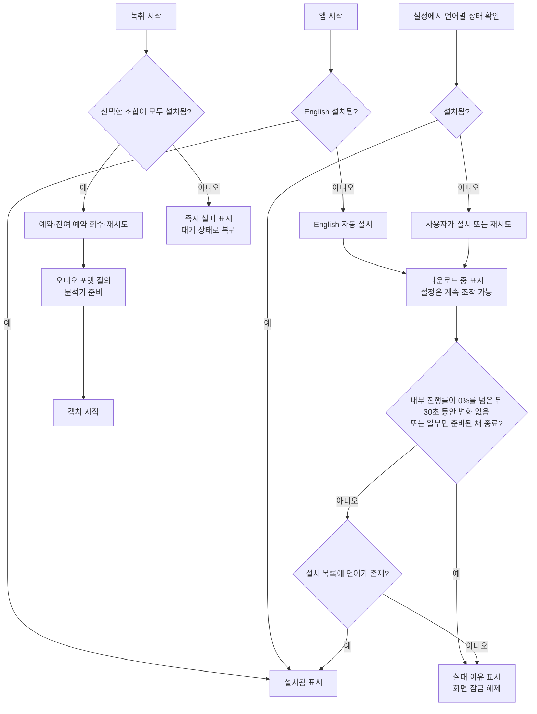

# ADR 0003: 언어 모델 설치를 설정에서 언어별로 관리한다

Date: 2026-07-30

## Status

Accepted (2026-08-21)

## Context

온디바이스 전사는 로케일별 모델이 기기에 설치돼 있어야 동작한다. 모델은 앱 번들에
들어 있지 않고 macOS가 내려받기와 회수를 관리한다. 필요한 모델이 없으면 분석기가
받아들일 최적 오디오 포맷을 얻을 수 없으므로 캡처 파이프라인도 시작할 수 없다.

모델 설치 요청은 진행률과 실제 완료 상태가 어긋날 수 있다. 한국어와 영어를 한 요청으로
준비할 때 한쪽만 설치된 채 진행률이 `50%`에 머물렀고, 설치 작업이 반환되지 않아 녹취
시작 화면이 무기한 잠기는 현상이 관측됐다. 반면 한국어 단독 설치가 `0%`인 동안의 시스템
로그는 다운로드 실패가 아니라 자산 구성을 바꾸고 기존 작업을 취소한 뒤 새 요청을 대기열에
넣는 중이었다. 앱이 요청 30초 뒤 구독을 해제해 실제 다운로드가 시작되기 전에 스스로
설치를 중단했다.

예약과 설치는 별개다. 예약은 이미 확보한 모델이 세션 도중 회수되는 것을 막지만, 모델이
이미 설치돼 있으면 예약 없이도 최적 포맷 질의와 분석기 준비가 성공했다. 플랫폼은 앱에
모델 설치 요청과 예약·해제 기능을 제공하지만 설치된 모델을 삭제하는 기능은 제공하지 않는다.

## Decision Drivers

- 일부 에셋만 준비된 설치 요청이 양수 진행률에서 반환되지 않으면 설치 행이 무기한
  대기할 수 있다.
- 시스템이 보고하는 `0%`는 실제 다운로드 정체와 자산 구성·대기열 준비를 구분하지 못한다.
- 미설치 모델을 분석기에 넣으면 최적 오디오 포맷을 얻을 수 없고 살아 있는 분석기도
  회복 불가능하게 실패할 수 있다.
- 사용자는 어느 언어가 설치됐는지와 설치가 실패한 이유를 언어별로 확인하고 재시도할 수
  있어야 한다.
- 모델 예약은 세션 중 회수를 막지만, 예약 실패가 설치된 모델의 사용 가능성을 없애지는 않는다.
- 모델 삭제는 운영체제 소유라 앱이 동일한 생명주기 제어를 제공할 수 없다.

## Decision

English 모델은 앱의 필수 기본 자산으로 둔다. 앱 시작 시 설치 여부를 확인하고 없으면
macOS Speech 에셋 설치를 자동으로 시작한다. 한국어 모델은 설정 화면에서 사용자가 명시적으로
설치한다. 두 언어 모두 `미설치`, `설치 중`, `설치됨`, `실패` 상태를 표시하고 실패 상태에는
재시도 동작을 제공한다.

녹취 시작과 회의 중 언어 전환은 모델을 자동으로 내려받지 않는다. 그 경로는 설치된 모델만
사용하며, 필요한 모델이 없으면 분석기나 캡처를 건드리기 전에 즉시 실패를 알린다.

### Requirement contract

- 설정은 한국어와 영어 각각에 대해 `미설치`, `설치 중`, `설치됨`, `실패` 중 하나를
  표시한다.
- **English는 필수 모델이다.** 앱 시작 시 English가 없으면 설치를 자동으로 시작한다.
  설치가 끝나기 전에는 녹취를 시작할 수 없지만, 설치 실패나 정체가 앱과 설정 화면을
  잠그지는 않는다.
- 한국어는 설정에서 사용자가 설치한다. 실패한 언어는 같은 자리에서 재시도할 수 있다. 한 언어의
  설치가 진행되는 동안 다른 언어와 설정 화면은 계속 조작할 수 있다.
- 시스템 진행률은 자산 구성과 대기열 준비를 실제 전송과 구분하지 못하므로 화면에 퍼센트를
  표시하지 않고 설치가 끝날 때까지 `다운로드 중` 상태를 표시한다.
- 내부 진행률이 `0%`인 동안은 정체로 판정하지 않는다.
- 설치 진행률이 처음 `0%`를 넘은 뒤 **30초 동안 변하지 않으면** 정체로 판정해 설치
  요청을 끝내고 실패 상태와 이유를 표시한다.
- 설치 요청이 끝났거나 더 진행할 수 없는 상태에서 필요한 에셋 일부만 설치돼 있으면 성공으로
  보지 않는다. 즉시 실패 상태와 이유를 표시하고 화면 잠금을 푼다.
  이미 설치된 다른 언어는 계속 사용할 수 있다.
- 회의 언어의 기본값은 English다. English가 설치되면 English를 표시하고, 한국어가 설치되면
  한국어와 한국어+English 조합을 추가로 표시한다.
- English가 설치되지 않은 동안에는 회의 언어 선택과 녹취 시작을 사용할 수 없고, 자동 설치
  중에는 `다운로드 중` 상태를, 실패하면 이유와 재시도 동작을 표시한다.
- 녹취 시작은 필요한 모델이 모두 설치됐는지 먼저 검증한다. 일부만 설치됐거나 운영체제가
  모델을 회수했으면 다운로드를 기다리지 않고 즉시 실패를 표시한 뒤 대기 상태로 돌아간다.
- 모델이 설치된 뒤에는 세션 시작 시 예약을 시도한다. 실패하면 이번 세션이 쓰지 않는 잔여
  예약을 회수해 다시 시도하고, 그래도 실패해도 모델이 설치돼 있으면 경고와 함께 진행한다.
  모델이 미설치면 세션을 시작하지 않는다.
- 예약 실패를 알릴 때 시스템이 준 원인과 요청한 로케일, 현재 예약 목록을 보존한다. 한도
  초과가 확인되지 않았는데 한도 초과로 단정하지 않는다.
- 오디오 포맷은 설치 확인과 예약 처리 뒤에 질의하고, 포맷이 없으면 세션을 실패로 접는다.
  분석기는 캡처를 열기 전에 준비해 첫 발화를 놓치지 않는다.
- 앱은 설치된 모델 삭제 기능을 제공하지 않는다. 모델 삭제와 저장 공간 회수는 macOS가
  관리한다.

### 대안 검토

#### 녹취 시작 시 필요한 모든 모델을 한 요청으로 자동 설치한다

사용자는 설정을 미리 열 필요가 없지만, 일부 에셋만 준비된 요청이 반환되지 않으면 녹취
시작 전체가 `0%` 또는 `50%`에서 잠긴다. 어느 언어가 문제인지도 알 수 없고 이미 설치된
언어로 녹취를 시작할 수도 없어 채택하지 않는다.

#### 모든 언어를 설정에서만 수동 설치한다

사용자가 동의한 시점에만 네트워크를 사용하고 구현도 일관된다. 그러나 English는 앱의 기본
전사 언어이므로 첫 실행에서 반드시 필요하다. 설치 버튼을 찾기 전까지 핵심 기능을 쓸 수 없는
상태를 피하기 위해 English만 시작 시 자동 설치하고 한국어는 명시적 설치로 남긴다.

#### 미설치 언어를 선택기에 계속 표시하고 고르면 설치한다

언어 목록은 항상 일정하지만 선택값과 실제 전사 언어가 다운로드 동안 어긋난다. 미설치
로케일을 살아 있는 분석기에 넣는 실패도 되돌릴 수 없어 설치와 사용을 분리한다.

#### 모델 설치와 삭제를 모두 앱에서 관리한다

일반적인 패키지 관리자와 같은 경험을 제공하지만 플랫폼이 삭제 API를 제공하지 않아 앱이
보장할 수 없는 동작이다. 삭제는 운영체제에 맡긴다.

## Consequences

### Positive

- 한 언어의 설치 실패가 다른 설치된 언어의 녹취를 막지 않는다.
- 신뢰할 수 없는 퍼센트 대신 설치가 진행 중이라는 사실만 정확히 표시한다.
- 시스템 준비를 다운로드 정체로 오판해 `0%`에서 설치를 취소하지 않는다.
- 양수 진행률 정체는 실패와 재시도 가능한 상태로 끝난다.
- 언어 선택기가 실제 사용 가능한 구성만 보여 화면 표시와 분석기 상태가 일치한다.
- 녹취 시작 경로에서 네트워크 다운로드가 사라져 시작 실패가 즉시 드러난다.

### Negative

- English 설치가 실패하면 재시도하기 전까지 녹취를 시작할 수 없다.
- 앱 시작 시 macOS가 English Speech 에셋을 내려받기 위해 네트워크를 사용할 수 있다.
- 운영체제가 모델을 회수하면 이전에 선택한 조합이 사라지거나 녹취 시작이 거부될 수 있다.
- 앱에서 모델을 삭제하거나 정확한 저장 공간 사용량을 제어할 수 없다.

### Risks

- 시스템 진행률이 계속 `0%`인 채 실제 요청도 반환하지 않으면 설치 행이 오래 `다운로드 중`에
  머물 수 있다. 설정의 다른 기능과 이미 설치된 언어 사용은 계속 가능하다.
- 시스템이 양수 진행률을 실제 바이트 진행보다 거칠게 보고하면 정상 설치도 정체로 판정될 수
  있다. 실패 후 재시도로 복구할 수 있지만 다운로드가 다시 시작될 수 있다.
- 설치 목록 갱신이 늦으면 설치 완료 직후 잠시 미설치로 보일 수 있다. 성공 판정은 진행률이
  아니라 최종 설치 목록 확인으로 지켜야 한다.
- 예약 없이 설치된 모델은 세션 시작 전 운영체제가 회수할 수 있다. 앱 시작과 녹취 시작에서
  English 설치 여부를 다시
  검증하는 이유다.

## Related

- [회의 언어를 녹취 중에도 바꾼다](./0004-in-session-language-switch.md)
- [두 캡처 소스의 실패를 서로 격리한다](../capture/0003-per-source-failure-isolation.md)
