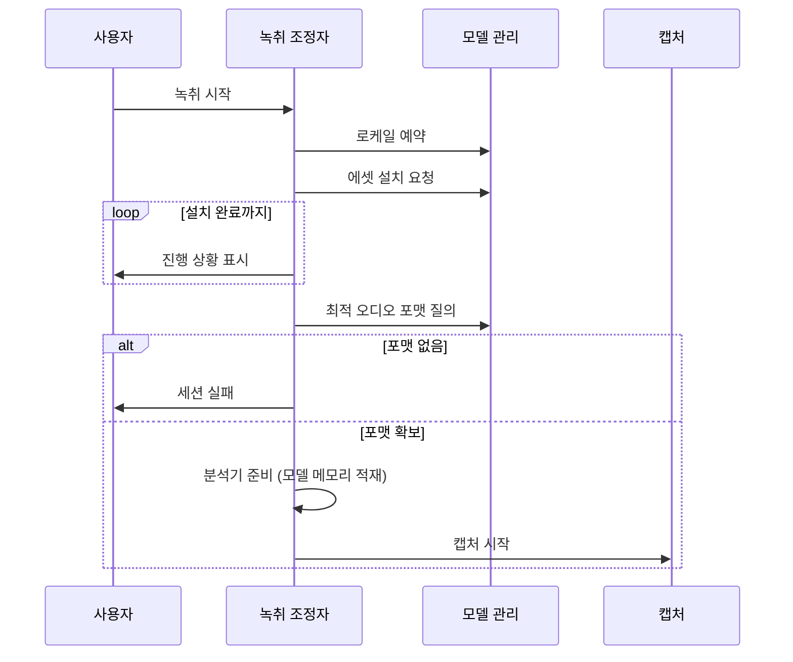

# ADR 0003: 언어 모델 확보를 녹취 시작의 게이트로 둔다

Date: 2026-07-30

## Status

Proposed

## Context

온디바이스 전사는 로케일별 모델이 기기에 설치돼 있어야 동작한다. 모델은 앱 번들에
들어 있지 않고 시스템이 관리하며, 필요할 때 내려받는다.

이 의존이 만드는 제약이 하나 있다. 분석기가 받아들일 수 있는 최적 오디오 포맷을
질의하면, 모델이 하나라도 설치되지 않은 상태에서는 답이 나오지 않는다. 즉 캡처
파이프라인의 목표 포맷을 정하려면 **모델 설치가 먼저 끝나 있어야** 한다. 포맷은 캡처
변환기와 파일 저장 형식을 모두 결정하므로, 이 순서를 지키지 않으면 파이프라인을 조립할
수 없다.

시스템의 모델 관리에는 두 가지 성질이 더 있다. 첫째, 예약하지 않은 모델은 시스템이
정리할 수 있다. 둘째, 동시에 예약할 수 있는 로케일 수에 플랫폼이 정한 한도가 있다
(값은 시스템이 런타임에 알려준다).

## Decision Drivers

- 모델이 미설치면 최적 오디오 포맷 질의가 답을 내지 않는다 — 포맷 없이는 캡처 변환기와
  저장 형식을 정할 수 없다.
- 예약하지 않은 모델은 시스템이 정리할 수 있어 세션 중 사라질 수 있다.
- 동시 예약 로케일 수에 플랫폼 한도가 있다 — 무제한으로 잡아둘 수 없다.
- 모델 다운로드는 네트워크 상태에 따라 수 분이 걸릴 수 있다 — 진행 상황을 알리지 않으면
  앱이 멈춘 것으로 보인다.

## Decision

녹취 시작을 **모델 확보가 끝난 뒤로 게이트**한다. 이 게이트가 강제하는 순서 불변식은
두 개다.

- **예약이 다운로드보다 먼저다.** 내려받은 모델이 시스템에 정리되지 않도록 먼저
  붙잡는다. 순서가 뒤집히면 방금 받은 모델이 사라질 수 있다.
- **설치가 끝난 뒤에만 오디오 포맷을 질의한다.** 답이 없으면 세션을 실패로 접는다 —
  포맷 없이 파이프라인을 조립하지 않는다.

캡처를 시작하기 전에 분석기를 준비 상태로 만들어 모델을 메모리에 올린다. 그러지 않으면
첫 발화가 잘린다.

모델 다운로드가 진행되는 동안 진행 상황을 UI에 보고한다. 여러 로케일이 필요하면 에셋을
묶어 한 번에 요청한다.

세션 종료 시 예약을 해제한다. 예약 한도가 있으므로 붙잡은 채로 두면 다른 언어 구성으로
전환할 수 없게 된다.

**언어 구성은 세션 시작 시점에 고정한다.** 녹취 중 변경은 이미 만들어진 전사기와
어긋나므로 잠근다. 이 잠금은 모델·전사기 생애주기에서 파생되므로 이 결정이 소유한다.

### 대안 검토

#### 캡처를 먼저 시작하고 모델은 백그라운드로 받는다

사용자가 시작을 누른 즉시 녹음이 시작되므로 회의 앞부분을 놓치지 않는다. 모델이 준비되기
전 구간은 원본 오디오만 저장해 두고, 준비가 끝나면 그 지점부터 전사를 붙이거나 저장된
앞부분을 나중에 재전사할 수 있다.

채택하지 않은 이유는 목표 오디오 포맷을 정할 수 없다는 것이다. 캡처 변환기와 원본 저장
형식이 모두 이 포맷에 의존하는데, 모델 설치 전에는 질의에 답이 없다. 임의의 포맷으로
먼저 시작하면 모델이 준비된 뒤 요구 포맷과 어긋날 수 있고, 그때 변환기를 갈아끼우거나
이미 열린 저장 파일의 형식을 바꿔야 한다 — 세션 중에 파이프라인 포맷을 교체하는 복잡도가
얻는 이득보다 크다. 게다가 모델 다운로드는 첫 실행에만 발생하고 그 이후에는 즉시
통과하므로, 상시 비용이 아닌 일회성 지연을 위해 파이프라인을 가변으로 만드는 교환이
된다.

#### 필요한 모델을 앱 번들에 포함해 배포한다

다운로드 단계가 사라져 첫 실행부터 즉시 녹취가 시작되고, 네트워크 없이도 동작하며,
진행 상황을 알릴 UI 자체가 필요 없다. 예약 한도 문제도 사라진다.

채택하지 않은 이유는 이 모델이 시스템 자산이라 앱이 번들에 담아 배포할 수 있는 대상이
아니기 때문이다. 설치와 생애주기를 OS가 관리하며, 앱은 설치를 요청하고 예약으로 붙잡을
수 있을 뿐이다. 가능하다 해도 플랫폼이 지원하는 로케일 수를 감안하면 사용자가 고를 수
있는 조합을 모두 번들에 넣는 것은 앱 크기 면에서 비현실적이다.

## Consequences

### Positive

- 캡처 파이프라인이 확정된 포맷 위에서 조립되므로 세션 중 포맷 교체가 없다.
- 예약을 다운로드보다 먼저 하므로 내려받은 모델이 세션 중 정리되지 않는다.
- 분석기를 미리 준비하므로 첫 발화가 잘리지 않는다.
- 여러 로케일 에셋을 한 요청으로 묶어 다운로드 횟수를 줄인다.

### Negative

- 첫 실행에서 모델 다운로드가 끝날 때까지 녹취가 시작되지 않는다 — 회의가 이미
  시작됐다면 앞부분을 놓친다.
- 언어 구성이 세션 중 잠기므로, 예상과 다른 언어로 회의가 진행되면 녹취를 중지하고 다시
  시작해야 한다.

### Risks

- 이전 세션이 로케일을 예약해 둔 상태면 플랫폼 한도에 걸려 시작이 실패할 수 있다.
  종료 시 해제하지만 비정상 종료에서는 예약이 남을 수 있다.
- 네트워크가 느리거나 끊기면 시작 단계에서 오래 대기한다.
- 모델이 설치됐는데도 포맷 질의가 답하지 않는 경우를 세션 실패로 처리하므로, 그 상황의
  원인 구분 없이 동일한 오류로 보고된다.

## Related

- [다국어 결과를 토큰 단위 신뢰도로 중재한다](./0002-token-level-language-arbitration.md)
- [두 캡처 소스의 실패를 서로 격리한다](../capture/0003-per-source-failure-isolation.md)
- [원본 오디오를 리샘플링 전 AAC로 보관한다](../archive/0002-original-audio-format.md)
