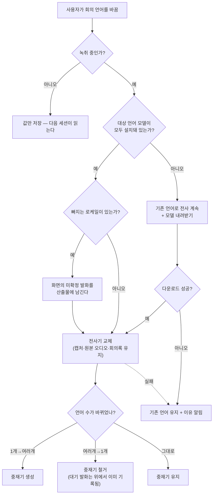

# ADR 0004: 회의 언어를 녹취 중에도 바꾼다 (캡처와 원본 오디오는 끊지 않는다)

Date: 2026-08-06

## Status

Proposed

## Context

회의 언어 구성은 어느 로케일의 전사기를 돌릴지 정하는 값이다. 이 값은 회의가 시작된
뒤에야 틀렸다는 것이 드러난다 — 한국어 회의로 알고 시작했는데 상대가 영어로 말하고,
단일 언어로 둔 사용자는 다른 언어 발화가 통째로 빠지는 것을 화면에서 본다. 그것을
발견하는 시점이 회의 중이다.

이 값을 세션 시작 시점에 고정하면 사용자가 할 수 있는 일은 녹취를 중지하고 다시
시작하는 것뿐이다. 그 경로는 회의를 두 산출물로 쪼개고, 다시 시작하는 동안 모델 확보
관문을 다시 통과하면서 그 사이 발화를 잃는다. 회의는 한 번 일어나고 끝나므로 이 대가가
크다.

전환을 가능하게 하는 사실이 세 겹으로 측정됐다.

**오디오 포맷이 언어 구성과 무관하게 같다.** 한국어 단독, 영어 단독, 두 언어 동시 —
세 구성 모두 최적 포맷이 `16000 Hz, 1채널, Int16, interleaved`로 동일했다. 그래서
언어를 바꾸는 것이 캡처 파이프라인을 건드릴 이유가 되지 않는다. 변환기·프레임 기준
시간축·장치 연결이 모두 그대로 유효하다.

**분석기는 살아 있는 채로 전사기를 갈아 끼울 수 있다.** 오디오가 흐르는 중에 전사기를
교체하는 데 성공했고, 한국어 발화를 흘린 뒤 영어 전사기를 추가하자 그 직후 영어 발화가
온전히 인식됐다(`ko [0.00~8.69] 안녕하세요...` 와 `en [4.93~8.69] The release is
scheduled...`가 함께 나왔다). 교체 자체는 80밀리초 안에 끝났다.

**원본 오디오 저장은 전사기와 같은 경로에 있지 않다.** 캡처 버퍼는 리샘플링과 분석기
전달보다 먼저 파일에 기록되므로, 전사기를 어떻게 교체해도 원본 오디오는 한 프레임도
잃지 않는다.

전환을 제약하는 사실도 하나 측정됐다. **모델이 설치되지 않은 로케일을 살아 있는
분석기에 넣으면 그 분석기가 죽는다.** 미설치 로케일을 추가하는 교체는 실패를 던지는데,
던진 뒤에도 모듈 목록에는 그것이 들어가 있었고, 원래 구성으로 되돌리는 교체는 성공을
반환하면서 실제로는 되돌리지 못했다. 결과는 그 세션의 전사 자체가 끝난 것이다 — 아무
문제 없던 기존 언어의 결과 스트림까지 같은 에러로 닫혔고, 그 시점에 진행 중이던 발화가
사라졌다. 미설치 로케일이 섞이면 오디오 포맷 질의도 답하지 않는다.

## Decision Drivers

- 언어 구성이 틀렸다는 것은 **회의 중에** 드러난다 — 그때 고칠 수 없으면 사용자가 할 수
  있는 일은 회의를 쪼개는 것뿐이고, 회의는 한 번 일어난다.
- 오디오 포맷이 언어 구성과 무관하게 같다 — 언어 전환이 캡처를 재구성할 이유가 없다.
- 원본 오디오 기록이 전사보다 앞에 있다 — 전사기를 교체해도 오디오 파일은 영향받지
  않는다.
- **미설치 로케일을 살아 있는 분석기에 넣으면 그 분석기가 회복 불가능하게 죽는다** —
  실패를 던지고도 모듈 목록이 오염되고, 되돌리는 교체가 성공을 반환하면서 실패한다.
- 모델 다운로드는 네트워크 상태에 따라 수 분이 걸릴 수 있다 — 그동안 전사를 멈추면
  회의의 그 구간을 잃는다.

## Decision

**회의 언어는 녹취 중에도 언제든 바꿀 수 있다.** 전환은 세션을 끊지 않는다 — 캡처
경로, 원본 오디오 파일, 회의록 파일, 발화 시간축이 모두 이어진다. 바뀌는 것은 어느
로케일의 전사기가 결과를 내는지뿐이다. 캡처 장치 전환과 같은 성질의 조작으로 다룬다.

### 요구사항 계약

**소리는 어떤 경우에도 끊기지 않는다.** 전환이 실패하든 성공하든, 다운로드를 기다리는
중이든, 원본 오디오 기록은 계속된다. 전사만 잠시 흔들릴 수 있고 녹음은 그렇지 않다 —
이것이 이 결정이 성립하는 근거이므로, 원본 기록이 전사 교체의 성패에 영향받는 구조로
바뀌면 이 결정은 무효다.

**모델이 설치되지 않은 언어는 살아 있는 분석기에 넣지 않는다.** 넣으려는 시도 자체가
금지된다 — 실패를 확인한 뒤 되돌리는 방식은 측정에서 되돌아가지 못했다. 전환 대상
언어의 모델이 모두 설치돼 있는지를 **분석기를 건드리기 전에** 확인하고, 미설치면 아래
순서를 따른다.

1. **기존 언어로 전사를 계속하면서** 모델을 내려받는다. 다운로드 중에도 전사가 멈추지
   않는다.
2. 다운로드가 끝나면 전환한다.
3. 다운로드가 실패하면 **기존 언어를 그대로 유지**하고 이유를 알린다. 실패가 세션을
   끝내지 않는다.

**전환에 실패하면 이전 언어 구성이 유효한 상태로 남는다.** 사용자가 고른 값이 반영되지
않은 채로 남는 것보다, 어느 언어로 인식되고 있는지가 화면 표시와 어긋나는 것이 더 나쁘다
— 결과를 해석할 수 없게 된다. 그래서 실패했을 때 화면이 표시하는 언어는 실제로 동작하고
있는 언어여야 한다.

**로케일이 빠지는 전환은 떼어내기 전에 화면의 미확정 발화를 산출물에 남긴다.** 전사기는
무음을 만나도 확정을 미루므로(실측: 발화 사이에 1.5초 무음을 넣어도 한국어 전사기가
13.14초까지 하나의 세그먼트로 뭉갠 뒤에야 확정했다) 그 상태에서 떼어내면 그 덩어리가 통째로
사라진다 — 진행 중인 한 문장이 아니라 그때까지의 발화 전부다.

**확정을 유도해서 건지는 방식은 쓸 수 없다.** 입력이 열려 있는 동안 마감을 요청하면 반환되지
않아 녹취 전체가 멈춘다(실측: 90초 동안 반환되지 않았고, 이미 공급된 지점까지로 한정해도
10.4초 동안 반환되지 않았다). 대신 그 시점의 잠정 결과에 발화가 이미 담겨 있으므로(실측:
제거 직전 잠정 텍스트에 그때까지의 한국어 발화가 온전히 들어 있었다) **화면에 보이던 것을
그대로 확정해 남긴다.** 종료·세션 경계가 미확정 발화를 다루는 것과 같은 판단이다 — 불완전한
발화가 누락보다 낫다.

그 결과 남는 것은 완전하지 않다. 제거되는 언어가 자기 언어가 아닌 구간까지 뭉갠 텍스트가
함께 들어오고, 그 구간은 남는 언어의 결과와 중복된다. 중복은 감수한다 — 사용자가 방금 그
언어를 끄라고 지시했으므로 그 언어의 마지막 기록이 거친 것은 지시 내용과 어긋나지 않고,
누락과 달리 되돌릴 수 있다. **남는 언어의 발화는 영향받지 않는다.**

**전환은 세션 경계를 만들지 않는다.** 한 회의 안에서 언어가 바뀐 것은 회의가 바뀐 것이
아니므로 산출물을 쪼개지 않는다. 그 결과 한 회의록에 전환 전후의 서로 다른 로케일 결과가
함께 남는데, 그것은 손실이 아니라 사실 기록이다.

**전환에 따라 다국어 중재기가 생기거나 사라진다.** 언어가 하나에서 둘로 늘면 중재가
필요해지고, 둘에서 하나로 줄면 필요 없어진다. **중재기가 필요 없어지는 전환은 반드시
로케일이 빠지는 전환이므로**, 위 배출이 중재기가 들고 있던 발화까지 함께 기록한다 — 그
관계가 깨지면 대기 중이던 발화를 기록하지 않고 철거하는 조합이 생긴다.

**언어 구성은 전사 화면에서 바꿀 수 있다.** 이 값이 틀렸다는 것을 발견하는 화면이 전사
화면이므로, 고치는 조작도 그 화면에 있어야 한다. 설정 창에서도 바꿀 수 있고 두 경로가 같은
값을 다룬다.

### 대안 검토

#### 언어 구성을 세션 시작 시점에 고정한다

전사기가 세션 내내 불변이므로 중재기 생애주기·모델 다운로드·교체 실패를 세션 중에 다룰
필요가 없다. 예상과 다른 언어로 회의가 진행되면 사용자가 녹취를 중지하고 다시 시작한다.

채택하지 않은 이유는 **문제가 드러나는 시점에 고칠 수 없다**는 것이다. 언어 구성이 틀렸다는
신호는 화면에 빠진 발화로 나타나고 그것은 회의 중이다. 중지 후 재시작은 한 회의를 두 산출물로
쪼개고, 재시작이 모델 확보 관문을 다시 통과하는 동안의 발화를 잃는다 — 캡처 장치를 잘못
골랐을 때 세션을 끊지 않고 그 소스만 다시 연결하기로 한 것과 같은 상황인데, 언어만 다르게
다룰 근거가 측정에서 나오지 않았다. 오디오 포맷이 세 구성 모두 동일하므로 고정이 지켜주는
것도 없다.

#### 전환할 때 세션 경계를 끊어 새 산출물로 넘어간다

언어가 다른 구간이 서로 다른 회의록으로 나뉘어, 한 파일 안에 여러 로케일 결과가 섞이지
않는다. 세션 경계 처리는 이미 있으므로 전사기 교체 로직을 세션 시작 경로에 합칠 수 있다.

채택하지 않은 이유는 사용자가 요청한 것이 아니기 때문이다. 언어를 고치는 것은 잘못된 설정을
바로잡는 조작이고, 회의가 바뀌었다는 뜻이 아니다. 한 회의가 언어를 고쳤다는 이유로 두
폴더로 쪼개지면 나중에 그 회의를 찾는 사람이 두 곳을 봐야 하고, 재시작 경로와 마찬가지로
경계에서 모델 확보 관문을 다시 통과한다. 한 회의록에 두 로케일 결과가 남는 것은 실제로
일어난 일의 기록이므로 문제가 아니다.

#### 전환을 시도하고 실패하면 이전 구성으로 되돌린다

구현이 단순하다. 설치 여부를 미리 확인하지 않고, 교체가 던지면 원래 구성으로 다시 교체하면
된다. 모델 설치 상태를 앱이 따로 추적할 필요가 없다.

채택하지 않은 이유는 **측정에서 되돌아가지 못했다**는 것이다. 미설치 로케일 추가가 실패를
던진 뒤에도 모듈 목록은 오염된 상태로 남았고, 원래 구성으로 되돌리는 교체는 성공을 반환하면서
실제로는 복구하지 못했다. 그 결과 아무 문제 없던 기존 언어의 결과 스트림까지 죽어 그 세션의
전사가 끝났다. 성공 반환을 증거로 믿을 수 없는 경로이므로, 사후 복구가 아니라 사전 확인만이
안전하다.

#### 모델 다운로드가 필요하면 전환을 거부한다

다운로드 중 상태를 다룰 필요가 없고, 전환은 항상 즉시 끝나거나 즉시 거부된다. 사용자는
녹취를 끝낸 뒤 그 언어로 다시 시작하면 된다.

채택하지 않은 이유는 거부가 곧 기능 부재라는 것이다. 전환이 가장 필요한 상황이 예상하지
못한 언어를 만난 경우인데, 예상하지 못한 언어일수록 모델이 없을 가능성이 높다. 다운로드를
기다리는 동안 기존 언어로 전사가 계속되므로 기다림의 대가는 없다 — 거부는 그 대가 없는
기다림을 잃고 아무것도 얻지 못한다.

## Consequences

### Positive

- 언어 구성이 틀렸다는 것을 발견한 시점에 고칠 수 있다 — 회의를 쪼개거나 재시작하지
  않는다.
- 원본 오디오가 전환의 성패와 무관하게 이어진다 — 전사가 흔들려도 재전사할 원본이 남는다.
- 넓히는 방향은 손실이 없다 — 교체 직후 오디오부터 새 언어가 인식된다.
- 좁히는 방향에서도 발화가 사라지지 않는다 — 떼어내기 전에 화면에 있던 것을 남기므로,
  확정을 기다리다 통째로 잃는 일이 없다.
- 미설치 언어를 골라도 전사가 멈추지 않는다 — 기존 언어로 계속하면서 내려받는다.
- 회의 한 건이 한 폴더에 남는다 — 언어를 고쳤다는 이유로 산출물이 쪼개지지 않는다.

### Negative

- 언어를 좁히면 제거되는 언어의 마지막 기록이 거칠다. 확정 전 상태를 그대로 남기므로 그
  언어가 자기 언어 아닌 구간까지 뭉갠 텍스트가 함께 들어오고, 그 구간은 남는 언어의 결과와
  중복된다.
- 한 회의록에 전환 전후의 서로 다른 로케일 결과가 섞인다. 파일을 읽는 도구는 발화별
  언어 표시로 구분해야 한다.
- 세션 중에 다뤄야 하는 상태가 늘어난다 — 모델 다운로드 진행, 중재기 생성·철거, 전환
  실패 후의 유효 구성. 각각이 녹취를 멈추지 않으면서 처리돼야 한다.
- 사용자가 회의 도중 언어를 여러 번 바꿀 수 있고, 그때마다 진행 중 후보가 버려질 수 있다.

### Risks

- 전환 실패 후 화면이 표시하는 언어와 실제로 동작하는 언어가 어긋나면 사용자가 결과를
  잘못 해석한다. 어긋남 자체가 조용하므로, 화면이 사용자가 고른 값이 아니라 실제 유효한
  구성을 표시해야 한다.
- 다운로드를 기다리는 동안 사용자는 전환이 반영됐다고 오해할 수 있다 — 그 구간의 발화는
  이전 언어로 인식된다.
- 모델을 내려받는 중에 녹취가 끝나면 전환은 완료되지 않는다. 다음 세션이 그 값을 읽으므로
  사용자가 고른 언어는 유지되지만, 이번 회의에는 반영되지 않는다.

## Related

- [언어 모델 확보를 녹취 시작의 게이트로 둔다](./0003-model-provisioning-gate.md)
- [다국어 결과를 토큰 단위 신뢰도로 중재한다](./0002-token-level-language-arbitration.md)
- [캡처 장치는 시스템 기본을 따라가고 사용자가 고르면 고정한다](../capture/0005-capture-device-change-follow.md)
- [설정을 전사 화면에서 분리해 별도 창에 둔다](../session/0003-settings-surface-separation.md)
