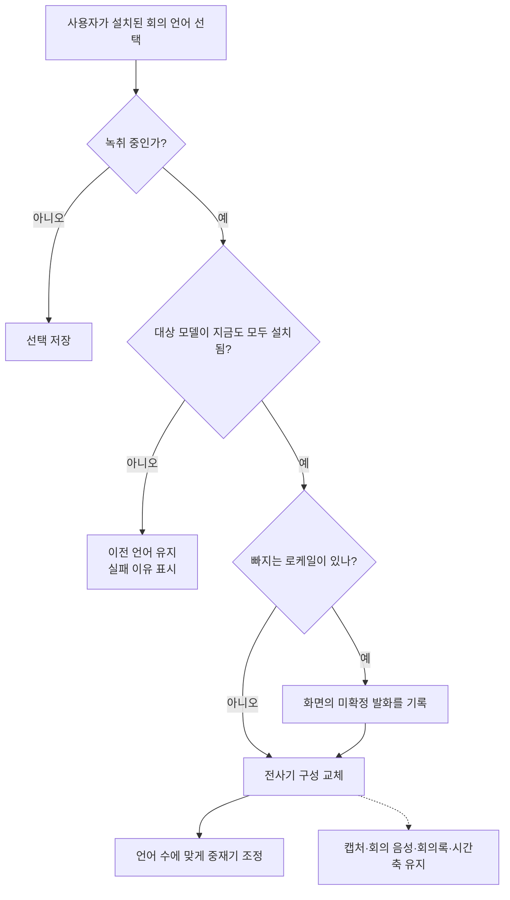

# ADR 0004: 설치된 회의 언어를 녹취 중에도 바꾼다

Date: 2026-08-06

## Status

Accepted (2026-08-21)

## Context

회의 언어 구성이 틀렸다는 사실은 회의 중 화면에 빠진 발화가 나타날 때 드러난다. 그때
고칠 수 없으면 사용자는 녹취를 중지하고 다시 시작해야 하고, 한 회의가 여러 산출물로
갈리며 전환 구간의 발화를 잃는다.

한국어 단독, 영어 단독, 두 언어 동시 구성은 모두 같은 최적 오디오 포맷을 사용한다
(`16000 Hz`, 1채널, Int16, interleaved). 따라서 언어 변경은 캡처·회의 음성 파일·시간축을
다시 열 이유가 없다.

반면 미설치 로케일을 살아 있는 분석기에 추가하면 실패 뒤에도 모듈 목록이 오염되고 기존
언어 결과 스트림까지 닫히는 회복 불가능한 실패가 관측됐다. 설치 여부를 확인한 뒤 시도하는
것만 안전하다.

## Decision Drivers

- 언어 구성이 틀렸다는 신호는 회의 중에 나타나므로 그 자리에서 바꿀 수 있어야 한다.
- 세 언어 구성의 오디오 포맷이 같아 캡처를 재시작할 기술적 이유가 없다.
- 미설치 로케일을 분석기에 넣은 실패는 이전 구성으로 되돌릴 수 없다.
- 모델 설치는 설정에서 명시적으로 관리하며 녹취 화면은 실제 사용 가능한 구성만 보여야 한다.
- 로케일을 제거할 때 미확정 발화를 먼저 남기지 않으면 화면에 보이던 발화가 사라진다.

## Decision

회의 언어는 녹취 중에도 바꿀 수 있지만 **설치된 모델로 만들 수 있는 구성만** 선택할 수
있다. 전환은 캡처, 회의 음성 파일, 회의록, 발화 시간축을 유지하고 전사기 구성만 바꾼다.

### Requirement contract

- 한국어 모델이 설치됐으면 한국어, 영어 모델이 설치됐으면 영어를 표시한다. 두 모델이 모두
  설치됐을 때만 한국어와 영어 동시 구성을 표시한다. 설정과 전사 화면은 같은 목록을 사용한다.
- English는 필수 기본 모델이며 English가 설치되지 않으면 선택기를 사용할 수 없고 녹취를
  시작하지 않는다. 한국어 모델이 설치되면 한국어와 한국어+English 구성이 추가된다.
- 녹취 중 전환은 분석기를 건드리기 전에 대상 모델이 모두 설치됐는지 다시 확인한다. 화면을
  그린 뒤 모델이 회수된 경우에는 이전 언어를 유지하고 실패 이유를 표시한다.
- 녹취 시작과 회의 중 전환은 모델을 자동으로 설치하지 않는다. 미설치 언어는 설정에서
  설치해야 선택기에 나타난다.
- 전환 성공과 실패 모두 캡처와 회의 음성 저장을 중단하거나 새 세션을 만들지 않는다.
- 로케일이 빠지는 전환은 전사기를 떼기 전에 화면에 보이는 미확정 발화를 회의록에 남긴다.
  입력이 열린 분석기의 확정을 기다려 녹취를 멈추지 않는다.
- 전환에 실패하면 이전 언어 구성과 화면 표시를 그대로 유지한다. 선택한 값만 먼저 표시해
  실제 동작 언어와 어긋나게 하지 않는다.
- 한 언어에서 두 언어로 넓어지면 중재기를 만들고, 두 언어에서 하나로 좁아지면 미확정 발화를
  남긴 뒤 중재기를 제거한다.

### 대안 검토

#### 언어 구성을 세션 시작 시점에 고정한다

전사기 상태가 단순하지만 잘못된 언어를 발견한 사용자가 회의를 중지하고 다시 시작해야 한다.
오디오 포맷이 모든 구성에서 같으므로 이 손실을 정당화할 기술적 이점이 없다.

#### 미설치 언어를 고르면 기존 언어로 전사하며 자동 설치한다

예상하지 못한 언어를 회의 중 바로 준비할 수 있다. 그러나 선택값과 실제 언어가 다운로드
기간 동안 어긋나고, 설치 작업이 정체되면 회의 화면이 `0%` 또는 `50%`에서 끝나지 않는다.

#### 미설치 여부를 확인하지 않고 전환을 시도한 뒤 실패하면 되돌린다

사전 상태 관리가 필요 없지만 측정에서 되돌리기가 실패했다. 미설치 로케일 추가가 던진 뒤
기존 언어의 결과 스트림까지 닫혔으므로 사후 복구가 아니라 사전 확인만 허용한다.

## Consequences

### Positive

- 회의 중 언어를 바로잡아도 소리와 회의록이 끊기지 않는다.
- 선택기에 보이는 값이 실제로 분석기에 넣을 수 있는 구성과 일치한다.
- 미설치 모델 다운로드가 녹취 화면을 잠그지 않는다.
- 언어를 좁힐 때 화면에 보이던 미확정 발화가 사라지지 않는다.

### Negative

- 회의 중 필요한 언어가 보이지 않으면 설정을 열어 설치를 완료한 뒤 선택해야 한다.
- 운영체제가 모델을 회수하면 선택 가능한 조합이 줄어들 수 있다.
- 언어를 좁힐 때 남기는 미확정 발화는 확정 결과보다 거칠고 남은 언어 결과와 중복될 수 있다.

### Risks

- 설치 목록 갱신이 화면보다 늦으면 잠시 오래된 선택지가 보일 수 있다. 전환 직전 재검증이
  이 상태에서 분석기가 손상되는 것을 막아야 한다.
- 설치 상태 변경 뒤 현재 선택을 축소하지 않으면 Picker 값이 표시 목록에 없는 상태가 된다.
- 전환 실패 뒤 화면이 사용자가 누른 값을 표시하면 실제 언어와 어긋난다.

## Related

- [언어 모델 설치를 설정에서 언어별로 관리한다](./0003-model-provisioning-gate.md)
- [다국어 결과를 토큰 단위 신뢰도로 중재한다](./0002-token-level-language-arbitration.md)
- [캡처 장치는 시스템 기본을 따라가고 사용자가 고르면 고정한다](../capture/0005-capture-device-change-follow.md)
- [설정을 전사 화면에서 분리해 별도 창에 둔다](../session/0003-settings-surface-separation.md)
