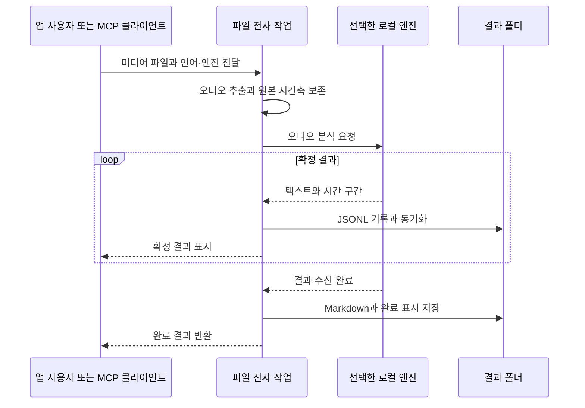

# ADR 0005: 음성·영상 파일을 로컬 전사 작업으로 처리한다

Date: 2026-09-28

## Status

Accepted (2026-09-28)

## Purpose

사용자는 이미 저장된 음성 파일이나 영상의 소리를 다시 재생·녹음하지 않고 트랜스크립트로
얻으려 한다. 앱에서 파일을 선택하는 흐름과 MCP 에이전트가 파일 경로를 전달하는 흐름이
같은 결과·실패 기준을 가져야 한다. 파일 전사는 원본 미디어와 진행 중인 회의 녹취를
보존하면서, 완료된 결과와 중단된 부분 결과를 사용자가 구별할 수 있게 한다.

## Decision Drivers

- 사용자가 요청한 입력은 MP3 등의 음성 파일과 영상 파일이며, 화면 캡처나 재생 장치에 의존하면 파일을 직접 전사한다는 목적을 충족하지 못한다.
- 원본 미디어와 기존 전사 결과는 재시도 때도 보존해야 하며, 독립된 파일 작업이 현재 회의의 기록을 중단해서는 안 된다.
- 영상의 오디오 시작 시각이 영상 시작과 다를 수 있어, 추출 과정이 시간 정보를 없애면 결과를 원본과 대조하기 어렵다.
- 에이전트는 성공 응답을 바탕으로 후속 작업을 하므로, 부분 결과나 저장 실패를 완료로 표시할 수 없다.

## Decision

**미디어 파일 전사를 실시간 녹취와 독립된 로컬 작업으로 제공한다.** 사용자는 앱에서 파일을
선택하거나 CLI·MCP로 로컬 경로를 전달한다. 이 경로는 캡처 장치를 열거나 미디어를 재생하지
않고, 선택한 로컬 음성 인식 엔진에 오디오를 전달한다.

영상의 영상 프레임은 전사 대상이 아니다. 오디오 트랙만 추출하며 원본의 시간축을 유지한다.
기본 대상은 첫 번째 오디오 트랙이고, 다른 언어의 별도 오디오 트랙들을 임의로 섞지 않는다.
트랙 내부 채널은 어느 채널의 음성도 빠지지 않도록 하나의 전사 입력으로 합친다. 전사에 쓰는
임시 오디오는 작업 중간 자료이며, MP3 파일을 별도 산출물로 내보내는 기능은 이 결정에 포함하지 않는다.

### Requirement contract

#### 입력과 시간 계약

- MP3·M4A·WAV·AIFF·CAF 음성 파일과 운영체제가 오디오를 해독할 수 있는 영상 파일을 받는다. 영상 지원의 기본 검증 대상은 MP4·MOV다. **관찰 가능한 결과:** 파일을 재생하지 않고 앱과 MCP에서 동일한 입력의 음성이 전사된다.
- 입력은 읽을 수 있는 로컬 파일이며 URL·디렉터리는 받지 않는다. MCP의 파일·출력 경로는 절대 경로 또는 홈 경로 표기다. **관찰 가능한 결과:** 원격 주소나 폴더를 넘기면 작업이 거절된다.
- 오디오가 없는 영상과 해독할 수 없는 입력은 오류다. 소리가 없지만 유효한 오디오 트랙은 빈 전사로 완료할 수 있다. **관찰 가능한 결과:** 영상 전용 파일은 오류가 되고 무음 오디오 파일은 빈 결과로 성공한다.
- 시간 단위는 원본 파일 시작을 기준으로 한 초다. 영상의 오디오 시작 지연과 중간 공백을 보존한다. **관찰 가능한 결과:** 결과 시각에 원본 영상을 재생하면 같은 소리 구간을 찾을 수 있다.

#### 결과와 보존 계약

- 원본 미디어와 기존 결과를 수정하지 않으며, 반복·동시 요청은 별도 결과 폴더를 쓴다. **관찰 가능한 결과:** 같은 입력을 재전사해도 원본과 이전 결과가 그대로 남는다.
- 가져온 파일의 화자는 `unknown`으로 표시하고 개인별 화자를 추정하지 않는다. **관찰 가능한 결과:** 마이크 사용자나 원격 참석자로 잘못 확정된 라벨이 나타나지 않는다.
- 확정 결과는 JSONL에 기록·동기화한 뒤 화면이나 후속 처리에 전달한다. **관찰 가능한 결과:** 화면에 표시된 확정 발화는 작업 종료 전에도 저장된 기록에서 읽힌다.
- 전체 결과 수신 후 Markdown과 완료 메타데이터를 저장한 다음 성공을 반환한다. `result.json`이 완료 표시다. **관찰 가능한 결과:** 성공한 작업에는 `transcript.jsonl`, `transcript.md`, `result.json`이 모두 있고 마지막 확정 발화가 포함된다.

#### 호출과 실패 계약

- MCP는 `transcribe_audio`로 파일 전사를 제공한다. 텍스트, 시간 구간, 선택 엔진·모델, 시간 정보의 정밀도와 저장 경로를 반환한다. **관찰 가능한 결과:** 에이전트가 파일 경로와 엔진을 지정하고 구조화된 결과를 받는다.
- 언어는 `english`·`korean` 중 하나이며 기본은 `english`다. CLI·MCP의 기본 결과 루트는 `~/Documents/Scribird`이고 명시적으로 다른 루트를 지정할 수 있다. 앱은 설정된 저장 위치를 사용한다. **관찰 가능한 결과:** 같은 입력을 선택한 언어로 처리하며 실제 저장 경로가 응답에 표시된다.
- MCP 처리 제한 시간은 기본 600초, 허용 입력은 1~3600초다. 시간 초과·취소·저장 실패는 성공이 아니다. **관찰 가능한 결과:** 제한을 넘긴 호출이 오류로 끝나고 완료 표시가 생성되지 않는다.
- 실패·취소 시 이미 확정해 저장한 JSONL을 보존하고, 소유한 작업을 종료해 임시 오디오를 정리한다. 강제 종료·운영체제 중단에서는 임시 자료가 남을 수 있다. **관찰 가능한 결과:** 부분 결과를 복구할 수 있고 일반 취소 후 해당 작업의 임시 오디오와 자식 실행기가 남지 않는다.

미디어와 전사 텍스트는 앱이나 ASR 실행기가 외부 서비스로 업로드하지 않는다. MCP 결과는
요청한 클라이언트에 반환되므로, 그 클라이언트가 모델 제공자에게 결과를 전달하는 동작과
앱의 로컬 전사는 서로 다른 데이터 전달 경계다.

### Alternatives

#### 미디어를 재생하고 기존 실시간 녹취로 기록한다

기존 캡처 경로를 그대로 사용할 수 있지만 재생 장치·권한·음소거 상태의 영향을 받는다.
파일 길이만큼 기다려야 하고 현재 회의 녹취와 충돌할 수 있어 채택하지 않는다.

#### 사용자가 별도 도구로 오디오를 추출한 후 가져온다

영상 형식마다 적합한 변환기를 사용자가 고를 수 있다. 그러나 영상 입력부터 전사까지 앱과
MCP에서 수행하려는 요청을 충족하지 못하고, 변환 중 시간축을 잃는 문제를 사용자에게 넘긴다.

#### 파일 전체 결과를 메모리에 모았다가 한 번에 저장한다

출력 구성이 단순하지만 취소나 실행기 실패 전에 화면에 나타난 결과까지 함께 잃을 수 있다.
부분 결과를 보존해야 하므로 확정 결과의 즉시 기록을 선택한다.

## Consequences

- 사용자는 음성·영상 파일을 같은 방식으로 전사하고 원본 미디어의 시각과 결과를 대조할 수 있다.
- 입력 파일에는 실제 화자 신원을 확정할 근거가 없어 화자 분리는 제공하지 않는다.
- 임시 오디오를 준비하는 동안 추가 디스크 공간이 필요하고, 강제 종료에서는 정리가 끝나지 않을 수 있다.
- 운영체제의 미디어 해독 범위를 벗어난 형식과 첫 번째가 아닌 오디오 트랙 선택은 별도 확장이 필요하다.

## Related

- [파일 전사의 로컬 ASR 엔진 선택](./0006-selectable-local-file-asr.md)
- [실시간 녹취의 소스 기반 화자 구분](./0001-source-based-speaker-attribution.md)
- [실시간 회의록의 즉시 기록과 종료 처리](../archive/0001-transcript-durability.md)
