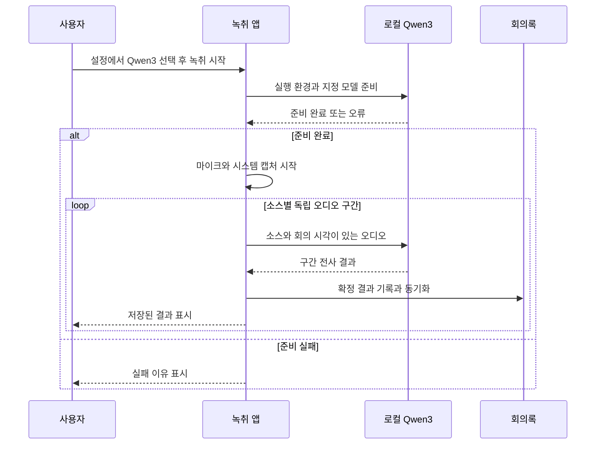

# ADR 0006: 실시간 녹취와 파일 전사에 로컬 음성 인식 엔진 선택을 제공한다

Date: 2026-09-28

## Status

Accepted (2026-09-29)

## Purpose

사용자는 설정에서 macOS SpeechAnalyzer와 `Alkd/Qwen3-ASR-1.7B-MLX-8bit` 중 하나를
골라 실시간 회의를 녹취하려 한다. 파일 전사에서도 같은 두 엔진을 선택할 수 있어야 한다.
어느 엔진을 쓰든 회의 중 전사 결과를 보고, 마이크와 시스템 소리의 화자를 구분하고,
회의록과 원본 음성을 보존하는 사용 흐름을 유지한다. 추가 준비와 결과의 시간 정밀도는
선택 전에 설명해야 한다.

## Decision Drivers

- 사용자가 Qwen3의 구체적인 모델을 지정했으므로 다른 크기·양자화·호스팅 모델로 임의 교체할 수 없다.
- Qwen3는 Apple Silicon에서 동작하는 별도 로컬 모델이며, Apple Speech 모델과 실행 환경 준비 방식이 다르다.
- 두 엔진의 시간 정보는 같은 정밀도를 보장하지 않으므로 결과를 동일한 발화 경계로 해석하게 해서는 안 된다.
- 엔진 설치나 실행 실패를 다른 엔진의 성공으로 감추면 사용자가 선택한 인식 방식을 검증할 수 없다.
- 실시간 녹취는 끝난 뒤 파일을 재전사하는 것만으로 대체할 수 없다. 회의 중 결과가 표시되어야 하고 두 오디오 소스의 구분과 저장 연속성이 유지되어야 한다.

## Decision

**설정에서 실시간 녹취 엔진을 SpeechAnalyzer 또는 Qwen3로 선택하고, 파일 전사에서도
두 엔진을 제공한다. 기본값은 SpeechAnalyzer다.** 실시간 선택은 앱을 다시 켜도 유지하며
다음 녹취 시작에 적용한다. 엔진 준비·녹취·종료 처리 중에는 엔진 변경을 거절하고 이유를
표시한다. 한 회의 안에서 엔진을 교체하는 동작은 제공하지 않는다.

파일 전사의 앱·CLI·MCP 선택값은 `speech-analyzer`와 `qwen3`이며 파일 작업별로 선택한다.
실시간 설정과 파일 작업의 선택은 서로 바꾸지 않는다. Qwen3는 지정된 Hugging Face 모델을
Apple Silicon Mac에서 실행한다. 모델 제공자에게 음성을 보내는 호스팅 ASR로 대체하지 않는다.

### Requirement contract

#### 엔진과 환경 계약

- SpeechAnalyzer는 선택한 언어의 설치된 Apple Speech 모델을 사용한다. 미설치 상태에서는 모델 설치 방법을 알리고 전사를 실패로 반환한다. **관찰 가능한 결과:** 준비되지 않은 언어가 임의의 다른 언어로 전사되지 않는다.
- Qwen3는 `Alkd/Qwen3-ASR-1.7B-MLX-8bit`를 로컬에서 실행하며 Apple Silicon이 필요하다. **관찰 가능한 결과:** 결과에 선택 엔진과 이 모델 식별자가 표시된다. 지원하지 않는 기기에서는 명확한 오류가 발생한다.
- Qwen3의 외부 실행 환경·모델 준비가 필요함을 사용자가 시작하기 전에 알린다. 최초 준비에는 네트워크가 필요할 수 있고 준비한 환경과 가중치는 재사용한다. **관찰 가능한 결과:** 앱 설치만으로 모델까지 포함됐다는 오해 없이 시작할 수 있으며 준비 후 오프라인 전사가 된다.
- 파일 입력에서 Qwen3를 사용하기 위해 Apple Speech 모델을 요구하지 않는다. **관찰 가능한 결과:** Apple Speech 모델 준비와 독립적으로 Qwen3 파일 전사를 사용할 수 있다.
- 실시간 Qwen3도 Apple Speech 모델의 설치·예약 상태와 독립적으로 준비하고 시작한다. 앱 시작 시 English Speech 자산을 준비하는 정책은 유지하지만 그 성공을 Qwen3 사용 조건으로 삼지 않는다. **관찰 가능한 결과:** Apple Speech 설치가 실패해도 Qwen3 준비가 완료되면 녹취할 수 있다.

추가 실행 환경의 구체적인 설치 도구와 라이브러리 구성은 교체 가능한 구현 수단이다. 필요한
외부 선행 설치와 자동 준비 범위는 배포 문서·화면에 현재 사실대로 안내해야 한다.
모델은 실행 간 동일한 버전을 재현할 수 있도록 고정해 사용한다.

#### 실시간 선택과 언어 계약

- 설정은 두 엔진의 선택과 현재 선택값을 제공하며, 저장값이 없거나 유효하지 않으면 SpeechAnalyzer를 사용한다. 준비·녹취·종료 처리 중 변경 요청은 실제 엔진과 저장된 선택을 모두 유지한 채 거절한다. **관찰 가능한 결과:** 다시 실행해도 선택이 유지되고 진행 중 회의의 엔진이 바뀌지 않는다.
- Qwen3 최초 사용 전에 외부 선행 설치, 실행 환경·모델 다운로드, 구간 단위 결과 표시를 안내한다. 녹취 시작 시 Qwen3 준비를 마친 뒤 캡처를 열며, 준비 실패는 이유와 함께 표시한다. **관찰 가능한 결과:** 준비 중 상태와 실제 녹취 중 상태가 구분되고, 준비 실패를 녹취 성공으로 표시하지 않는다.
- 실시간 Qwen3의 회의 언어는 English, 한국어, 한국어+English를 제공하고 기본값은 English다. 혼합 구성은 지정 모델의 다국어 인식을 사용하며, 존재하지 않는 신뢰도를 만들어 Apple의 로케일별 결과 비교에 넣지 않는다. **관찰 가능한 결과:** Apple 한국어 모델 없이도 Qwen3의 한국어와 혼합 구성을 고를 수 있다.
- Qwen3 녹취 중 언어 변경은 이미 받은 오디오와 처리 중 결과를 보존하고 이후 입력부터 새 언어 구성을 적용한다. 캡처·회의 음성·회의록·시간축을 유지하며 실패하면 이전 언어와 표시를 유지한다. **관찰 가능한 결과:** 언어 변경 전후 발언이 같은 회의록에 남고 새 세션이 생기지 않는다.

#### 실시간 입력과 보존 계약

- 마이크와 시스템 출력은 독립된 전사 입력으로 유지하고 화자는 각각 `me`, `remote`로 확정한다. 모델 가중치를 공유하더라도 두 소스의 오디오와 인식 문맥을 섞지 않는다. **관찰 가능한 결과:** 동시에 말해도 마이크 발언과 원격 발언의 라벨이 뒤바뀌지 않는다.
- Qwen3는 녹취 중 받은 오디오를 구간별로 처리하고 결과가 준비되는 대로 표시한다. 종료된 회의 파일을 일괄 처리하는 것으로 실시간 전사를 대신하지 않는다. **관찰 가능한 결과:** 녹취를 중지하기 전에도 확정 결과가 표시되고 저장된다.
- 확정 결과는 저장을 완료한 뒤 화면에 전달한다. 세션 경계는 캡처를 유지한 채 처리 대기 오디오와 결과를 해당 세션에 귀속시키며 새 세션 시간은 초 단위로 다시 시작한다. **관찰 가능한 결과:** 경계 직전 발언이 사라지거나 다음 회의에 중복되지 않고 화면에 보인 확정 결과가 저장된다.
- 원본 음성 저장, 마이크 음소거, 소스별 장치 전환과 실패 격리를 유지한다. 한 소스의 실패로 정상 소스를 중단하지 않는다. **관찰 가능한 결과:** 한 입력을 잃거나 마이크를 음소거해도 다른 입력의 녹취와 저장은 이어진다.

다음 흐름은 Qwen3 녹취에서 준비, 두 입력의 독립 처리, 저장과 표시의 순서를 나타낸다.

#### 결과와 실패 계약

- 결과에 실제 사용한 엔진·모델과 시간 정보의 정밀도를 남긴다. **관찰 가능한 결과:** 요청한 선택과 저장된 결과를 대조할 수 있다.
- SpeechAnalyzer는 `timestampGranularity=utterance`인 발화 구간, Qwen3는 `timestampGranularity=chunk`인 입력 오디오 분할 구간을 반환한다. Qwen3 구간을 정확한 발화·단어 시각으로 표시하지 않는다. **관찰 가능한 결과:** Qwen3 결과에는 `timestampGranularity=chunk`가 표시되고 정밀한 단어 정렬로 오해하지 않게 안내된다.
- Qwen3가 제공하지 않는 신뢰도나 화자 신원을 만들어 넣지 않는다. **관찰 가능한 결과:** 근거 없는 신뢰도 수치·개인별 화자 라벨이 결과에 없다.
- 엔진 준비·추론 실패는 오류로 반환하고 다른 엔진으로 자동 전환하지 않는다. 생성 한도 때문에 중단된 구간을 완전한 결과로 저장하지 않는다. **관찰 가능한 결과:** 실패한 Qwen3 요청이 SpeechAnalyzer 결과나 잘린 완료 결과로 바뀌지 않는다.
- 실시간 결과에도 실제 엔진·모델과 구간 단위 시간 정밀도를 보존한다. 시간은 추론 완료 시각이 아니라 해당 오디오의 회의 내 시각이다. 입력 누락, 추론 실패, 종료 처리 제한으로 미처리 오디오가 남으면 이를 알리고 이미 저장된 결과와 원본 음성을 보존한다. **관찰 가능한 결과:** 처리 지연으로 시간 표시가 밀리지 않고 불완전한 전사를 정상 완료로 오인하지 않는다.

실행 환경과 모델의 다운로드는 필요한 자산을 기기에 가져오는 동작으로 한정한다. 앱이나
ASR 실행기는 음성·전사·사용량 정보를 모델 저장소로 보내지 않는다. MCP 클라이언트로의 결과
반환 범위와 산출물 보존은 파일 전사 계약을 따른다.

### Alternatives

#### SpeechAnalyzer만 제공한다

운영체제의 모델 설치 경로만 관리하면 되지만 사용자가 지정한 Qwen3를 선택할 수 없어
요구를 충족하지 못한다. SpeechAnalyzer는 기본 엔진으로 유지하고 Qwen3를 선택지로 추가한다.

#### Qwen3를 파일 전사에만 제공한다

회의 중 처리 지연과 오디오 입력의 연속성을 다루지 않아도 된다. 그러나 설정에서 Qwen3를
골라 회의 중 전사 결과를 보려는 요구를 충족하지 못하므로 채택하지 않는다.

#### Qwen3를 기본이자 유일한 엔진으로 사용한다

인식 경로가 하나로 줄어들지만 Apple Silicon과 별도 모델 설치를 모든 파일 사용자에게
요구한다. 기존 Apple Speech 경로를 사용할 수 있는 사용자에게도 추가 준비를 강제하므로 채택하지 않는다.

#### 클라우드 ASR 또는 다른 Qwen3 변형으로 대체한다

기기의 모델 설치 부담을 줄이거나 작은 모델로 자원 사용량을 줄일 수 있다. 그러나 지정된
로컬 모델 선택과 데이터 전달 경계를 바꾸므로 사용자의 별도 결정 없이 대체할 수 없다.

## Consequences

- 사용자는 설정에서 실시간 엔진을 고르고, 파일 작업에서는 별도로 엔진을 선택하며 실제 사용한 모델을 결과에서 확인한다.
- Qwen3는 별도 모델 저장 공간과 실행 자원을 사용하며 최초 준비 시간이 필요하다.
- 오프라인 사용은 선택한 엔진의 실행 환경과 모델이 준비되어 있다는 조건에 의존한다.
- Qwen3의 분할 경계와 신뢰도 부재 때문에 두 엔진의 시간 정보·신뢰도를 같은 의미로 비교할 수 없다.
- Qwen3는 구간을 모으고 추론하는 시간이 필요하다. 처리 속도는 기기와 동시 작업의 영향을 받으며 SpeechAnalyzer와 같은 표시 지연이나 단어별 실시간 갱신을 보장하지 않는다.

## Related

- [음성·영상 파일 전사 계약](./0005-local-media-file-transcription.md)
- [실시간 녹취용 Apple Speech 모델 준비](./0003-model-provisioning-gate.md)
- [회의 중 언어 변경과 연속성](./0004-in-session-language-switch.md)
- [지정된 Qwen3 모델](https://huggingface.co/Alkd/Qwen3-ASR-1.7B-MLX-8bit)
