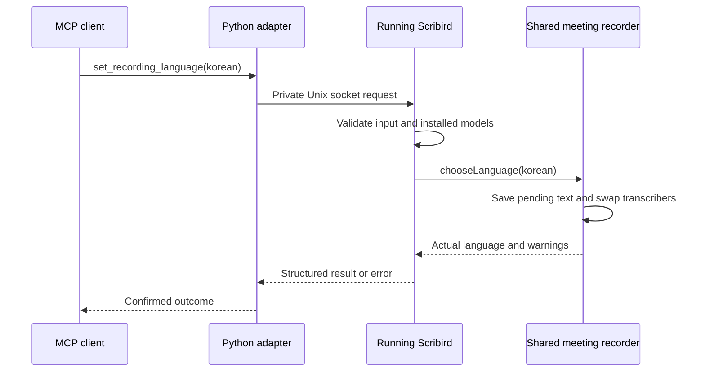

# Scribird MCP control

The local MCP (Model Context Protocol) server exposes live recording, settings,
transcript access and audio-file transcription. It has 23 tools. Live meeting
languages are `english`, `korean` and `auto` (**Korean + English together**).
File imports remain single-language: `english` or `korean`.

## Connection and app lifecycle

### Start the server

Build the app and install the Python dependencies:

```bash
./build.sh release
uv sync --project mcp --frozen
uv run --directory /absolute/path/to/scribird/mcp --frozen python server.py
```

The last command waits for an MCP client on standard input/output. Configure clients
with an absolute path to `uv` if it is absent from their PATH:

```json
{
  "mcpServers": {
    "scribird": {
      "command": "/opt/homebrew/bin/uv",
      "args": ["run", "--directory", "/absolute/path/to/scribird/mcp", "--frozen", "python", "server.py"],
      "env": {
        "SCRIBIRD_EXECUTABLE": "/absolute/path/to/scribird/build/Scribird.app/Contents/MacOS/Scribird"
      }
    }
  }
}
```

For [Codex](https://learn.chatgpt.com/docs/extend/mcp), the equivalent is:

```bash
codex mcp add scribird --env SCRIBIRD_EXECUTABLE=/absolute/path/to/scribird/build/Scribird.app/Contents/MacOS/Scribird -- /opt/homebrew/bin/uv run --directory /absolute/path/to/scribird/mcp --frozen python server.py
```

Set the MCP client's tool timeout to at least 120 seconds for live finalization and
to the file call's `timeout_seconds` for long imports (up to 3600 seconds). Reconnect
the MCP server after configuration changes. An older running app must be closed
and the newly built bundle reopened before live controls are available.

### App access and local transport

| Tool | Behavior |
|---|---|
| `launch_app` | Launch the configured bundle in the background; does not record. |
| `get_app_status` | Read actual recording language/state, sources, meters, warnings, paths, pending command and update status. |
| `show_window` | Show `transcript`, `settings` or `file_transcription`; this explicit action may focus Scribird. |
| `dismiss_error` | Clear the failed recording state without deleting output or retrying. |

Without `SCRIBIRD_EXECUTABLE`, file transcription and app launch prefer the checkout's
`build/Scribird.app`, then `/Applications/Scribird.app`. The live app exposes one
Unix socket in `/tmp/scribird-control-<uid>/`, a directory accessible only to its
owning user (mode 0700). No TCP port, browser session or keyboard/mouse automation
is used. A disconnected MCP client does not stop a recording.

The adapter discovers a single listening instance. If more than one is available,
it sends no command and asks for `SCRIBIRD_CONTROL_SOCKET` with the intended absolute
socket path. Stale sockets are skipped; the adapter does not remove another process's
files or stop another instance. Socket paths identify one app process and change on
restart. `get_app_status` returns that process's PID and executable.

### External requests and scope

Speech recognition and storage run locally. Scribird does not upload meeting audio.
Transcript-reading tools return content to the configured MCP client; that client's
own handling of the text is outside Scribird. `install_speech_model` explicitly asks
macOS to download an English/Korean model. Launch may install mandatory English.
`check_for_updates` requests one GitHub lookup; it never downloads or installs a
release. Qwen file imports may download their runtime/model on first use.

macOS permission grants, app quitting/restarting, release installation and Finder
file operations remain outside the control tools. Summary generation and arbitrary
speaker naming are not built-in Scribird features. The legacy AWS diarization plugin
is separate and is not invoked by these tools.

## Live recording and settings

### Session control and meeting language

| Tool | Inputs and behavior |
|---|---|
| `start_recording` / `stop_recording` | Optional start `language`; stop awaits finalization. Start while already recording returns that session unless a different language was requested. |
| `set_recording_language` | `language`: `english`, `korean` or `auto`. Works before and during recording. Missing models and failed switches are errors. |
| `start_new_session` | Rotate archives while capture continues. While idle, clear displayed text only. Same-second folder collisions receive a unique suffix; old files remain intact. |
| `set_microphone_muted` | Explicit `muted` boolean; excludes microphone audio from transcription and saved audio while system capture continues. Requires an active microphone. |

For a bilingual meeting, call `get_speech_models`, install a missing model if needed,
then start with `{"language":"auto"}`. During recording,
`set_recording_language({"language":"korean"})` narrows recognition while keeping the
same session folder, audio files and capture paths. The app saves pending text before
removing a language's transcriber. `set_interface_language` only changes screen text.



Only one MCP mutation runs at a time; status and transcript reads remain available.
Preparing/stopping states reject incompatible changes. Requests are not automatically
retried. A live-control timeout or client cancellation closes that request's connection
but does not undo the app action: read status and session paths before retrying,
especially after `start_new_session`. Silent/unavailable level measurements use `null`
for decibels; recording state alone is not proof that both sources have audio.

### Output and interface preferences

| Tool | Inputs and restrictions |
|---|---|
| `get_settings` | Read effective settings, selected/effective output roots, lock state and shortcuts. |
| `set_recording_preferences` | Optional `saves_audio`, `opens_folder_on_stop`. Audio retention changes only while idle/failed; folder opening can change during recording. Invalid combinations change neither value. |
| `set_transcript_root` | Absolute `path` (or `~`), `null` restores default. Applies to future recordings, only while idle/failed; existing files never move. |
| `set_interface_language` / `set_keyboard_shortcut` | Interface: `english` or `korean`. Shortcut: `slot`, physical `key_code`, `modifiers`, or `reset=true`. |

Shortcut slots are `transcript_window`, `settings_window` and `microphone_mute`.
Allowed modifiers are `command`, `option`, `control`, `shift`; at least one of the
first three is required. `key_code` is a macOS physical key code from 0 to 127.
Use `reset=true` without `key_code` or `modifiers` to restore that slot's default.
Conflicting Scribird shortcuts are rejected. The transcript shortcut is global;
settings and microphone mute are local to Scribird.

If a chosen save folder later becomes unusable, live recording falls back to the
default root and returns a warning while retaining the user's choice. Session rotation
uses the current recording's resolved root. File imports have a different root/error
contract, described in the file-transcription guide.

### Devices and speech models

| Tool | Inputs and behavior |
|---|---|
| `list_audio_devices` | Direction-filtered device names and stable UIDs, pinned/default selections and fallback status. |
| `select_audio_device` | `source`: `microphone` or `system`; listed `uid`, or `null` to follow the system default. Reconnects only that source. |
| `get_speech_models` / `install_speech_model` | Read availability; request English/Korean installation and poll until `installed` or `failed`. `auto` requires both models and is not an installable model itself. |
| `check_for_updates` | Start one release lookup and poll `get_app_status.updates`. |

Selecting a device does not change macOS defaults. A pinned device that disappears
falls back to the default while preserving the pin. A reconnect can fail for one
source while the other continues; inspect `activeSources` and `warnings` after changing
it. Model installation does not start recording or replace the meeting language.

## Transcript access

| Tool | Read contract |
|---|---|
| `get_live_transcript` | `include_partial` (default true), `offset` and `limit` (1–1000, default 200). Includes `isFinal`, `me`/`remote`, times and current/last session path. |
| `list_sessions` | Optional `output_root`, `kind` (`all`, `live`, `import`), `offset`, `limit` (1–200, default 50). Returns saved paths, not meeting text. |
| `read_session` | Absolute `session_directory`, `offset`, `limit` (1–1000, default 200). Reads persisted JSONL and returns that page's text and segments. |

Live offsets address a snapshot, not stable events. Partial rows can change or be
removed by language arbitration; reread after a session/language change. Saved-session
reads work without the app. A final incomplete JSONL line is omitted and flagged;
malformed complete lines are errors. Neither reader edits, renames or deletes files.
A Markdown file is a finalized snapshot, not a reliable test of current recording state.

`list_sessions` defaults to the running app's effective root. When the app is closed,
it reads the saved root preference, then defaults to `~/Documents/Scribird`.
Pass `output_root` to inspect an old root, a fallback root, or file imports saved at
the CLI/MCP default. The returned `outputRoot` identifies the folder actually scanned.

## Audio and video file transcription

`transcribe_audio` accepts local audio or MP4/MOV video, `language=english|korean`,
`engine=speech-analyzer|qwen3`, an optional output root and a timeout of 1–3600 seconds.
It runs a separate headless worker, creates a new `import-<UUID>` directory, and labels
speakers `unknown`. It does not control or cancel an import started in the app window.
Cancel its MCP request to stop its own worker/process group; partial JSONL remains.
Video uses the first audio track and retains the original timeline. No-audio video
is an error; audio is prepared as temporary WAV without creating an exported MP3.

See [file-transcription.md](file-transcription.md) for the complete CLI, result schema,
Qwen setup, timestamp granularity, saved-file and failure contracts. Live `auto` mode
is not accepted for file imports.
