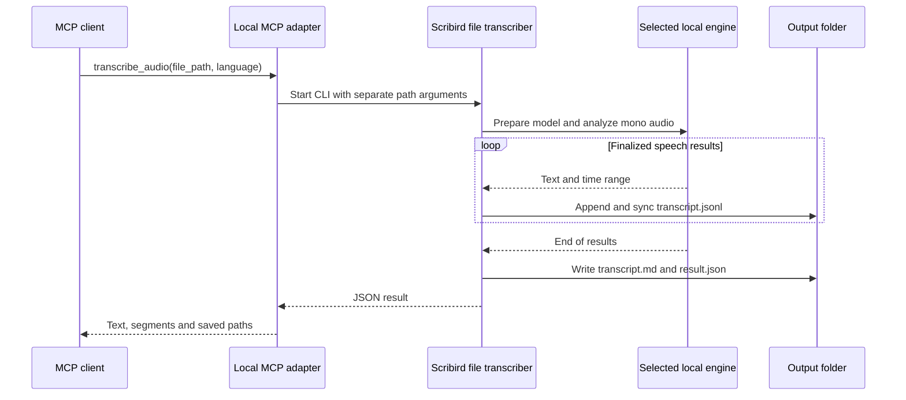

# Audio file transcription

Scribird transcribes local MP3, M4A, WAV, AIFF and CAF files from its app, command
line, or the `transcribe_audio` MCP tool. macOS decodes and recognizes the audio
without playing it or opening microphone/system-audio capture. Unreadable codecs
and corrupt files return errors.

## App and command line

In the transcript window, click **Transcribe File**, choose an audio file and its
language, then click **Transcribe**. The separate window shows finalized text and
links to its working/output folder. Closing the window leaves the job running;
**Cancel** stops it. Live meeting recording keeps its own state and output.

File transcription supports **English or Korean, one language per file**. It does
not use the live meeting's Korean + English arbitration mode. Select either
**SpeechAnalyzer** (the default) or **Qwen3 ASR (MLX 8-bit)**. SpeechAnalyzer requires
the selected language model to be installed in Scribird settings first. Qwen3 uses
`Alkd/Qwen3-ASR-1.7B-MLX-8bit` on Apple Silicon and prepares its runtime/model on
first use; the model download is approximately 2.3 GB. The UI describes this before
starting. Once cached, Qwen3 runs offline without requiring an Apple Speech model.

Build from the repository root, then run the bundle with `--transcribe` to use it
without opening the UI:

```bash
./build.sh release
build/Scribird.app/Contents/MacOS/Scribird \
  --transcribe "/absolute/path/meeting.mp3" \
  --language korean \
  --engine qwen3 \
  --output-root "/absolute/path/transcripts"
```

The default CLI language is `english` and engine is `speech-analyzer`; use
`--engine qwen3` to select Qwen3. CLI and MCP output defaults to
`~/Documents/Scribird`; the app uses its configured save folder, or that default
when none is configured. An explicitly selected but unusable folder is an error
for file imports, which can be retried from the original file. A successful command
prints one JSON result to stdout. Errors go to stderr and exit nonzero.

## MCP connection

The adapter requires Python 3.11+ and `uv`. It uses the official Python MCP SDK over
standard input/output (stdio) and starts the locally built Scribird executable for
each file-transcription call. Live controls instead connect to the running app; see
the [MCP control guide](README.md). Dependency installation and first-use Qwen3 setup use the network.
Recognition runs locally and does not upload audio. The Qwen3 worker and its locked
dependencies are documented in [`runtime/qwen/README.md`](../runtime/qwen/README.md).

```bash
uv sync --project mcp --frozen
uv run --directory /absolute/path/to/scribird/mcp --frozen python server.py
```

The second command waits for an MCP client on stdin. For clients accepting
`mcpServers` JSON, replace the repository paths below with your checkout's absolute path:

```json
{
  "mcpServers": {
    "scribird": {
      "command": "uv",
      "args": [
        "run", "--directory", "/absolute/path/to/scribird/mcp",
        "--frozen", "python", "server.py"
      ],
      "env": {
        "SCRIBIRD_EXECUTABLE": "/absolute/path/to/scribird/build/Scribird.app/Contents/MacOS/Scribird"
      }
    }
  }
}
```

If a desktop client's PATH does not include `uv`, use the absolute path returned by
`command -v uv`. Without `SCRIBIRD_EXECUTABLE`, discovery tries the checkout's built
bundle, then `/Applications/Scribird.app`. Both must be built from a revision with
file transcription support. Reconnect the client after adding the server.

## Tool contract

MCP (Model Context Protocol) lets an agent discover and call `transcribe_audio`.
The tool accepts:

| Input | Contract |
|---|---|
| `file_path` | Required existing absolute file path on the server's Mac; `~` expands to its home directory. URLs and directories are rejected. |
| Recognition: `engine`, `language` | `engine`: `speech-analyzer` (default) or `qwen3`. `language`: `english` (default) or `korean`. SpeechAnalyzer requires the corresponding installed Speech model; Qwen3 uses its own model. |
| `output_root` | Optional absolute output directory; default `~/Documents/Scribird`. |
| `timeout_seconds` | Integer from 1 to 3600, default 600. Set the client's request timeout to at least this duration for long files. |

Example arguments:

```json
{
  "file_path": "/absolute/path/meeting.mp3",
  "language": "korean",
  "engine": "qwen3",
  "output_root": "/absolute/path/transcripts",
  "timeout_seconds": 600
}
```

The result has `sourcePath`, `durationSeconds`, `language`, `text`, `segments`,
`outputDirectory`, `jsonlPath`, `markdownPath`, `engine`, optional `model`, and
`timestampGranularity`. Each segment has `id`, `speaker`,
`start`, `end`, `text`, optional `confidence`, and `locale`. Times are seconds from
the beginning of the file. SpeechAnalyzer reports utterance ranges
(`timestampGranularity=utterance`); Qwen3 reports input chunks up to 20 seconds
(`timestampGranularity=chunk`) and no confidence value. Qwen3 times are not exact
utterance or word boundaries. **`speaker` is always `unknown`**: a recording can contain
several voices and this feature does not identify them. All channels are recognized
as one source. Imported results are not inputs to the legacy diarization plugin's
merge workflow, which expects a live recording's source-based speaker labels.

The tool creates new local files on each call. Its annotations are
`readOnlyHint=false`, `destructiveHint=false`, `idempotentHint=false`, and
`openWorldHint=true` (Qwen3 may download public runtime/model files).

## Saved results and failures

Each call creates `import-<UUID>/` under the selected root. UUID is a randomly
generated identifier, so repeated/concurrent calls use separate folders. The original
audio is unchanged. A temporary mono WAV averages all channels, preventing speech
only in the right channel from being missed; it is removed after ordinary completion,
failure or cancellation. A forced process/OS termination can leave temporary files.



`transcript.jsonl` is written and synchronized after each finalized segment. After
all results arrive, `transcript.md` and `result.json` are written before the success
response. `result.json` contains the CLI result and marks a completed import.
Archive headings and speaker labels stay English regardless of the interface language.

Silence succeeds with empty text and segments; Markdown states that no speech was
recognized. Missing files/models, decoding failures and write failures are errors.
Cancellation or timeout stops processing and retains any already-written JSONL;
a partial folder has no `result.json` and may omit unfinished speech. The app links
to its working folder. CLI failures after output creation include the partial
folder's path; an MCP timeout points to the selected output root.

The adapter signals its own process group on timeout or cancellation, covering both
the headless Scribird process and its Qwen3 worker. The CLI handles termination by
cancelling the file job so temporary audio can be removed.
File transcription does not modify live recording's capture paths, transcript store,
or model reservations. Concurrent work still shares CPU and model resources on the Mac.
