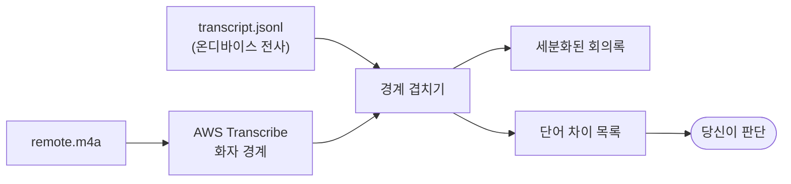

# multi-speaker-diarize

Scribird는 회의 오디오를 **두 갈래로 따로** 받는다. 마이크는 반드시 이 기기를 쓰는
사람(`me`), 시스템 출력은 반드시 원격 참석자(`remote`)다. 추론이 아니라 **경로가**
화자를 정하므로 이 2분리는 틀릴 수 없다.

문제는 `remote`다. Zoom·Teams는 참석자별 스트림을 **믹스다운한 뒤** 시스템 오디오로
넘기므로, 5명이 참석해도 `remote.m4a` 안에서는 한 덩어리다. 이 스킬은 그 덩어리에 AWS
Transcribe의 speaker partitioning을 붙여 화자 경계를 얻고, **이미 있는 온디바이스
전사에 그 경계만 겹쳐** `Remote A/B/C`로 쪼갠다.



## 무엇이 사실이고 무엇이 추정인가

| | 출처 | 성질 |
|---|---|---|
| `me` vs `remote` | 오디오 경로 | **사실** — 추론이 아니다 |
| `Remote A` vs `Remote B` | AWS Transcribe | **추정** — 틀릴 수 있다 |
| 발화 텍스트 | 온디바이스 전사 | 회의 언어에 맞춰 돌아간 결과 |

그래서 텍스트를 AWS 것으로 갈아치우지 않는다. AWS는 화자 경계를 얻으려고 부른 것이지
정답으로 부른 것이 아니다.

## 실행 경로

명령을 실행하기 전에 `SKILL_DIR`을 **이 `SKILL.md`가 들어 있는 디렉터리의 절대
경로**로 설정한다. 스킬 로더가 제공한 source locator에서 구하며, 현재 작업
디렉터리가 스킬 디렉터리라고 가정하지 않는다.

이 스킬에 포함된 스크립트와 테스트는 항상 `"$SKILL_DIR/..."` 절대 경로로 실행한다.
`SKILL_DIR`은 미리 존재하는 환경 변수가 아니다. 각 도구 호출에서 실제 절대 경로를
직접 대입하거나 같은 셸 명령 안에서 설정하며, 이전 호출의 셸 환경이 남아 있다고
가정하지 않는다. 저장소 루트나 사용자의 작업 디렉터리에서 `scripts/...`를 직접
찾으면 안 된다.

## 판단은 스크립트가 하지 않는다

스크립트는 차이를 **측정**하고, 그 차이가 문제인지는 **당신이** 판단한다. 린터가
경고를 나열하고 무엇을 고칠지는 사람이 정하는 것과 같다.

| | 담당 |
|---|---|
| 시간 정렬 · 화자 배정 · 어느 단어가 다른가 | 스크립트 (기계적) |
| **그 차이가 뜻을 바꾸나** | **당신** (의미 판단) |

임계값으로 걸러내는 방식을 **의도적으로 버렸다.** 문자 유사도는 뜻의 보존과 순서가
어긋난다 — 뜻이 바뀌는 `care`/`car`가 0.857인데, 뜻이 보존되는 `ok`/`okay`는 0.667로
**더 낮다**. 어떤 문턱을 잡아도 한쪽이 틀리고, 틀리는 방향이 나쁘다: 문턱을 내리면
회의록의 `배포`가 `대포`로 남은 것을 아무도 모르게 된다. 실측 전체와 유일한 예외
(`spacing_only`)는 [references/thresholds.md](references/thresholds.md).

## 작업 흐름

### 1. 세션을 찾는다

```bash
ls -dt ~/Documents/Scribird/*/ | head -10
```

사용자가 어느 회의인지 말하지 않았으면 목록을 보여주고 고르게 한다. 최근 것을 임의로
고르면 엉뚱한 회의를 분석해 비용만 쓴다.

`transcript.jsonl`(필수)과 `remote.m4a`가 있어야 한다. `remote.m4a`가 없으면 시스템
오디오 캡처가 실패한 세션이라 분리할 대상이 없다 — 사용자에게 알리고 멈춘다.

### 2. 언어를 정한다 (그리고 화자 수를 물어본다)

언어는 정확도에 크게 영향을 준다. 물어보기 전에 온디바이스 전사가 쓴 로케일을 먼저 본다:

```bash
jq -r '.locale' ~/Documents/Scribird/<세션>/transcript.jsonl | sort -u
```

**스트리밍은 언어를 하나만 받는다.** 로케일이 하나면 그대로 쓰고, 여럿이면 지배 언어를
사용자에게 확인한다. 두 언어가 실제로 비슷한 비중이면 배치로 가야 한다.

| 상황 | 스트리밍 | 배치 |
|---|---|---|
| 언어를 안다 | `--language-code ko-KR` | 같음 |
| 한·영이 섞였다 | 지배 언어 하나만 | `--language-options ko-KR en-US` |
| 모른다 | 로케일에서 추정해 지정 | 생략 (AWS 자동 식별) |

**화자 수는 스트리밍에서 지정할 수 없다** — AWS가 알아서 나누고 최대 10명이다. 참석자가
그보다 많으면 배치의 `--max-speakers`(2~30)가 필요하니, 사용자에게 참석자 수를 물어
10을 넘는지만 확인한다.

### 3. AWS Transcribe를 돌린다 — 스트리밍이 기본

**스트리밍을 먼저 쓴다.** S3 버킷을 만들지도, 오디오를 저장하지도 않는다.

```bash
/usr/bin/python3 "$SKILL_DIR/scripts/stream_transcribe.py" \
  --session ~/Documents/Scribird/<세션> \
  --sources remote --language-code ko-KR
```

배치가 필요한 경우는 아래 표의 두 가지뿐이다.

| | 스트리밍 (기본) | 배치 |
|---|---|---|
| 스크립트 | `stream_transcribe.py` | `run_transcribe.py` |
| S3 | **쓰지 않음** | 버킷 생성 → 업로드 → 삭제 |
| 화자 수 상한 | 지정 불가 (최대 10명) | `--max-speakers` 2~30 |
| 다국어 식별 | 불가 (언어 하나) | `--identify-multiple-languages` |

즉 **화자가 10명을 넘거나, 한·영이 섞여 다국어 식별이 필요할 때만** 배치로 간다.
그 외에는 스트리밍이 낫다 — 오디오가 사용자 계정의 스토리지에 놓이지 않고, 정리를
잊어 남는 객체도 없다.

두 스크립트 모두 **먼저 `--yes` 없이** 실행한다. 이 스킬은 회의 오디오를 AWS로
보내는데, Scribird는 아무것도 네트워크로 보내지 않는 온디바이스 앱이라 앱의 기본
성질을 의도적으로 벗어나는 동작이다. 스크립트는 대상과 용량을 출력하고 exit 3으로
멈춘다. **그 출력을 사용자에게 그대로 보여주고 승인을 받은 뒤** `--yes`를 붙인다.

`--sources`는 기본이 `remote`다. `me`를 넣는 경우는 **대면 회의**뿐이다 — 상대방이 내
마이크로 함께 들어왔다면 `me.m4a`에도 여러 화자가 있다. 그렇지 않으면 보내지 않는다:
내 목소리가 기기 밖으로 나가지 않는 편이 낫고, 마이크 입력의 화자는 이미 확정이라 얻을
것도 없다.

결과는 어느 쪽이든 `aws-<source>.json`으로 저장되고 **형식이 같다.** 그래서 4단계
병합은 두 방식에서 동일하다.

종료 코드: `0` 성공 / `1` AWS·파일 문제 / `2` 인자 문제 / `3` 승인 대기(실패 아님).

### 4. 병합한다

```bash
/usr/bin/python3 "$SKILL_DIR/scripts/merge_speakers.py" \
  --session ~/Documents/Scribird/<세션> \
  --aws-remote ~/Documents/Scribird/<세션>/aws-remote.json \
  --max-speakers 5
```

`me`도 분석했으면 `--aws-me`를 함께 넘긴다. 원본 `transcript.jsonl`은 수정하지 않는다.

| 산출물 | 내용 |
|---|---|
| `transcript.speakers.md` | 세분화된 회의록. 본문은 로컬 전사, 차이는 각주 |
| `transcript.speakers.jsonl` | `source`에 원래 `me`/`remote`가 남아 되돌릴 수 있다. `word_diffs`에 차이 **전량** |
| `diarization-report.md` | 배정률·화자별 발화량·오프셋·단어 차이 목록 |

### 5. 차이를 읽고 판단한다

여기가 당신의 일이다.

**정렬 의심 구간을 먼저 처리한다.** 리포트 맨 위에 나온다. 이 구간의 단어 차이는 읽을
필요가 없다 — 서로 다른 발화를 비교한 것이라 전부 무의미하다. 오프셋을 확인하고 필요하면
다시 돌린다.

**단어 차이를 훑어 뜻이 바뀌는 것만 골라낸다.** `붙여쓰기만`에 표시가 있으면 건너뛴다.
나머지는 **유사도를 신뢰하지 말고** 단어 자체를 보고 판단한다. 어려우면 원본 오디오의
해당 시각을 들어보라고 안내한다.

회의록 본문은 로컬 전사를 그대로 두었다. 고칠 것이 있으면 어느 시각의 무엇인지 알려
주고 고칠지 **물어본다** — 임의로 덮어쓰지 않는다.

**화자 이름이 뒤집혔을 가능성.** 이름은 발화량 순서다 — `Remote A`가 가장 많이 말한
사람이고, `me` 소스에서는 최대 발화자가 `Me`다. 내가 거의 듣고만 있던 회의에서는
뒤집히므로, 리포트의 발화 시간 표를 보여주고 사용자가 판단하게 한다.

**감지 화자 수가 10명이면(스트리밍)** 상한에 걸려 잘렸을 수 있다. 배치로 다시 돌리면
`--max-speakers`를 올릴 수 있다고 알린다. 배치에서는 요청한 상한과 같을 때 스크립트가
경고한다.

**미배정이 30% 넘으면** 시간 정렬이 어긋났을 가능성이 있다. 리포트의 오프셋을 확인한다.

## 참조

- [references/thresholds.md](references/thresholds.md) — 판정 기준의 실측 근거,
  시간 정렬이 어긋날 때
- [references/troubleshooting.md](references/troubleshooting.md) — 증상별 대응,
  스트리밍과 배치의 선택
- [references/streaming.md](references/streaming.md) — S3를 쓰지 않는 방법의 구현,
  직접 짠 세 겹과 실측한 함정

## 참고

- 테스트: `/usr/bin/python3 -m unittest discover -s "$SKILL_DIR/tests"` (네트워크 불필요)
- 모든 스크립트가 Python 3 표준 라이브러리만 쓴다. `/usr/bin/python3`(3.9)에서 그대로
  돈다 — WebSocket과 SigV4까지 직접 구현한 값이 이것이다
- 자격 증명은 `awscli`에서 가져온다(`aws configure export-credentials`). 프로필·SSO·
  MFA 해석을 CLI에 맡기는 것이 목적이다 — 직접 파싱하면 `aws` 명령으로는 되는데
  스킬로는 안 되는 상황이 생긴다
